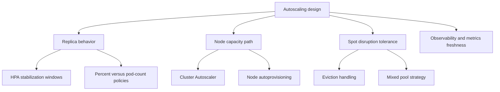

# Autoscaling

Healthy AKS autoscaling is mostly about **damping** and **blast-radius control**. Bad outcomes come from fast but noisy signals, interruptible capacity without isolation, or scaling models that no longer match workload diversity.

## Why This Matters

<!-- diagram-id: best-practices-autoscaling -->


The scaling loop spans more than one controller. HPA, KEDA, Cluster Autoscaler, NAP, the scheduler, and Azure capacity events all contribute. Production tuning should therefore optimize for **convergence**, not just fast reaction.

## Recommended Practices

### Practice 1: Tune HPA behavior to prevent flapping

**Why**: HPA already operates on delayed metrics. If you add bursty traffic, coarse metrics, or replica startup lag, the result is often replica thrash rather than useful elasticity.

**How**:

- Use `behavior.scaleDown.stabilizationWindowSeconds` to absorb brief drops before removing pods.
- Use `behavior.scaleUp` policies when a sudden metric spike would otherwise add too many pods at once.
- Prefer **percentage-based policies** for large replica sets and **pod-count policies** for small workloads where percentages round poorly.
- Keep a slightly higher minimum replica count for latency-sensitive apps so startup time does not become the bottleneck.

Example pattern:

```yaml
apiVersion: autoscaling/v2
kind: HorizontalPodAutoscaler
metadata:
  name: api-hpa
spec:
  minReplicas: 3
  maxReplicas: 30
  behavior:
    scaleUp:
      stabilizationWindowSeconds: 0
      policies:
        - type: Percent
          value: 100
          periodSeconds: 60
        - type: Pods
          value: 4
          periodSeconds: 60
      selectPolicy: Max
    scaleDown:
      stabilizationWindowSeconds: 300
      policies:
        - type: Percent
          value: 20
          periodSeconds: 60
      selectPolicy: Max
```

**Validation**:

- Replica count does not oscillate up and down every minute.
- Latency remains stable after a scale event instead of degrading during churn.
- New pods become ready before the next large adjustment is triggered.

### Practice 2: Isolate spot capacity and design for interruption

**Why**: Spot saves money only when interruption is operationally boring. If a spot eviction creates customer-visible instability, the cluster is under-designed.

**How**:

- Keep spot pools for **retryable**, **idempotent**, or **batch-oriented** workloads.
- Respect the built-in spot taint with matching tolerations and affinity so critical workloads never land there accidentally.
- Use graceful termination hooks, queue checkpointing, and retry-safe workers.
- Keep a regular on-demand fallback pool for spillover or critical control paths.

**Validation**:

- A single spot-node loss does not cause customer-facing outage.
- Work is retried or rescheduled automatically.
- Platform teams can explain exactly which workloads are allowed on spot.

### Practice 3: Decide explicitly between Cluster Autoscaler and NAP

**Why**: These models optimize different things. Cluster Autoscaler is excellent when pool shapes are already well understood. NAP is better when pool sprawl is becoming the scaling tax.

**Decision matrix**:

| If your cluster looks like this | Prefer | Reason |
|---|---|---|
| Few stable workload classes, explicit pool ownership, clear min/max boundaries | Cluster Autoscaler | Fixed pools remain simple and predictable |
| Many near-duplicate pools created only to chase different VM shapes | NAP | Constraint-based provisioning is easier than more pool tuning |
| Strong requirement for Azure CLI-driven pool operations and current runbook maturity | Cluster Autoscaler | Lower migration cost |
| Platform team is comfortable owning NodePool and AKSNodeClass CRDs | NAP | Better long-term fit for heterogeneous fleets |
| Need both during migration | Use only the documented feature-flagged migration path | Running Cluster Autoscaler and NAP together indefinitely can cause unpredictable scaling unless workloads are isolated with taints and tolerations |

### Practice 4: Keep metrics freshness aligned with scaling expectations

**Why**: An autoscaler can only be as stable as the metric pipeline feeding it.

**How**:

- Match metric scrape or publication frequency to the workload burst profile.
- Avoid using a metric that reflects distress after the incident is already happening.
- Use KEDA when queue depth or event lag is the real scaling signal.
- Use managed Prometheus or a well-understood adapter path rather than building multiple competing metrics adapters.

## Common Mistakes / Anti-Patterns

- Setting HPA thresholds aggressively low and then blaming the autoscaler for replica churn.
- Putting critical ingress, stateful services, or singleton workers on spot pools.
- Combining too many autoscaling paths on one workload without ownership clarity.
- Migrating to NAP before workload requests, PDBs, and taints are disciplined.
- Treating scale-out speed as the only success metric while ignoring convergence and cost.

## Validation Checklist

- [ ] HPA rules include deliberate stabilization behavior instead of defaults-by-accident.
- [ ] Scale-up and scale-down policies match workload size and warm-up time.
- [ ] Spot workloads are interruption tolerant and isolated with tolerations and affinity.
- [ ] Retry and reschedule behavior is documented for all spot-hosted workers.
- [ ] The team has made an explicit CA-versus-NAP decision and documented why.
- [ ] Metrics freshness and scaling frequency were reviewed together.

## See Also

- [Scaling](../platform/scaling.md)
- [KEDA on AKS](../platform/keda-on-aks.md)
- [Node Autoprovisioning](../platform/node-autoprovisioning.md)
- [Custom Metrics Scaling](../platform/custom-metrics-scaling.md)
- [Scaling Operations](../operations/scaling-operations.md)

## Sources

- [Scaling options for applications in AKS](https://learn.microsoft.com/en-us/azure/aks/concepts-scale)
- [Cluster autoscaler in AKS](https://learn.microsoft.com/en-us/azure/aks/cluster-autoscaler)
- [Overview of node auto-provisioning in AKS](https://learn.microsoft.com/en-us/azure/aks/node-auto-provisioning)
- [Migrate from cluster autoscaler to node auto-provisioning](https://learn.microsoft.com/en-us/azure/aks/migrate-from-autoscaler-to-node-auto-provisioning)
- [Add an Azure Spot node pool to an AKS cluster](https://learn.microsoft.com/en-us/azure/aks/spot-node-pool)
