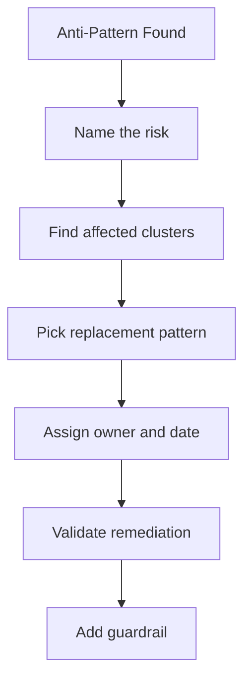

---
content_sources:
  diagrams:
  - id: best-practices-common-anti-patterns
    type: flowchart
    source: mslearn-adapted
    mslearn_url: https://learn.microsoft.com/en-us/azure/aks/best-practices
    based_on:
    - https://learn.microsoft.com/en-us/azure/aks/best-practices
    - https://learn.microsoft.com/en-us/azure/architecture/reference-architectures/containers/aks/secure-baseline-aks
    - https://learn.microsoft.com/en-us/azure/aks/concepts-network
    - https://learn.microsoft.com/en-us/azure/aks/use-network-policies
    - https://learn.microsoft.com/en-us/azure/aks/concepts-security
    - https://learn.microsoft.com/en-us/azure/aks/cluster-autoscaler
    - https://learn.microsoft.com/en-us/azure/azure-monitor/containers/container-insights-overview
    - https://learn.microsoft.com/en-us/azure/aks/operator-best-practices-cluster-isolation
content_validation:
  status: verified
  last_reviewed: 2026-05-21
  reviewer: agent
  core_claims:
    - claim: "AKS best practices cover multi-tenancy, cluster security, pod security, and business continuity concerns."
      source: https://learn.microsoft.com/azure/aks/best-practices
      verified: true
    - claim: "AKS network best practices cover IP planning, load balancers, ingress controllers, and WAF integration."
      source: https://learn.microsoft.com/azure/aks/operator-best-practices-network
      verified: true
    - claim: "AKS reliability guidance identifies PDBs, probes, topology spread constraints, multi-replica applications, zones, and autoscaling as reliability practices."
      source: https://learn.microsoft.com/azure/aks/best-practices-app-cluster-reliability
      verified: true
---

# Common Anti-Patterns

This page collects recurring AKS failure patterns and the replacement behavior reviewers should require before production approval.

## Why This Matters

An anti-pattern is not just a bad setting. It is a decision that repeatedly creates incidents, unclear ownership, wasted spend, or security exposure. Naming the pattern makes it easier to remove.

<!-- diagram-id: best-practices-common-anti-patterns -->

## Recommended Practices

### Practice 1: Replace single shared pools with role-based pools

A single pool for system add-ons, ingress, business services, batch jobs, and Spot workloads creates noisy-neighbor risk. Split pools by reliability and scheduling requirement.

### Practice 2: Replace open networking with declared paths

Default-open service communication hides dependency sprawl. Define ingress, egress, namespace-to-namespace flows, and DNS behavior explicitly.

### Practice 3: Replace shared credentials with identity boundaries

Shared kubeconfigs, broad service principals, and secrets in manifests remove accountability. Use Microsoft Entra integration, RBAC, managed identity, and workload identity.

### Practice 4: Replace manual review with policy for repeated controls

If reviewers repeatedly catch the same issue, encode it as Azure Policy, admission control, CI validation, or an infrastructure module default.

### Practice 5: Replace reactive upgrades with maintenance discipline

A cluster that waits until end-of-support pressure will eventually force a risky upgrade. Use upgrade channels, planned maintenance, lower-environment testing, and PDB validation.

### Practice 6: Replace cost guesswork with ownership metadata

Cost reviews need labels, workload ownership, node pool purpose, and usage signals. Otherwise optimization turns into random node downsizing.

## Common Mistakes / Anti-Patterns

### Anti-Pattern 1: Cluster-admin for convenience

Convenience access becomes a permanent escalation path. Use scoped roles and temporary break-glass access.

### Anti-Pattern 2: Public ingress by default

Public exposure should be a design decision with WAF, certificate, DNS, and monitoring ownership.

### Anti-Pattern 3: PDBs copied from examples

PDBs must match replica count and availability goals. A copied PDB can either fail to protect the app or block upgrades.

### Anti-Pattern 4: Unowned namespaces

If nobody owns a namespace, nobody owns its spend, risk, or remediation.

### Anti-Pattern 5: Logs without a question

Logging everything forever is not observability. Keep the data needed to answer operational, security, and compliance questions.

## Validation Checklist

- Every identified anti-pattern has an owner and remediation date.
- Replacement guidance links to a specific best-practices page.
- Repeated findings are turned into automated guardrails.
- Exceptions are time-bound and visible to platform owners.
- Remediation is verified through dashboards, policy state, or deployment evidence.

## Review Matrix

| Review area | Page-specific check |
|---|---|
| Scope | Confirm the guidance applies to Common Anti-Patterns. |
| Source basis | Validate the recommendation against the Microsoft Learn sources in this page. |
| Evidence | Capture command output, portal state, metrics, logs, or screenshots before treating the result as proven. |

## See Also

- [Production Baseline](production-baseline.md)
- [Networking](networking.md)
- [Security](security.md)
- [Reliability](reliability.md)
- [Cost Optimization](cost-optimization.md)
- [Resource Governance](resource-governance.md)

## Sources

- [AKS best practices](https://learn.microsoft.com/azure/aks/best-practices)
- [AKS network best practices](https://learn.microsoft.com/azure/aks/operator-best-practices-network)
- [AKS reliability best practices](https://learn.microsoft.com/azure/aks/best-practices-app-cluster-reliability)
- [AKS cost optimization best practices](https://learn.microsoft.com/azure/aks/best-practices-cost)
