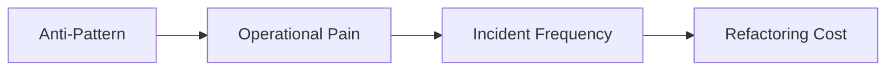

# Common Anti-Patterns

AKS incidents often come from a small set of repeated design mistakes. This page helps teams recognize them early and replace them with safer defaults.

## Why This Matters

Avoiding a few common anti-patterns eliminates a disproportionate amount of future troubleshooting work.

## Recommended Practices

- Keep system and application workloads separate.
- Require requests, limits, and probes for every production workload.
- Standardize ingress and identity patterns.
- Document ownership for namespaces, node pools, and alerting.

## Common Mistakes / Anti-Patterns

- One giant cluster with no governance boundaries.
- Cluster-admin access used as a convenience default.
- Static credentials injected into every pod.
- Services exposed publicly before internal routing is understood.
- Upgrades deferred until they become urgent.
- Persistent state placed on ephemeral node storage by accident.

## Validation Checklist

- [ ] At least one anti-pattern review is part of architecture sign-off.
- [ ] Teams can explain why their ingress, identity, and storage choices were made.
- [ ] Upgrade readiness is tracked continuously.

## See Also

- [Production Baseline](production-baseline.md)
- [Security](security.md)
- [Networking](networking.md)
- [Troubleshooting](../troubleshooting/index.md)

## Sources

- [AKS best practices overview](https://learn.microsoft.com/azure/aks/best-practices)
- [AKS secure baseline architecture](https://learn.microsoft.com/azure/architecture/reference-architectures/containers/aks/secure-baseline-aks)
