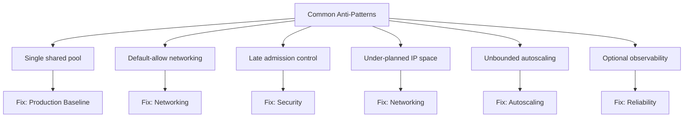

# Common Anti-Patterns

Most AKS incidents come from a familiar set of design mistakes: shared node pools, default-allow networking, admission control added after the fact, under-planned IP space, and observability treated as optional. This page names those anti-patterns, explains why they hurt, and points to the topic guide that carries the full fix.

This page is intentionally a **catalog and a map**, not another production blueprint. Each anti-pattern links to the differentiated best-practices guide that owns the detailed configuration.

## Why This Matters

Naming bad patterns before they reach production is cheaper than diagnosing them during an incident. A shared vocabulary lets reviewers reject a risky design in a pull request instead of explaining it in a postmortem.

<!-- diagram-id: best-practices-common-anti-patterns -->

Use this catalog in design reviews: if a proposed cluster matches one of the anti-patterns below, treat it as a blocking finding and route the author to the linked topic guide.

## Recommended Practices

This page is a triage entry point. Once you have identified an anti-pattern, the differentiated topic guides carry the full configuration, CLI, and validation steps:

| Concern | Owning guide |
|---|---|
| Node pool separation and standard cluster blueprint | [Production Baseline](production-baseline.md) |
| CNI selection, IP planning, and network policy | [Networking](networking.md) |
| Pod Security Standards and admission control | [Security](security.md) |
| Cluster autoscaler and node pool scaling | [Autoscaling](autoscaling.md) |
| Spot pools and spend discipline | [Cost Optimization](cost-optimization.md) |
| Monitoring baseline and first-responder signals | [Reliability](reliability.md) |

Do not duplicate configuration from those guides here. When a guide changes its recommendation, update only the anti-pattern framing and the link on this page.

## Common Mistakes / Anti-Patterns

### Anti-Pattern 1: Single shared pool for everything

**What happens**: System add-ons, production APIs, batch jobs, and test workloads all land on the same nodes.

**Why it is wrong**: This collapses isolation. Node pressure, kernel upgrades, or a noisy neighbor affect every workload at once, and incident ownership becomes ambiguous because a DNS or ingress problem is indistinguishable from an application problem.

**Correct approach**: Separate a `system` pool for cluster-critical add-ons from `user` pools mapped to workload classes, and use taints to keep sensitive workloads deliberate. See [Production Baseline](production-baseline.md).

### Anti-Pattern 2: Default-allow networking

**What happens**: Pods can reach any other pod or external destination because no network policy was ever introduced. By default, all pods in an AKS cluster can send and receive traffic without limitations.

**Why it is wrong**: A single compromised pod can scan the whole cluster, so a contained security event becomes a platform-wide investigation. Troubleshooting is also slower because expected communication paths were never declared.

**Correct approach**: Start every production namespace with default-deny ingress and egress, then add explicit allow rules for DNS, ingress, telemetry, and app dependencies. See [Networking](networking.md).

### Anti-Pattern 3: Admission control added after the incident

**What happens**: Teams wait until a privileged workload or an unsafe manifest reaches production before thinking about Pod Security Standards or Gatekeeper.

**Why it is wrong**: Retrospective policy usually carves out an exception for the exact unsafe behavior that caused the incident. Pod Security Admission uses labels to enforce Pod Security Standards on pods in a namespace and is enabled by default in AKS, so there is no reason to defer it.

**Correct approach**: Apply Pod Security Standard labels and admission constraints before the first production namespace is onboarded, and track every exemption as approved and time-bound. See [Security](security.md).

### Anti-Pattern 4: Under-planned IP space

**What happens**: A cluster uses a networking mode that consumes VNet addresses per pod in a subnet sized only for the initial node count.

**Why it is wrong**: Weeks later the cluster autoscaler cannot add nodes because pod IP reservations have exhausted the subnet. The symptom looks like a compute failure but is really IP-planning debt that is expensive to unwind in place.

**Correct approach**: Choose the CNI mode deliberately — Azure CNI Overlay for large pod scale with simpler planning, or a routable pod-subnet model when the network team needs first-class pod IPs — and document node, surge-upgrade, and autoscaler headroom. See [Networking](networking.md).

### Anti-Pattern 5: Unbounded or unreviewed autoscaling

**What happens**: Autoscaler minimum and maximum counts are set once and never revisited, or requests are inflated so the cluster autoscaler over-provisions nodes.

**Why it is wrong**: The cluster autoscaler watches for pods that can't be scheduled because of resource constraints and scales up the node pool, and it scales down nodes that lack running pods — so inflated requests and stale bounds quietly translate into wasted spend or, worse, starved critical add-ons when batch work lands on the wrong pool.

**Correct approach**: Review autoscaler min and max against real utilization each sprint, isolate interruptible work on spot pools, and protect critical services with PodDisruptionBudgets. See [Autoscaling](autoscaling.md) and [Cost Optimization](cost-optimization.md).

### Anti-Pattern 6: Observability as an optional add-on

**What happens**: Teams promise to enable monitoring later, after the first release is stable.

**Why it is wrong**: The first production incident then happens with no restart history, no node-condition trend, and no shared runbooks. Container insights collects stdout and stderr logs and Kubernetes events from each node in an AKS cluster, and that baseline is exactly what first responders lack when it is deferred.

**Correct approach**: Enable Container Insights and assign ownership for alerts, dashboards, and troubleshooting queries before go-live. See [Reliability](reliability.md).

## Validation Checklist

- [ ] No production workload shares the `system` pool with cluster-critical add-ons.
- [ ] Every production namespace has a default-deny network policy with explicit allow rules.
- [ ] Pod Security Standard labels and admission constraints are in place before onboarding, with exemptions tracked.
- [ ] CNI mode and subnet or overlay growth assumptions are documented before scale-out.
- [ ] Cluster autoscaler min and max values are reviewed against observed utilization.
- [ ] Container Insights is enabled and first-responder queries are tested before go-live.
- [ ] Each anti-pattern on this page still links to the correct owning topic guide.

## See Also

- [Production Baseline](production-baseline.md)
- [Networking](networking.md)
- [Security](security.md)
- [Autoscaling](autoscaling.md)
- [Cost Optimization](cost-optimization.md)
- [Reliability](reliability.md)
- [Troubleshooting](../troubleshooting/index.md)

## Sources

- [AKS best practices](https://learn.microsoft.com/en-us/azure/aks/best-practices)
- [Secure baseline for AKS](https://learn.microsoft.com/en-us/azure/architecture/reference-architectures/containers/aks/secure-baseline-aks)
- [Use network policies in AKS](https://learn.microsoft.com/en-us/azure/aks/use-network-policies)
- [Use Pod Security Admission in AKS](https://learn.microsoft.com/en-us/azure/aks/use-psa)
- [Cluster autoscaler in AKS](https://learn.microsoft.com/en-us/azure/aks/cluster-autoscaler)
- [Monitor AKS with Container insights](https://learn.microsoft.com/en-us/azure/aks/monitor-aks)
