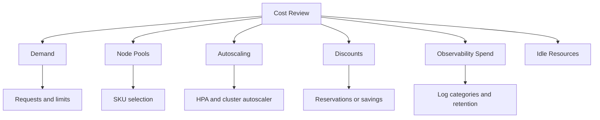

---
content_sources:
  diagrams:
  - id: best-practices-cost-optimization
    type: flowchart
    source: mslearn-adapted
    mslearn_url: https://learn.microsoft.com/en-us/azure/aks/best-practices
    based_on:
    - https://learn.microsoft.com/en-us/azure/aks/best-practices
    - https://learn.microsoft.com/en-us/azure/architecture/reference-architectures/containers/aks/secure-baseline-aks
    - https://learn.microsoft.com/en-us/azure/aks/concepts-network
    - https://learn.microsoft.com/en-us/azure/aks/use-network-policies
    - https://learn.microsoft.com/en-us/azure/aks/concepts-security
    - https://learn.microsoft.com/en-us/azure/aks/cluster-autoscaler
    - https://learn.microsoft.com/en-us/azure/azure-monitor/containers/container-insights-overview
    - https://learn.microsoft.com/en-us/azure/aks/quotas-skus-regions
content_validation:
  status: verified
  last_reviewed: 2026-05-21
  reviewer: agent
  core_claims:
    - claim: "AKS cost optimization guidance covers autoscaling, right-sizing, GPU optimization, multitenancy, and Azure discounts."
      source: https://learn.microsoft.com/azure/aks/optimize-aks-costs
      verified: true
    - claim: "AKS cost best practices recommend FinOps visibility, infrastructure selection, dynamic rightsizing, and discounts."
      source: https://learn.microsoft.com/azure/aks/best-practices-cost
      verified: true
    - claim: "AKS Spot node pools use unused Azure capacity and can be evicted when Azure needs capacity back."
      source: https://learn.microsoft.com/azure/aks/spot-node-pool
      verified: true
---

# Cost Optimization

AKS cost optimization is not just using cheaper nodes. It is matching capacity to workload demand while preserving reliability, security, and troubleshooting evidence.

## Why This Matters

Kubernetes hides waste well: unused node headroom, over-requested pods, idle load balancers, excessive logs, and unowned development clusters can all accumulate quietly.

<!-- diagram-id: best-practices-cost-optimization -->

## Recommended Practices

### Practice 1: Start with workload resource requests

Pod requests and limits are the input to scheduling and many cost decisions. Review them against real usage before increasing node count or changing SKUs.

### Practice 2: Use separate node pools for different cost profiles

Keep always-on services, burstable jobs, GPU workloads, and interruptible workloads in separate pools. This allows independent scaling, SKU choice, and Spot adoption where interruption is acceptable.

### Practice 3: Enable autoscaling with realistic boundaries

Cluster autoscaler should have min and max settings that reflect business demand and regional quota. HPA should scale applications based on signals that match service behavior.

### Practice 4: Use Spot only for interruption-tolerant workloads

Spot node pools can reduce cost but do not provide the same availability guarantees as regular nodes. Pair Spot workloads with tolerations, labels, and fallback behavior.

### Practice 5: Control observability spend intentionally

Logs are operationally necessary, but noisy categories and long retention can become expensive. Keep the signals needed for incidents, audits, and capacity planning; reduce or route low-value data deliberately.

### Practice 6: Stop or scale down non-production clusters

Development and test clusters should have ownership, schedules, and clear reasons to run outside working hours.

## Common Mistakes / Anti-Patterns

### Anti-Pattern 1: Cutting replicas before understanding availability

Reducing replicas can save money and create user-visible outages during node drains or pod failures.

### Anti-Pattern 2: One large general-purpose node pool

Large shared pools hide workload-level waste and make it hard to use specialized SKUs or Spot safely.

### Anti-Pattern 3: Unlimited log ingestion

More logs are not automatically better. Keep evidence that supports operations and compliance, then tune categories and retention.

### Anti-Pattern 4: Spot for stateful or critical services

Spot is best for workloads that tolerate eviction. Critical services need regular capacity or a tested fallback path.

## Validation Checklist

- Resource requests are reviewed against observed usage.
- Node pools reflect workload cost and reliability profiles.
- Autoscaler min and max settings are documented.
- Spot workloads are explicitly labeled, tainted, and interruption-tolerant.
- Log categories and retention have an owner and cost review cadence.
- Non-production clusters have stop, scale-down, or expiry rules.

## Review Matrix

| Review area | Page-specific check |
|---|---|
| Scope | Confirm the guidance applies to Cost Optimization. |
| Source basis | Validate the recommendation against the Microsoft Learn sources in this page. |
| Evidence | Capture command output, portal state, metrics, logs, or screenshots before treating the result as proven. |

## See Also

- [Scaling](../platform/scaling.md)
- [Monitoring and Logging](../operations/monitoring-logging.md)
- [Cluster Autoscaler Issues](../troubleshooting/playbooks/cluster-autoscaler-issues.md)
- [Resource Governance](resource-governance.md)

## Sources

- [AKS cost optimization best practices](https://learn.microsoft.com/azure/aks/best-practices-cost)
- [Optimize AKS usage and costs](https://learn.microsoft.com/azure/aks/optimize-aks-costs)
- [Operate cost-optimized AKS at scale](https://learn.microsoft.com/azure/aks/operate-cost-optimized-scale)
- [Spot node pools in AKS](https://learn.microsoft.com/azure/aks/spot-node-pool)
