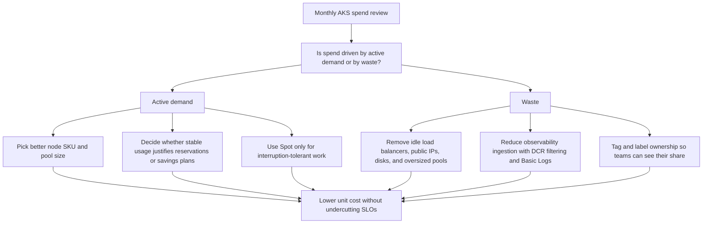

---
content_sources:
  diagrams:
    - id: best-practices-cost-optimization
      type: flowchart
      source: mslearn-adapted
      mslearn_url: https://learn.microsoft.com/en-us/azure/aks/best-practices-cost
      based_on:
        - https://learn.microsoft.com/en-us/azure/aks/best-practices-cost
        - https://learn.microsoft.com/en-us/azure/aks/cluster-autoscaler
        - https://learn.microsoft.com/en-us/azure/aks/spot-node-pool
        - https://learn.microsoft.com/en-us/azure/aks/monitor-aks
        - https://learn.microsoft.com/en-us/azure/azure-monitor/containers/container-insights-cost
        - https://learn.microsoft.com/en-us/azure/cost-management-billing/costs/quick-acm-cost-analysis
content_validation:
  status: verified
  last_reviewed: 2026-07-18
  reviewer: agent
  core_claims:
    - claim: "Platform metrics for AKS clusters are automatically collected at no cost."
      source: https://learn.microsoft.com/en-us/azure/aks/monitor-aks
      verified: true
    - claim: "A Spot node pool can't be a default node pool."
      source: https://learn.microsoft.com/en-us/azure/aks/spot-node-pool
      verified: true
    - claim: "AKS resource-specific mode supports configuration as Basic logs for significant cost savings."
      source: https://learn.microsoft.com/en-us/azure/aks/monitor-aks
      verified: true
    - claim: "Azure Reservations operate on a one-year or three-year term."
      source: https://learn.microsoft.com/en-us/azure/aks/best-practices-cost
      verified: true
---

# Cost Optimization

AKS cost optimization is a FinOps discipline, not a license to strip away resilience. The goal is to spend less on the same business outcome by matching node shape, monitoring volume, and idle infrastructure to real demand while preserving the reliability guardrails defined elsewhere.

## Why This Matters

<!-- diagram-id: best-practices-cost-optimization -->


Most AKS overspend comes from a few repeatable patterns: wrong VM families, minimum node counts that never came back down, idle Azure resources left behind by retired services, and logging every signal forever. A cost review that separates **deliberate headroom** from **accidental waste** cuts spend faster than broad pressure to “use fewer nodes.”

This page covers AKS FinOps economics only. For HPA, Cluster Autoscaler, node autoprovisioning, KEDA, and spot interruption handling, see [Autoscaling](autoscaling.md). For enforcement of requests, limits, and quotas, see [Resource Governance](resource-governance.md). For the reliability consequences of aggressive cost cuts, see [Reliability](reliability.md).

## Recommended Practices

### Practice 1: Choose node SKU families and pool sizes by steady-state economics

Start with the cheapest node family that still fits the workload's normal CPU, memory, and network profile. Expensive SKUs often hide poor workload fitting: memory-heavy services on general-purpose nodes, tiny services spread across too many pools, or premium families chosen “just in case.”

Keep the pool model simple:

- One small but resilient system pool for cluster-critical components.
- A limited set of user pools aligned to real workload classes such as general, memory-heavy, GPU, or interruptible batch.
- New pools only when the economics are different enough to matter.

```bash
az aks nodepool list \
    --resource-group "$RG" \
    --cluster-name "$CLUSTER_NAME" \
    --query "[].{name:name,mode:mode,vmSize:vmSize,count:count,min:minCount,max:maxCount,priority:scaleSetPriority,osDiskGb:osDiskSizeGb}" \
    --output table
```

Use this inventory to find pools whose VM family, node count floor, or disk size looks more expensive than the workload actually needs.

```bash
kubectl top nodes
```

Use this as a quick utilization check before changing SKU family or pool size.

If workload requests and limits are obviously wrong, fix that first in [Resource Governance](resource-governance.md); cost review should not guess around bad scheduling inputs. If the problem is scaling policy or pool creation mechanics, hand off to [Autoscaling](autoscaling.md).

For quota and commitment decisions, only lock in when usage is stable enough to justify it. Reservations, savings plans, and capacity reservations can lower unit cost, but they only help when the cluster actually consumes the committed shape for long enough to earn the discount.

### Practice 2: Treat Spot pools as a pricing tool, not a default capacity tier

Spot economics are attractive because Azure can offer significant discounts on unused capacity, but the savings are only real when the workload is eligible. Good candidates are batch workers, CI runners, dev/test environments, and queue-driven jobs with flexible completion time. Poor candidates are customer-facing baseline traffic, stateful quorum members, and anything whose downtime would force you to overbuild regular pools anyway.

```bash
az aks nodepool show \
    --resource-group "$RG" \
    --cluster-name "$CLUSTER_NAME" \
    --name spotpool \
    --query "{priority:scaleSetPriority,evictionPolicy:scaleSetEvictionPolicy,spotMaxPrice:spotMaxPrice,mode:mode,count:count,min:minCount,max:maxCount,vmSize:vmSize}" \
    --output json
```

Use this to confirm that the spot pool is a secondary user pool and that its price settings match the intended cost model.

The economic decision is simple: use Spot when interruption is cheaper than regular capacity. The operational details of taints, tolerations, evictions, and autoscaler recovery belong in [Autoscaling](autoscaling.md), and this page intentionally does not restate them.

### Practice 3: Budget overprovisioning explicitly instead of paying for accidental idle nodes

Some overprovisioning is rational. You may keep a deliberate node buffer for release windows, cold-start-sensitive services, or regional capacity risk. The waste begins when nobody can explain why the buffer exists, who owns it, or when it should be removed.

Review these cost floors regularly:

- Minimum node counts that reflect last year's peak rather than today's baseline.
- Large upgrade or surge buffers left in place after migration projects.
- “Temporary” dedicated pools that became permanent but lightly used.
- Premium SKUs held for workloads that no longer run there.

```bash
az aks show \
    --resource-group "$RG" \
    --name "$CLUSTER_NAME" \
    --query "agentPoolProfiles[].{name:name,count:count,enableAutoScaling:enableAutoScaling,min:minCount,max:maxCount,vmSize:vmSize,mode:mode}"
```

Use this to compare each pool's current count and minimum floor against the business reason for keeping spare capacity.

Document the reason for every intentional buffer. If a pool has a nonzero minimum, the team should be able to say which workload needs that floor, what latency or availability risk it protects, and when the assumption will be reviewed. If they cannot, treat it as waste.

### Practice 4: Run recurring cleanup for idle Azure infrastructure and stranded cluster capacity

AKS bills do not come only from nodes. Retired services often leave behind Standard Load Balancers, public IPs, managed disks, PVs, and oversized node pools in the node resource group. These artifacts are classic FinOps waste because they survive long after application traffic moved elsewhere.

```bash
NODE_RG=$(az aks show \
    --resource-group "$RG" \
    --name "$CLUSTER_NAME" \
    --query nodeResourceGroup \
    --output tsv) && az resource list \
    --resource-group "$NODE_RG" \
    --query "[].{type:type,name:name,location:location}" \
    --output table
```

Use this to inventory billable Azure resources created on behalf of the cluster before deciding what can be deleted or downsized.

```bash
kubectl get pv,pvc \
    --all-namespaces \
    --output wide
```

Use this to find persistent volumes and claims that still exist after the owning workload was removed.

Cleanup review should explicitly ask:

- Does this public IP or load balancer still front live traffic?
- Is this disk or PV attached to an active workload?
- Is this pool still carrying business traffic, or is it just an expensive placeholder?
- Did a migration leave duplicate ingress or storage paths behind?

### Practice 5: Meter observability spend and ownership as carefully as compute spend

Monitoring is part of the workload cost model. AKS platform metrics are free, but Container insights, resource logs, and long-retention analytics are not. High-volume audit data, verbose container logs, and “collect everything” defaults can erase savings from node optimization.

Prefer a layered approach:

- Keep free platform metrics for baseline cluster health.
- Use managed Prometheus where metrics economics are better suited than old log-based patterns.
- Filter Container insights with DCRs, ConfigMap settings, and transformations before data lands in the workspace.
- Use resource-specific logs and Basic Logs where the data is mostly for occasional troubleshooting rather than constant analytics.

```bash
az monitor diagnostic-settings list \
    --resource "/subscriptions/$SUBSCRIPTION_ID/resourceGroups/$RG/providers/Microsoft.ContainerService/managedClusters/$CLUSTER_NAME" \
    --output json
```

Use this to verify which AKS control-plane log categories are being collected and whether diagnostic settings still match the intended cost profile.

```bash
kubectl get namespaces \
    --show-labels
```

Use this to verify that namespaces carry ownership labels such as `team`, `cost-center`, or `environment` before you try to allocate spend.

Cost allocation works best when you combine two views:

- **Azure Cost Management views** for billed Azure resources, trends, budgets, reservations, and savings-plan coverage.
- **Kubernetes ownership labels and namespace views** for who is driving shared-cluster consumption.

Do not pretend Azure billing data natively explains every namespace. Instead, make team labels mandatory in Kubernetes and use Cost Analysis to review the Azure-side spend while Container insights usage views expose namespace-heavy log ingestion.

## Common Mistakes / Anti-Patterns

- **Buying premium node families before proving the workload needs them.** “More expensive” is not the same as “safer.” Validate CPU, memory, and disk pressure first.
- **Putting default capacity on Spot because the discount looks good.** Use Spot only when interruption is economically acceptable; eviction handling belongs in [Autoscaling](autoscaling.md).
- **Confusing deliberate headroom with forgotten minimums.** If nobody owns the capacity buffer, it is probably waste.
- **Ignoring non-node costs.** Idle load balancers, public IPs, disks, and verbose log ingestion can keep the bill high even after node counts drop.
- **Trying to solve shared anti-patterns here.** For cross-cutting mistakes that also affect networking, governance, or security, see [Common Anti-Patterns](common-anti-patterns.md).

## Validation Checklist

- [ ] Every node pool has a documented economic purpose, and pool count is limited to real workload classes.
- [ ] Spot pools are restricted to interruption-tolerant workloads, with business justification for the savings trade-off.
- [ ] Minimum node counts and other idle-capacity buffers have an owner, a reason, and a review date.
- [ ] The node resource group is reviewed for idle load balancers, public IPs, disks, and stranded infrastructure.
- [ ] Container insights, DCR filtering, resource-specific logs, and Basic Logs settings are reviewed against actual troubleshooting needs.
- [ ] Namespaces and workloads carry ownership labels that let teams map shared-cluster usage to Azure Cost Management views.
- [ ] Reservations, savings plans, or capacity reservations are used only where stable utilization justifies the commitment.

## See Also

- [Autoscaling](autoscaling.md)
- [Resource Governance](resource-governance.md)
- [Reliability](reliability.md)
- [Common Anti-Patterns](common-anti-patterns.md)

## Sources

- [Best practices for cost optimization in Azure Kubernetes Service (AKS)](https://learn.microsoft.com/en-us/azure/aks/best-practices-cost)
- [Use the cluster autoscaler in Azure Kubernetes Service (AKS)](https://learn.microsoft.com/en-us/azure/aks/cluster-autoscaler)
- [Add an Azure Spot node pool to an Azure Kubernetes Service (AKS) cluster](https://learn.microsoft.com/en-us/azure/aks/spot-node-pool)
- [Monitor Azure Kubernetes Service (AKS)](https://learn.microsoft.com/en-us/azure/aks/monitor-aks)
- [Monitoring cost for Container insights](https://learn.microsoft.com/en-us/azure/azure-monitor/containers/container-insights-cost)
- [Quickstart: Start using Cost Analysis](https://learn.microsoft.com/en-us/azure/cost-management-billing/costs/quick-acm-cost-analysis)
