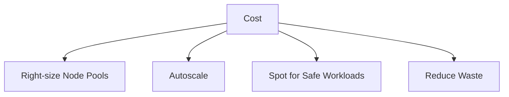

# Cost Optimization

AKS cost optimization is mostly about choosing the right cluster shape, node pool mix, and autoscaling behavior. Cheap clusters that fail during growth are not actually cost efficient.

## Why This Matters

The biggest cost drivers are idle node capacity, oversized requests, and unnecessary environment duplication.

## Recommended Practices

- Match VM family to workload profile instead of using one large general-purpose SKU everywhere.
- Enable autoscaling with safe min/max boundaries.
- Use spot pools only for interruptible workloads.
- Review requests and limits regularly so pods do not permanently reserve unused capacity.
- Delete unused load balancers, disks, and public IPs in the node resource group.

## Common Mistakes / Anti-Patterns

- Large fixed node pools in development clusters.
- HPA disabled because requests were never tuned.
- Treating storage and network resources as free side effects.
- Forgetting that every extra ingress controller or observability agent consumes cluster resources.

## Validation Checklist

- [ ] Node pools are right-sized by workload class.
- [ ] Autoscaler boundaries are documented.
- [ ] Spot usage has disruption tolerance.
- [ ] FinOps review includes node resource group artifacts.

## See Also

- [Scaling](../platform/scaling.md)
- [Node Pool Operations](../operations/node-pool-operations.md)
- [Scaling Operations](../operations/scaling-operations.md)

## Sources

- [AKS best practices overview](https://learn.microsoft.com/azure/aks/best-practices)
- [AKS secure baseline architecture](https://learn.microsoft.com/azure/architecture/reference-architectures/containers/aks/secure-baseline-aks)
- [AKS quotas, virtual machine sizes, and regional availability](https://learn.microsoft.com/azure/aks/quotas-skus-regions)
- [Azure subscription and service limits, quotas, and constraints](https://learn.microsoft.com/azure/azure-resource-manager/management/azure-subscription-service-limits)
