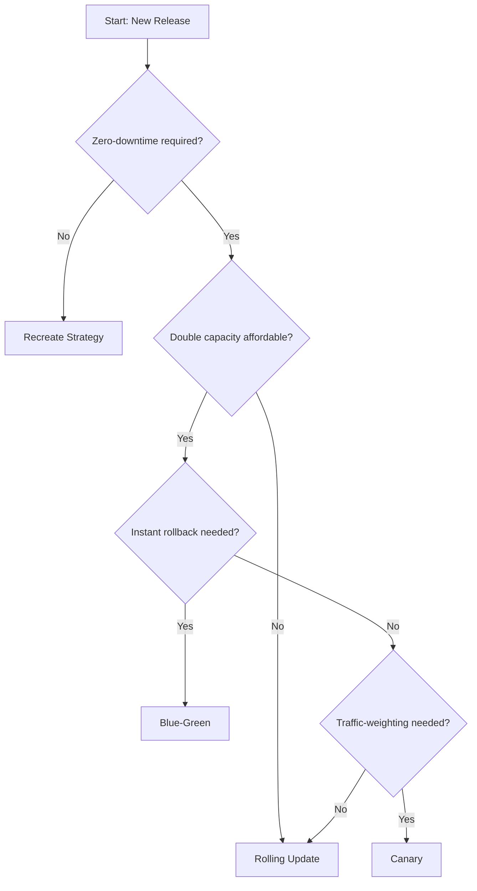

---
content_sources:
  diagrams:
  - id: deployment-strategy-selection
    type: flowchart
    source: mslearn-adapted
    mslearn_url: https://learn.microsoft.com/en-us/azure/aks/concepts-clusters-workloads
    based_on:
    - https://learn.microsoft.com/en-us/azure/aks/concepts-clusters-workloads#deployments-and-yaml-manifests
    - https://kubernetes.io/docs/concepts/workloads/controllers/deployment/
content_validation:
  status: pending_review
  last_reviewed: 2026-07-16
  reviewer: agent
  core_claims:
    - claim: "RollingUpdate is the default deployment strategy in Kubernetes and AKS."
      source: https://kubernetes.io/docs/concepts/workloads/controllers/deployment/#strategy
    - claim: "Blue-green deployments require doubling the compute capacity temporarily."
      source: https://learn.microsoft.com/en-us/azure/architecture/guide/aks/blue-green-deployment
    - claim: "Canary deployments on AKS can be implemented using service label selectors or ingress-based weighting."
      source: https://learn.microsoft.com/en-us/azure/aks/ingress-tls
---

# Deployment Strategies

Choosing the right deployment strategy on AKS ensures application availability while minimizing the risk of downtime or regressions during updates. This guide covers the mechanics and selection criteria for Kubernetes-native rolling updates, blue-green, and canary patterns.

## Why This Matters

The selection of a deployment strategy directly impacts your recovery time objective (RTO), resource costs, and the complexity of your CI/CD pipelines.

<!-- diagram-id: deployment-strategy-selection -->


## Recommended Practices

### Practice 1: Use Rolling Update as the default strategy

**Why**: Rolling updates are the native default in Kubernetes. They replace pods incrementally, ensuring that a minimum number of replicas are always available without requiring extra infrastructure.

**How**:
Tune the `rollingUpdate` parameters to control the speed and safety of the rollout. Use `maxSurge` to define how many extra pods can be created and `maxUnavailable` to define how many pods can be taken down.

```yaml
spec:
  replicas: 4
  strategy:
    type: RollingUpdate
    rollingUpdate:
      maxSurge: 25%
      maxUnavailable: 25%
```

**Key Considerations**:
- **Readiness Probes**: Always define readiness probes. Without them, Kubernetes assumes a pod is "ready" as soon as the process starts, which can lead to traffic being sent to a pod that is still initializing.
- **minReadySeconds**: Use this to give your application time to "settle" and pass health checks before the rollout proceeds to the next batch.
- **PodDisruptionBudget (PDB)**: Ensure a PDB is in place to protect availability during voluntary disruptions (like node drains) occurring simultaneously with a rollout.

### Practice 2: Implement Blue-Green for instant rollback and verification

**Why**: Blue-green deployments provide an isolated environment (Green) to verify the new version before shifting all traffic from the old version (Blue). This allows for instant rollback by simply flipping a traffic switch.

**How**:
Deploy two identical environments. Use a Service selector or Ingress rule to point to the active version.

```yaml
# Service pointing to 'blue'
apiVersion: v1
kind: Service
metadata:
  name: my-app
spec:
  selector:
    app: my-app
    version: blue # Change this to 'green' to cut over
  ports:
    - protocol: TCP
      port: 80
      targetPort: 8080
```

**Key Considerations**:
- **Cost**: Be prepared to double your compute capacity during the cut-over period.
- **Connection Draining**: Ensure your ingress controller or service mesh handles connection draining gracefully when the selector flips.
- **Stateful Data**: Manage database migrations carefully, as both versions may need to interact with the same data during the transition.

### Practice 3: Use Canary for risk mitigation with weighted traffic

**Why**: Canary deployments allow you to test a new version on a small subset of real users. This limits the blast radius of a potential failure.

**How**:
In a native Kubernetes approach, you can have two Deployments with the same labels used by a Service. The ratio of replicas determines the traffic distribution. For more precise control, use Ingress annotations or a service mesh.

Example using NGINX Ingress canary annotations:

```yaml
apiVersion: networking.k8s.io/v1
kind: Ingress
metadata:
  name: my-app-canary
  annotations:
    nginx.ingress.kubernetes.io/canary: "true"
    nginx.ingress.kubernetes.io/canary-weight: "10"
spec:
  rules:
  - host: my-app.example.com
    http:
      paths:
      - path: /
        pathType: Prefix
        backend:
          service:
            name: my-app-v2
            port:
              number: 80
```

**Key Considerations**:
- **Tooling**: For advanced progressive delivery, consider tools like **Argo Rollouts** or **Flagger**, which automate the promotion based on metrics.
- **Observability**: Successful canary deployments require robust metrics (error rates, latency) to decide whether to promote or abort the rollout.

### Practice 4: Leverage AKS-specific deployment considerations

**Why**: AKS provides specific platform behaviors that interact with your deployment strategies, particularly during cluster maintenance.

**Recommended Actions**:
- **Surge Upgrades**: Distinguish between application rollouts and AKS node image/version upgrades. Use surge upgrades (`max-surge`) in node pools to minimize disruption to your already-running deployment strategies.
- **HPA Interaction**: Ensure your Horizontal Pod Autoscaler (HPA) is not fighting your deployment strategy. For example, during a blue-green cut-over, the HPA on the "green" pool might need time to ramp up.
- **ACR Readiness**: Ensure your Azure Container Registry (ACR) has enough throughput (Premium tier for large clusters) to handle the simultaneous image pulls during a large-scale rolling update across multiple AZs.

## Common Mistakes / Anti-Patterns

- **Missing Readiness Probes**: Rollouts appear successful even if the new pods are in a `CrashLoopBackOff` or not yet serving traffic, leading to total service failure.
- **Incorrect Blue-Green Draining**: Flipping a Service selector without considering active long-lived connections (like WebSockets), causing abrupt user disconnects.
- **Manual Canary Promotion**: Promoting a canary based on "gut feeling" instead of automated health signals (error budgets and latency p95).
- **Ignoring PDBs**: Running a deployment rollout during a node maintenance window without a PodDisruptionBudget, leading to fewer available replicas than the application can tolerate.

## Validation Checklist

- [ ] All Deployments have defined `readinessProbes` and `livenessProbes`.
- [ ] `maxSurge` and `maxUnavailable` are tuned for the specific throughput needs of the application.
- [ ] A `PodDisruptionBudget` exists for each production workload.
- [ ] The choice between RollingUpdate, Blue-Green, and Canary is documented for each service.
- [ ] Rollback procedures are tested and automated in the CI/CD pipeline.
- [ ] Monitoring dashboards include metrics specifically for tracking rollout health (e.g., success rate by version).

## See Also

- [Production Baseline](production-baseline.md)
- [Reliability](reliability.md)
- [Upgrades](../operations/upgrades.md)
- [Scaling Operations](../operations/scaling-operations.md)
- [Scaling](../platform/scaling.md)

## Sources

- [Azure / AKS / Concepts / Clusters and Workloads](https://learn.microsoft.com/en-us/azure/aks/concepts-clusters-workloads)
- [Azure / Architecture / Guide / AKS / Blue-Green Deployment](https://learn.microsoft.com/en-us/azure/architecture/guide/aks/blue-green-deployment)
- [Kubernetes / Concepts / Workloads / Controllers / Deployment](https://kubernetes.io/docs/concepts/workloads/controllers/deployment/)
