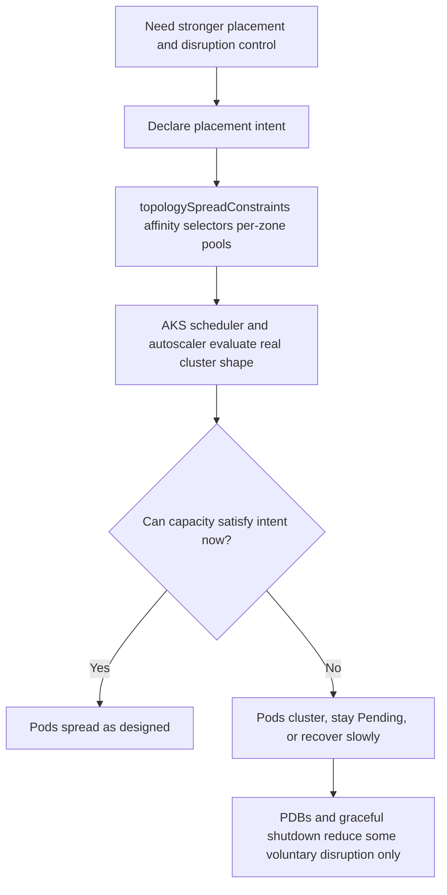

# When You Need Explicit Placement and Disruption Control

Use this page when a workload has moved beyond platform-default resiliency and now needs declared placement or disruption policy in Azure Kubernetes Service (AKS). AKS gives you explicit primitives such as `topologySpreadConstraints`, affinity rules, node selectors, per-zone node pools, and Pod Disruption Budgets (PDBs), but those controls still operate inside real capacity, scheduler, and drain limits.

## Why This Matters

<!-- diagram-id: best-practices-explicit-placement-disruption-control -->

The trade-off is control, not determinism.

- AKS lets you declare **where** replicas should land and **how much voluntary disruption** you will tolerate.
- AKS does **not** guarantee that a zone, node pool, image path, or replacement node is always available when failure happens.
- PDBs, `preStop`, and `terminationGracePeriodSeconds` can improve **voluntary** paths such as drain and upgrade, but they do not prevent dips caused by node crashes, zone impairment, image pull failure, or unschedulable replacements.

This is the AKS landing target for teams escalating from Azure Container Apps because they now need explicit workload placement and disruption contracts.

## Recommended Practices

1. **Treat scheduler intent and cluster shape as one design problem.**

    If you require zonal spread, design the node pool topology and autoscaler settings to match it. Strict spread rules on an imbalanced or capacity-constrained cluster only move the failure from hidden placement to visible `Pending` pods.

2. **Use strict spread only when Pending is the correct fallback.**

    `whenUnsatisfiable: DoNotSchedule` is useful when the wrong placement is worse than waiting, but it intentionally converts missing zonal capacity into scheduling failure.

3. **Separate voluntary-disruption protection from involuntary-failure planning.**

    PDBs help during drain and upgrade eviction paths. They do not protect against node loss, zone loss, kernel panic, or a replacement pod that cannot start.

4. **Prefer AKS-specific evidence before changing manifests.**

    Start with scheduler events, zone labels, node-pool shape, autoscaler bounds, and Azure capacity signals. Do not assume every skewed placement outcome is a YAML bug.

5. **Use the focused playbook that matches the failure mode.**

    - [Topology Spread Skew Under Capacity](../troubleshooting/playbooks/scheduling/topology-spread-skew-under-capacity.md) for strict spread, skew, and `Pending` replicas.
    - [Ready Capacity Drops Below Desired](../troubleshooting/playbooks/scheduling/ready-capacity-drops-below-desired.md) for desired replicas staying constant while Ready or Available dips.
    - [Pod Disruption Budget Drain Contract](../troubleshooting/playbooks/scheduling/pdb-drain-disruption-contract.md) for the voluntary-disruption contract and limits.
    - [Availability-Zone-Imbalanced Node Pools and Spread Failures](../troubleshooting/playbooks/scheduling/az-imbalanced-node-pools-spread.md) for cases where scheduler intent is sound but the zonal node-pool shape is wrong.

## Common Mistakes / Anti-Patterns

- Treating AKS placement controls as a guarantee that disruption windows disappear.
- Assuming PDB protects against node failure, zone outage, or image-pull failure.
- Using a single multi-zone pool with strict zonal spread and then expecting the cluster autoscaler to make zone-perfect choices under pressure.
- Reading `spec.replicas` as proof that capacity stayed healthy during an incident.
- Adding stricter affinity and spread constraints before checking actual zonal node-pool counts, `max-count` bounds, and Azure capacity limits.

## Validation Checklist

- The workload has enough replicas to survive at least one node loss without total outage.
- Each strict spread rule has a matching node-pool and autoscaler design.
- Per-zone pools use balanced autoscaler settings when zonal control is required.
- PDB expectations are documented as **voluntary disruption only**.
- Staging or game-day tests prove what happens during drain, node loss, image pull failure, and zonal pressure.

## See Also

- [Reliability](reliability.md)
- [Autoscaling](autoscaling.md)
- [Node Pools](../platform/node-pools.md)
- [Scaling](../platform/scaling.md)
- [Playbooks](../troubleshooting/playbooks/index.md)

## Sources

- [Deployment and cluster reliability best practices for Azure Kubernetes Service (AKS)](https://learn.microsoft.com/en-us/azure/aks/best-practices-app-cluster-reliability)
- [Zone resiliency recommendations for Azure Kubernetes Service (AKS)](https://learn.microsoft.com/en-us/azure/aks/reliability-zone-resiliency-recommendations)
- [Cluster autoscaling in Azure Kubernetes Service (AKS) overview](https://learn.microsoft.com/en-us/azure/aks/cluster-autoscaler-overview)
- [Upgrade options and recommendations for AKS clusters](https://learn.microsoft.com/en-us/azure/aks/upgrade-options)
- [Pod Disruptions](https://kubernetes.io/docs/concepts/workloads/pods/disruptions/)
