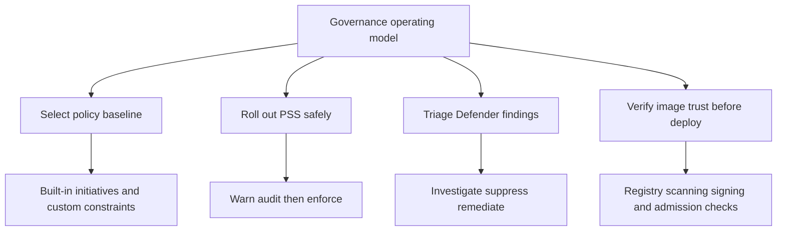

# Governance

Security governance in AKS is the operating discipline that turns cluster hardening into a repeatable standard. The goal is not just to block one bad manifest. The goal is to choose the right policy set, roll it out safely, triage findings consistently, and keep image trust decisions tied to deployment controls.

## Why This Matters

<!-- diagram-id: best-practices-governance -->

Governance debt usually shows up as deployment surprises: a deny policy arrives with no rollout plan, a Defender alert has no owner, or a signed-image rule breaks release night because nobody modeled the exception path.

## Recommended Practices

### Practice 1: Select the right Azure Policy initiative before writing custom constraints

**Why**: Most AKS governance failures start with either under-scoping or over-customizing. Teams jump to custom Rego before exhausting built-in AKS initiatives, or they assign a strict initiative cluster-wide without understanding namespace readiness.

**How**:

- Start with the built-in AKS baseline or restricted initiative that matches the namespace risk profile.
- Use baseline for most application namespaces first.
- Use restricted only after the workload manifests already comply.
- Add custom constraints only for organization-specific rules not covered by built-ins.
- Keep exception management explicit through assignment parameters, exclusions, and expiration tracking.

Useful decision table:

| Need | Preferred control |
|---|---|
| Common pod hardening requirements | Built-in AKS baseline or restricted initiative |
| Allowed-image policy | Built-in allowed-image definition or initiative layer |
| Naming, metadata, or org-specific conventions | Custom Gatekeeper-backed Azure Policy definition |
| Short-term exception | Namespace exclusion or scoped assignment with documented owner |

### Practice 2: Run a Defender for Containers triage workflow instead of one-off alert handling

**Why**: Defender findings span posture recommendations, vulnerabilities, and runtime alerts. If each engineer triages them differently, the team never builds a reliable severity model.

**How**:

1. Separate **runtime alert**, **posture recommendation**, and **registry vulnerability** buckets.
2. Prioritize internet exposure, privileged behavior, sensitive mount, and active suspicious runtime alerts first.
3. Investigate in Defender for Cloud, then pivot to Microsoft Defender XDR only when incident-level context is needed.
4. Remediate the root cause in cluster config, workload manifest, or image pipeline.
5. Create suppression rules only for well-understood false positives with expiration and owner fields.

Minimum triage questions:

- Is this a runtime signal or a static posture signal?
- Is the affected workload internet facing?
- Is the image already known vulnerable in the registry?
- Does an Azure Policy or PSS control exist that would prevent recurrence?

### Practice 3: Roll out PSS with warn and audit before enforce

**Why**: PSS rollout usually fails because teams switch directly to hard enforcement without inventorying `securityContext` gaps.

**How**:

- Label namespaces with `warn` and `audit` first.
- Measure the actual gap set.
- Fix manifests that require root, privilege escalation, extra capabilities, or missing seccomp settings.
- Move stable namespaces to `enforce` only after the warnings stop being noisy.
- Track every namespace exemption with owner, reason, and review date.

Audit-first pattern:

| Phase | Label pattern | Goal |
|---|---|---|
| Discovery | `warn=baseline` | Show teams where manifests will fail later |
| Measurement | `audit=baseline` or `audit=restricted` | Track repeat offenders |
| Controlled rollout | `enforce=baseline` | Block new unsafe defaults |
| High-trust hardening | `enforce=restricted` | Apply stronger namespace posture where workloads are ready |

### Practice 4: Treat image supply chain controls as a deployment safeguard, not just a registry feature

**Why**: Scanning alone tells you an image is risky. Governance requires a second question: should the image be admitted?

**How**:

- Scan registries continuously for new vulnerabilities.
- Prefer signed-image workflows based on Notation or Notary v2-style signing for AKS admission scenarios.
- If your broader platform standard also uses Sigstore, keep publisher identity and trust-root review aligned with the AKS admission path.
- Use Azure Policy allowed-image rules for registry allow-lists.
- Use AKS Image Integrity where you need signed-image verification before deployment.
- Avoid designing new production workflows around Docker Content Trust because Microsoft Learn documents its deprecation path.

Supply-chain control stack:

| Control | Purpose |
|---|---|
| Registry vulnerability scanning | Detect known CVEs and exploitability risk |
| Registry allow-list | Limit what registries or image patterns are deployable |
| Image signing | Prove publisher identity and image integrity |
| Image Integrity / Ratify path | Verify trusted signatures at deployment time |
| Deployment safeguards | Keep release pipelines from bypassing trust decisions |

## Common Mistakes / Anti-Patterns

- Moving straight to `deny` on a broad initiative without a burn-in period.
- Treating PSS as equivalent to Azure Policy instead of as a narrower built-in namespace control.
- Enabling Defender findings with no ownership model for triage or suppression.
- Allowing unsigned or unreviewed registry paths because “the image already passed CI.”
- Building new registry-signing workflows on Docker Content Trust after its documented deprecation milestones.

## Validation Checklist

- [ ] Each production namespace has a documented target posture of baseline, restricted, or privileged with justification.
- [ ] Azure Policy initiatives were selected from built-ins before custom constraints were introduced.
- [ ] Custom constraints have an owner, a test namespace, and an exception process.
- [ ] Defender triage distinguishes runtime alerts from vulnerability findings and posture recommendations.
- [ ] Suppression rules are time-bound and reviewed.
- [ ] Registry scanning and deployment-time image verification are both covered.
- [ ] Any signed-image path documents current verifier choice and trust-root ownership.
- [ ] Exempt namespaces are tracked with expiry, not left indefinite.

## See Also

- [Azure Policy Add-on](../platform/azure-policy-addon.md)
- [Defender for Containers](../platform/defender-for-containers.md)
- [Pod Security Standards](../platform/pod-security-standards.md)
- [Best Practices: Security](security.md)
- [Resource Governance](resource-governance.md)

## Sources

- [Learn Azure Policy for Kubernetes](https://learn.microsoft.com/en-us/azure/governance/policy/concepts/policy-for-kubernetes)
- [Use Azure Policy to secure your Azure Kubernetes Service (AKS) clusters](https://learn.microsoft.com/en-us/azure/aks/use-azure-policy)
- [Introduction to Microsoft Defender for Containers](https://learn.microsoft.com/en-us/azure/defender-for-cloud/defender-for-containers-introduction)
- [Enable Defender for Containers in Microsoft Defender for Cloud](https://learn.microsoft.com/en-us/azure/defender-for-cloud/defender-for-containers-enable-plan)
- [Use Pod Security Admission in Azure Kubernetes Service (AKS)](https://learn.microsoft.com/en-us/azure/aks/use-psa)
- [Use Deployment Safeguards to Enforce Best Practices in Azure Kubernetes Service (AKS)](https://learn.microsoft.com/en-us/azure/aks/deployment-safeguards)
- [Use Image Integrity to validate signed images before deploying them to your Azure Kubernetes Service (AKS) clusters (Preview)](https://learn.microsoft.com/en-us/azure/aks/image-integrity)
- [Manage Signed Images with Docker Content Trust in Azure Container Registry](https://learn.microsoft.com/en-us/azure/container-registry/container-registry-content-trust)
