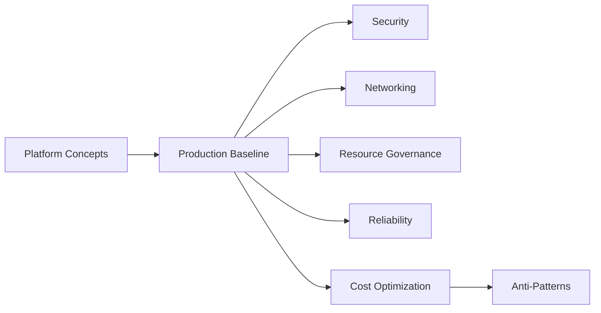

# Best Practices

This section turns AKS concepts into production standards. Read it after Platform and before writing infrastructure or workload manifests.

## Main Content

| Topic | Purpose |
|---|---|
| [Production Baseline](production-baseline.md) | Define the minimum controls every production cluster should meet |
| [Security](security.md) | Reduce cluster, node, and workload attack surface |
| [Networking](networking.md) | Standardize IP planning, ingress, egress, and policy boundaries |
| [Resource Governance](resource-governance.md) | Apply quotas, limits, and namespace controls |
| [Reliability](reliability.md) | Improve upgrade safety, failure isolation, and recovery |
| [Cost Optimization](cost-optimization.md) | Right-size node pools and avoid waste in shared clusters |
| [Common Anti-Patterns](common-anti-patterns.md) | Identify frequent AKS design mistakes before production |

## Advanced Topics

- Convert these pages into platform guardrails, Azure Policy, and admission policy checks.
- Review drift from these standards after every major incident.

## See Also

- [Platform](../platform/index.md)
- [Operations](../operations/index.md)
- [Troubleshooting](../troubleshooting/index.md)

## Sources

- [AKS best practices overview](https://learn.microsoft.com/azure/aks/best-practices)
- [AKS secure baseline architecture](https://learn.microsoft.com/azure/architecture/reference-architectures/containers/aks/secure-baseline-aks)
