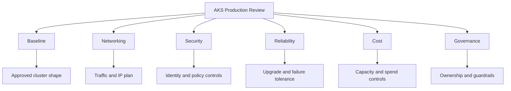

---
content_sources:
  diagrams:
  - id: best-practices-index
    type: flowchart
    source: mslearn-adapted
    mslearn_url: https://learn.microsoft.com/en-us/azure/aks/best-practices
    based_on:
    - https://learn.microsoft.com/en-us/azure/aks/best-practices
    - https://learn.microsoft.com/en-us/azure/architecture/reference-architectures/containers/aks/secure-baseline-aks
    - https://learn.microsoft.com/en-us/azure/aks/concepts-network
    - https://learn.microsoft.com/en-us/azure/aks/use-network-policies
    - https://learn.microsoft.com/en-us/azure/aks/concepts-security
    - https://learn.microsoft.com/en-us/azure/aks/cluster-autoscaler
    - https://learn.microsoft.com/en-us/azure/azure-monitor/containers/container-insights-overview
    - https://learn.microsoft.com/en-us/azure/aks/quotas-skus-regions
content_validation:
  status: verified
  last_reviewed: 2026-05-21
  reviewer: agent
  core_claims:
    - claim: "Microsoft Learn groups AKS best practices around operator and developer responsibilities such as multi-tenancy, security, and business continuity."
      source: https://learn.microsoft.com/azure/aks/best-practices
      verified: true
    - claim: "The Azure Architecture Center publishes an AKS baseline architecture for secure production clusters."
      source: https://learn.microsoft.com/azure/architecture/reference-architectures/containers/aks/secure-baseline-aks
      verified: true
---

# Best Practices

AKS best practices are useful only when each page owns a clear operational decision. Use this section as the review map for production cluster design.

## Why This Matters

A production AKS platform joins several ownership areas: platform engineering, application teams, security, networking, and finance. If every page repeats the same generic guidance, reviewers cannot tell which decision is being evaluated.

<!-- diagram-id: best-practices-index -->

## Recommended Practices

### Practice 1: Start every review with the production baseline

The baseline page defines the minimum cluster controls that should exist before application teams deploy workloads: managed identity, Microsoft Entra integration, workload identity, separate system and user pools, observability, upgrade channels, and documented ownership.

Use it when a new environment is created or when an existing cluster needs a readiness review. Do not use it as a substitute for the deeper networking, security, reliability, cost, and governance reviews.

### Practice 2: Split review ownership by concern

| Concern | Primary page | Review question |
|---|---|---|
| Cluster defaults | [Production Baseline](production-baseline.md) | Is there a known-good platform shape? |
| Traffic design | [Networking](networking.md) | Are ingress, egress, DNS, and pod IP choices explicit? |
| Security controls | [Security](security.md) | Are identity, pod, secret, and admission controls enforced? |
| Failure tolerance | [Reliability](reliability.md) | Can workloads survive maintenance, scale events, and node failures? |
| Spend | [Cost Optimization](cost-optimization.md) | Is capacity tied to demand and owner accountability? |
| Guardrails | [Resource Governance](resource-governance.md) | Are namespaces, quotas, policy, and labels usable at scale? |
| Failure patterns | [Common Anti-Patterns](common-anti-patterns.md) | Are known bad patterns being removed, not normalized? |

### Practice 3: Treat best practices as review gates

Each page should end in a concrete decision: approve, approve with conditions, or block until the missing control is implemented. A checklist without an owner and deadline is operational debt.

### Practice 4: Keep exceptions visible

Exceptions are sometimes valid, such as temporary public ingress during a migration or a high-cost node SKU for a GPU workload. Record the reason, expiry date, owner, and compensating controls in the platform backlog.

## Common Mistakes / Anti-Patterns

### Anti-Pattern 1: One generic AKS checklist

A single checklist hides tradeoffs. Networking reviewers need different evidence than security or FinOps reviewers.

### Anti-Pattern 2: Guidance without enforcement

A best-practice document that never maps to Azure Policy, admission controls, CI checks, or operational dashboards becomes optional reading.

### Anti-Pattern 3: Treating dev clusters as exempt

Development clusters still need basic identity, upgrade, and cost controls. Looser controls should be intentional, not accidental.

## Validation Checklist

- Every production cluster has a named platform owner and application owner.
- Each design review links to the relevant best-practices page.
- Exceptions include owner, expiry date, and mitigation.
- Policy and automation cover the controls that humans should not inspect manually.

## See Also

- [Production Baseline](production-baseline.md)
- [Networking](networking.md)
- [Security](security.md)
- [Reliability](reliability.md)
- [Cost Optimization](cost-optimization.md)
- [Resource Governance](resource-governance.md)
- [Common Anti-Patterns](common-anti-patterns.md)

## Sources

- [AKS best practices](https://learn.microsoft.com/azure/aks/best-practices)
- [Baseline architecture for an AKS cluster](https://learn.microsoft.com/azure/architecture/reference-architectures/containers/aks/secure-baseline-aks)
