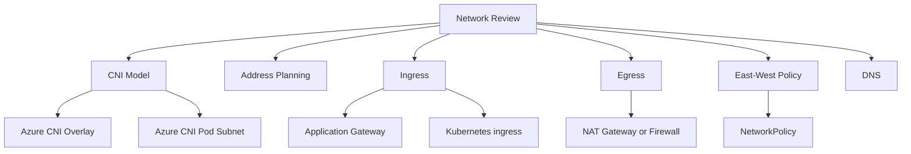

---
content_sources:
  diagrams:
  - id: best-practices-networking
    type: flowchart
    source: mslearn-adapted
    mslearn_url: https://learn.microsoft.com/en-us/azure/aks/best-practices
    based_on:
    - https://learn.microsoft.com/en-us/azure/aks/best-practices
    - https://learn.microsoft.com/en-us/azure/architecture/reference-architectures/containers/aks/secure-baseline-aks
    - https://learn.microsoft.com/en-us/azure/aks/concepts-network
    - https://learn.microsoft.com/en-us/azure/aks/use-network-policies
    - https://learn.microsoft.com/en-us/azure/aks/concepts-security
    - https://learn.microsoft.com/en-us/azure/aks/cluster-autoscaler
    - https://learn.microsoft.com/en-us/azure/azure-monitor/containers/container-insights-overview
    - https://learn.microsoft.com/en-us/azure/aks/azure-cni-overlay
content_validation:
  status: verified
  last_reviewed: 2026-05-21
  reviewer: agent
  core_claims:
    - claim: "Microsoft Learn states that kubenet networking for AKS is scheduled for retirement on 31 March 2028."
      source: https://learn.microsoft.com/azure/aks/operator-best-practices-network
      verified: true
    - claim: "Azure CNI Overlay assigns pods IP addresses from a logically separate private CIDR instead of the node subnet."
      source: https://learn.microsoft.com/azure/aks/azure-cni-overlay
      verified: true
    - claim: "AKS network best practices cover IP planning, load balancers, ingress controllers, and WAF integration."
      source: https://learn.microsoft.com/azure/aks/operator-best-practices-network
      verified: true
---

# Networking

AKS networking decisions define pod reachability, IP consumption, ingress ownership, egress control, DNS behavior, and how quickly teams can isolate a connectivity failure.

## Why This Matters

Networking is expensive to change after workloads are live. CNI mode, subnet sizing, private access, ingress controllers, egress paths, and network policy should be reviewed before teams rely on the cluster.

<!-- diagram-id: best-practices-networking -->

## Recommended Practices

### Practice 1: Choose the CNI model deliberately

Use Azure CNI Overlay when you need Azure CNI integration without consuming VNet IPs per pod. Use routable pod IP models only when the design requires pods to be directly reachable from the virtual network and the IP plan can support that growth.

### Practice 2: Reserve IP space for scale and upgrades

Subnet and pod CIDR planning must include current replicas, autoscaler expansion, upgrade surge, and future node pools. A cluster that has enough addresses for steady state can still fail during an upgrade or scale event.

### Practice 3: Assign a single ingress ownership model

Pick who owns north-south traffic: the platform team, network team, or application team. Application Gateway-based ingress is usually a better fit when centralized WAF and Azure edge ownership matter. Kubernetes-native ingress controllers are better when application teams need flexible in-cluster routing and can own the operational lifecycle.

### Practice 4: Design egress explicitly

Do not rely on accidental outbound paths. Document whether egress leaves through a load balancer, NAT Gateway, Azure Firewall, or another controlled path. Private clusters and regulated environments should treat outbound dependencies as an allowlist, not an afterthought.

### Practice 5: Enforce east-west boundaries

NetworkPolicy should express which namespaces and services may communicate. Start with namespace boundaries and tighten toward workload identity as service ownership matures.

### Practice 6: Include DNS and private endpoint behavior in the review

Private clusters, private endpoints, and custom DNS can fail in ways that look like application defects. DNS ownership, conditional forwarding, and troubleshooting commands should be part of the networking runbook.

## Common Mistakes / Anti-Patterns

### Anti-Pattern 1: Choosing CNI based only on a quickstart

A quickstart optimizes for speed. Production design must optimize for address growth, route control, and operational ownership.

### Anti-Pattern 2: Multiple unmanaged ingress controllers

Several ingress controllers can coexist, but only when ingress classes, certificates, DNS records, and support boundaries are explicit.

### Anti-Pattern 3: Network policy without default-deny intent

Policies that only add allow rules without a boundary model rarely produce meaningful isolation.

### Anti-Pattern 4: Ignoring kubenet retirement planning

Kubenet retirement requires migration planning. Do not create new designs that depend on a networking mode with a published retirement path.

## Validation Checklist

- CNI mode and pod address plan are documented.
- Subnets account for node pools, autoscaler growth, and upgrade surge.
- Ingress owner, ingress class, certificate owner, and DNS owner are recorded.
- Egress path and allowed destinations are documented.
- NetworkPolicy baseline exists for production namespaces.
- DNS resolution path is tested for public, private, and Azure service endpoints.

## Review Matrix

| Review area | Page-specific check |
|---|---|
| Scope | Confirm the guidance applies to Networking. |
| Source basis | Validate the recommendation against the Microsoft Learn sources in this page. |
| Evidence | Capture command output, portal state, metrics, logs, or screenshots before treating the result as proven. |

## See Also

- [Networking Models](../platform/networking-models.md)
- [Ingress and Load Balancing](../platform/ingress-load-balancing.md)
- [CNI IP Exhaustion](../troubleshooting/playbooks/node-issues/cni-ip-exhaustion.md)
- [Service Unreachable](../troubleshooting/playbooks/connectivity/service-unreachable.md)

## Sources

- [AKS network best practices](https://learn.microsoft.com/azure/aks/operator-best-practices-network)
- [Azure CNI Overlay](https://learn.microsoft.com/azure/aks/azure-cni-overlay)
- [CNI networking concepts](https://learn.microsoft.com/azure/aks/concepts-network-cni-overview)
- [Network policy best practices](https://learn.microsoft.com/azure/aks/network-policy-best-practices)
