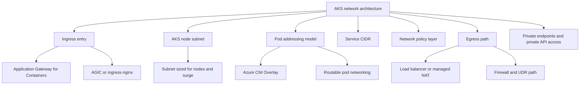

---
content_sources:
  diagrams:
    - id: best-practices-networking
      type: flowchart
      source: mslearn-adapted
      mslearn_url: https://learn.microsoft.com/en-us/azure/aks/concepts-network
      based_on:
        - https://learn.microsoft.com/en-us/azure/aks/concepts-network
        - https://learn.microsoft.com/en-us/azure/aks/azure-cni-overlay
        - https://learn.microsoft.com/en-us/azure/aks/configure-azure-cni
        - https://learn.microsoft.com/en-us/azure/aks/use-network-policies
        - https://learn.microsoft.com/en-us/azure/aks/egress-outboundtype
        - https://learn.microsoft.com/en-us/azure/aks/private-clusters
        - https://learn.microsoft.com/en-us/azure/aks/app-gateway-ingress-controller-overview
content_validation:
  status: verified
  last_reviewed: 2026-07-18
  reviewer: agent
  core_claims:
    - claim: "Azure CNI Overlay assigns pod IP addresses from a private CIDR that is logically different from the VNet subnet used by AKS nodes."
      source: https://learn.microsoft.com/en-us/azure/aks/azure-cni-overlay
      verified: true
    - claim: "Azure CNI Pod Subnet assigns pod IP addresses from a separate subnet in the virtual network."
      source: https://learn.microsoft.com/en-us/azure/aks/configure-azure-cni
      verified: true
    - claim: "By default, all pods in an AKS cluster can send and receive traffic without limitations."
      source: https://learn.microsoft.com/en-us/azure/aks/use-network-policies
      verified: true
    - claim: "AKS supports multiple outbound types to control egress design."
      source: https://learn.microsoft.com/en-us/azure/aks/egress-outboundtype
      verified: true
---

# Networking

AKS networking should define how traffic enters the cluster, how pods receive addresses, how east-west traffic is constrained, and how outbound dependencies are reached. This page owns those design choices so teams can separate network architecture from security, governance, and cost policy details.

## Why This Matters
<!-- diagram-id: best-practices-networking -->


Most AKS networking incidents are design mistakes discovered late: exhausted subnets during scale-out, ingress patterns that do not match the application boundary, uncontrolled outbound paths, and east-west traffic that stayed default-allow too long. Deciding these patterns early reduces disruptive rework after workloads are live.

Network architecture also determines which teams own routing, DNS, firewall rules, and IP allocations. A clear design prevents the common failure mode where the platform team assumes Azure handles a path automatically while the network team assumes AKS is isolated from shared enterprise controls.

## Recommended Practices

### 1. Choose one pod networking model on purpose

Use **Azure CNI Overlay** when you want simpler VNet IP planning and do not need each pod IP to be directly routable inside the virtual network. Use **flat or routable pod networking** only when downstream network controls, inspection tools, or legacy integrations require pod IPs to be first-class addresses.

Recommended decision points:

- Prefer Overlay for most new multi-team clusters because pod growth does not consume node-subnet IPs.
- Prefer routable pod networking only when a real requirement exists for pod-level reachability or subnet-based network controls.
- Document the ownership boundary: who manages VNet routes, who owns pod CIDR allocation, and who approves exceptions.

Review the active network profile during design validation:

```bash
az aks show \
    --resource-group "$RG" \
    --name "$CLUSTER_NAME" \
    --query "networkProfile" \
    --output json
```

This command confirms the cluster's network plugin, plugin mode, policy engine, outbound type, and CIDR settings before application onboarding starts.

### 2. Treat IP planning as a scale and upgrade requirement

Size node subnets, pod CIDRs, and service CIDRs for the cluster's **peak** state, not its first deployment. Headroom must cover autoscaler growth, upgrade surge, replacement nodes, and future node pools.

Plan for these questions up front:

- How many nodes can exist during the largest expected surge or upgrade window?
- Does the chosen CNI model consume VNet IPs for pods, for nodes only, or from a separate pod subnet?
- Are service CIDRs large enough to avoid overlapping with existing on-premises, peered, or private endpoint ranges?
- Can a new node pool be added later without renumbering the cluster?

Check the current subnet allocation before increasing node-pool ceilings:

```bash
az network vnet subnet show \
    --resource-group "$RG" \
    --vnet-name "$VNET_NAME" \
    --name "$AKS_SUBNET_NAME" \
    --query "{addressPrefix:addressPrefix,routeTable:routeTable.id,natGateway:natGateway.id}" \
    --output json
```

This command shows whether the AKS node subnet is already tied to route or NAT decisions that affect scale headroom.

### 3. Standardize ingress around a small set of supported topologies

Do not let each workload team choose a different ingress pattern. Standardize a short list based on whether traffic is north-south internet traffic, private east-west traffic, or internal-only enterprise traffic.

Recommended topology choices:

| Requirement | Preferred topology | Design note |
|---|---|---|
| New Application Gateway-based ingress | Application Gateway for Containers | Good fit when you want a managed ingress layer aligned to Azure application delivery patterns |
| Existing estate already standardized on Application Gateway integration | AGIC | Keep when the operational model is already built around Application Gateway |
| Kubernetes-native ingress with platform-owned configuration | ingress-nginx | Good fit when the team wants in-cluster ingress behavior and explicit controller ownership |
| Internal-only application entry | Internal ingress endpoint | Use private load-balancing paths instead of exposing a public frontend |

Validate Kubernetes ingress exposure during reviews:

```bash
kubectl get ingress \
    --all-namespaces \
    --output wide
```

This command helps confirm which namespaces publish ingress objects and whether the expected internal or external address is being assigned.

Keep detailed private API access procedures in [Private Cluster API Connectivity](private-cluster-api-connectivity.md). This page stays at the topology decision level only.

### 4. Design egress paths explicitly instead of accepting the default path

Egress architecture affects SNAT behavior, firewall inspection, private endpoint reachability, and incident response. Pick an outbound model that matches the enterprise network path before the cluster starts calling external registries, databases, or SaaS APIs.

Design review topics:

- Which `outboundType` matches the landing zone: managed load balancer, user-defined routing, NAT Gateway, or another approved enterprise path?
- Where can SNAT exhaustion occur during fan-out traffic or burst scale events?
- Which destinations must stay on private routing through private endpoints instead of public internet egress?
- If Azure Firewall or another appliance is in the path, who owns route tables and exception workflows?

Inspect the configured outbound type:

```bash
az aks show \
    --resource-group "$RG" \
    --name "$CLUSTER_NAME" \
    --query "networkProfile.outboundType" \
    --output tsv
```

This command confirms whether the cluster is using the expected egress pattern before teams depend on firewall or NAT assumptions.

For idle public IP and load balancer cost posture, use [Cost Optimization](cost-optimization.md) instead of restating that guidance here.

### 5. Start network policy from the intended trust boundary

AKS starts with pod-to-pod traffic effectively open. Move to a **default-deny mindset** for production namespaces, then choose the enforcement engine that matches the required feature set and migration path.

Practical decision points:

- **Azure CNI Powered by Cilium** is a strong default for new AKS network policy designs when the cluster uses Azure CNI, because it provides an eBPF-based policy engine managed by AKS.
- **Azure NPM** should be treated as a platform compatibility choice, not an automatic default.
- **Calico** is appropriate when teams already depend on its policy model or operational patterns.
- Policy enforcement design belongs here; policy enforcement governance belongs in [Governance](governance.md).

Confirm the network policy engine and baseline objects:

```bash
az aks show \
    --resource-group "$RG" \
    --name "$CLUSTER_NAME" \
    --query "networkProfile.networkPolicy" \
    --output tsv
```

This command verifies which policy engine the cluster was built with.

```bash
kubectl get networkpolicy \
    --all-namespaces \
    --output wide
```

This command verifies whether production namespaces actually have policy objects instead of relying on undocumented trust.

Keep workload identity, secret access, and Kubernetes or Azure RBAC details in [Security](security.md).

### 6. Use private cluster networking when control-plane isolation is a design requirement

Choose a private cluster design when platform operators, compliance boundaries, or enterprise network policy require API access to stay on private addressing. Make the decision based on network isolation goals, not because a private cluster is assumed to be a universal default.

Private design is usually appropriate when:

- Administrative access must traverse private network paths or approved jump environments.
- The cluster is part of a broader private endpoint and private DNS architecture.
- Internet-exposed API server access would conflict with landing zone controls.

Keep this page at the design level. For connection troubleshooting, DNS path checks, and operator runbooks, use [Private Cluster API Connectivity](private-cluster-api-connectivity.md).

## Common Mistakes / Anti-Patterns

- **Picking routable pod networking without a real routing requirement**: This increases IP-management complexity for little gain. If your main goal is scale simplicity, use Overlay instead.
- **Sizing subnets for day-one nodes only**: This is a recurring platform anti-pattern. Keep the local rule simple: if the subnet cannot absorb autoscaler growth and upgrade surge, the design is incomplete. See [Common Anti-Patterns](common-anti-patterns.md).
- **Running both internal and external ingress without an ownership model**: Mixed ingress paths create inconsistent TLS, WAF, and troubleshooting behavior. Standardize which controller handles each exposure type.
- **Treating egress as "whatever the cluster does by default"**: Unplanned outbound paths hide SNAT risk and break private endpoint assumptions when enterprise routing is added later.
- **Leaving east-west traffic default-allow in production namespaces**: This is also cataloged in [Common Anti-Patterns](common-anti-patterns.md). Keep the local rule brief: define the trust boundary first, then encode it with the chosen policy engine.

## Validation Checklist

- The cluster networking design explicitly chooses Azure CNI Overlay or a routable pod model and records why.
- Pod CIDRs, service CIDRs, and node-subnet ranges include autoscaler and upgrade-surge headroom.
- The ingress standard is limited to approved topologies, with clear internal versus external exposure rules.
- The egress path is documented, including outbound type, NAT or firewall ownership, and private endpoint routing expectations.
- The network policy posture is defined as default-allow by exception or default-deny by design, with an explicit engine choice.
- The decision to use or not use a private cluster is based on control-plane isolation requirements, not habit.

## See Also

- [Production Baseline](production-baseline.md)
- [Security](security.md)
- [Governance](governance.md)
- [Cost Optimization](cost-optimization.md)
- [Private Cluster API Connectivity](private-cluster-api-connectivity.md)
- [Platform: Networking Models](../platform/networking-models.md)
- [Platform: Outbound Networking](../platform/outbound-networking.md)

## Sources

- [AKS network concepts](https://learn.microsoft.com/en-us/azure/aks/concepts-network)
- [Azure CNI Overlay networking](https://learn.microsoft.com/en-us/azure/aks/azure-cni-overlay)
- [Configure Azure CNI Pod Subnet](https://learn.microsoft.com/en-us/azure/aks/configure-azure-cni)
- [Use network policies in AKS](https://learn.microsoft.com/en-us/azure/aks/use-network-policies)
- [Customize cluster egress with outbound types in AKS](https://learn.microsoft.com/en-us/azure/aks/egress-outboundtype)
- [Create private AKS clusters](https://learn.microsoft.com/en-us/azure/aks/private-clusters)
- [Application Gateway Ingress Controller overview](https://learn.microsoft.com/en-us/azure/aks/app-gateway-ingress-controller-overview)
