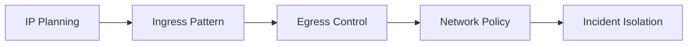

# Networking

Networking decisions in AKS affect security, operability, and scale limits. Treat VNet design, pod addressing, ingress, and egress control as platform architecture, not app-team detail.

## Why This Matters

Poor networking choices show up later as IP exhaustion, unpredictable routing, and difficult incident triage.

## Recommended Practices

- Standardize on one supported network model per landing zone when possible.
- Reserve enough address space for node and pod growth.
- Choose one ingress standard for internet-facing and one for internal workloads.
- Use private clusters or private ingress where business requirements demand it.
- Document DNS ownership for private endpoints and internal services.

## Common Mistakes / Anti-Patterns

- Choosing a tiny subnet and discovering autoscaler cannot add nodes.
- Mixing multiple ingress patterns without ownership rules.
- Assuming network policy exists because a CNI plugin was selected.
- Treating Service type LoadBalancer as the default for every application.

## Validation Checklist

- [ ] Subnet and IP growth model is documented.
- [ ] Public and private exposure standards are documented.
- [ ] Network policy enforcement is enabled and tested.
- [ ] DNS and private endpoint ownership is clear.

## See Also

- [Networking Models](../platform/networking-models.md)
- [Ingress and Load Balancing](../platform/ingress-load-balancing.md)
- [Node Not Ready](../troubleshooting/playbooks/node-issues/node-not-ready.md)

## Sources

- [AKS network concepts](https://learn.microsoft.com/azure/aks/concepts-network)
- [Create an AKS cluster with Azure CNI Overlay](https://learn.microsoft.com/azure/aks/azure-cni-overlay)
- [AKS best practices overview](https://learn.microsoft.com/azure/aks/best-practices)
- [AKS secure baseline architecture](https://learn.microsoft.com/azure/architecture/reference-architectures/containers/aks/secure-baseline-aks)
