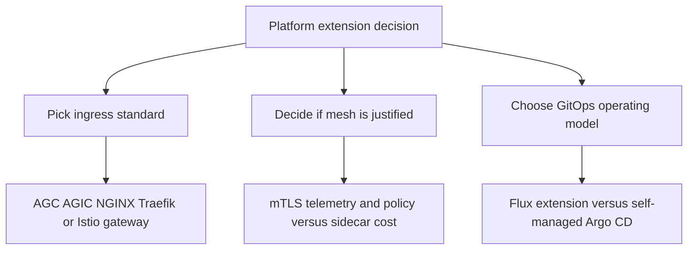

# Platform Extensions

AKS platform extensions are useful only when they simplify cluster operations more than they complicate them. This page focuses on choosing the right extension model instead of enabling every capability at once.

## Why This Matters

<!-- diagram-id: best-practices-platform-extensions-decision-flow -->

Extension sprawl is a reliability problem. Each additional controller or sidecar adds upgrade sequencing, support boundaries, permissions, and cluster resource pressure.

## Recommended Practices

### Practice 1: Use an ingress controller decision matrix instead of team-by-team exceptions

**Why**: Ingress choices tend to calcify early. If every team picks a different controller, incident response, TLS management, and WAF posture all become inconsistent.

**How**:

Use one platform-owned matrix and force new workload reviews through it.

| Option | Choose it when | Avoid it when |
|---|---|---|
| **Application Gateway for Containers** | You want Azure-managed ingress and a Gateway API direction | You are locked into existing AGIC operational patterns for the near term |
| **AGIC** | You already operate classic Application Gateway estates and need brownfield continuity | You are standardizing greenfield ingress around Gateway API |
| **ingress-nginx** | You need broad ecosystem compatibility or already depend on NGINX behavior | You have no long-term migration plan beyond the documented retirement timeline |
| **Traefik** | A team already has strong Traefik platform standards outside Azure | You want one Azure-managed ingress standard for most clusters |
| **Istio gateway** | Ingress policy is part of a wider service-mesh decision | Your requirement is only basic north-south routing |

Operator decision criteria:

1. Does the platform want Azure-managed ingress outside the cluster?
2. Does the platform standardize on Gateway API?
3. Is WAF integration required at the edge?
4. Is ingress part of a service-mesh operating model?
5. Is the cluster brownfield with an existing controller the team cannot yet replace?

### Practice 2: Adopt a service mesh only when the problem is bigger than ingress

**Why**: Mesh adoption is expensive. The value appears only when platform teams need service-to-service policy, mTLS, and rich telemetry at scale.

**How**:

- Start with plain ingress plus Kubernetes-native networking unless you need mesh-only capabilities.
- Use the managed Istio add-on when the platform needs supported mesh lifecycle on AKS.
- Model sidecar overhead explicitly in capacity planning.
- Treat mTLS posture as a platform security decision, not as an optional app feature.

Use this readiness test:

| Signal | Mesh justified? |
|---|---|
| Need canary and retry policy only at the edge | Usually no |
| Need service-to-service mTLS across many namespaces | Usually yes |
| Need per-hop tracing and uniform telemetry | Often yes |
| Need only one or two internal retries in app code | Usually no |

Sidecar trade-off checklist:

- budget CPU and memory for `istio-proxy`,
- account for slower startup and restart behavior,
- verify observability gains are worth the resource tax,
- define where strict mTLS is required versus where permissive rollout is acceptable.

### Practice 3: Treat GitOps as an operating model not just a deployment tool

**Why**: GitOps succeeds when repo ownership and promotion rules are clear. It fails when every team pushes directly to production overlays with no platform contract.

**How**:

- Use the **Flux extension** when Azure-managed lifecycle and pull-based reconciliation are the priority.
- Use **self-managed Argo CD** only when Argo-native UX or application constructs are a real requirement.
- Separate cluster baseline, shared services, and app repos.
- Promote environments by merge or release flow, not by editing production objects by hand.

Recommended multi-tenant repo model:

| Layer | Ownership | Example content |
|---|---|---|
| Platform baseline repo | Platform team | Namespaces, policies, ingress standards, extension config |
| Shared services repo | Platform or service owners | cert-manager, monitoring agents, ingress gateways |
| App repo or app config repo | Application team | Deployments, services, app Helm values, overlays |

Promotion guidance:

1. render and validate in lower environments first,
2. keep overlays small and explicit,
3. avoid direct cluster-side hotfixes that bypass Git,
4. make drift visible and owned.

## Common Mistakes / Anti-Patterns

- Declaring AGC as a universal AGIC replacement without checking workload dependencies.
- Enabling a mesh because it looks like a best practice rather than because the platform needs mesh capabilities.
- Running multiple ingress controllers with no ownership model.
- Adopting GitOps while still allowing routine production changes outside Git.
- Mixing self-managed and managed runtimes for the same extension surface without a migration plan.

## Validation Checklist

- [ ] The platform has a documented default ingress controller for new clusters.
- [ ] Brownfield AGIC or NGINX clusters have a documented migration or exception path.
- [ ] Mesh adoption is tied to mTLS, telemetry, or service-policy requirements.
- [ ] Sidecar overhead is included in node-pool sizing.
- [ ] GitOps repositories separate platform baseline from app delivery.
- [ ] Environment promotion is driven through Git workflow rather than manual kubectl changes.
- [ ] Extension lifecycle ownership is explicit for platform, security, and app teams.

## See Also

- [Application Gateway for Containers](../platform/application-gateway-for-containers.md)
- [Istio Managed Add-on](../platform/istio-managed-addon.md)
- [Flux GitOps Extension](../platform/flux-gitops-extension.md)
- [Dapr Extension](../platform/dapr-extension.md)
- [Reliability](reliability.md)

## Sources

- [What is Application Gateway for Containers?](https://learn.microsoft.com/en-us/azure/application-gateway/for-containers/overview)
- [AKS managed NGINX ingress with the application routing add-on](https://learn.microsoft.com/en-us/azure/aks/app-routing)
- [Istio-based service mesh add-on for AKS](https://learn.microsoft.com/en-us/azure/aks/istio-about)
- [Application deployments with GitOps (Flux v2)](https://learn.microsoft.com/en-us/azure/azure-arc/kubernetes/conceptual-gitops-flux2)
- [Dapr Extension for AKS and Arc-enabled Kubernetes](https://learn.microsoft.com/en-us/azure/aks/dapr-overview)
