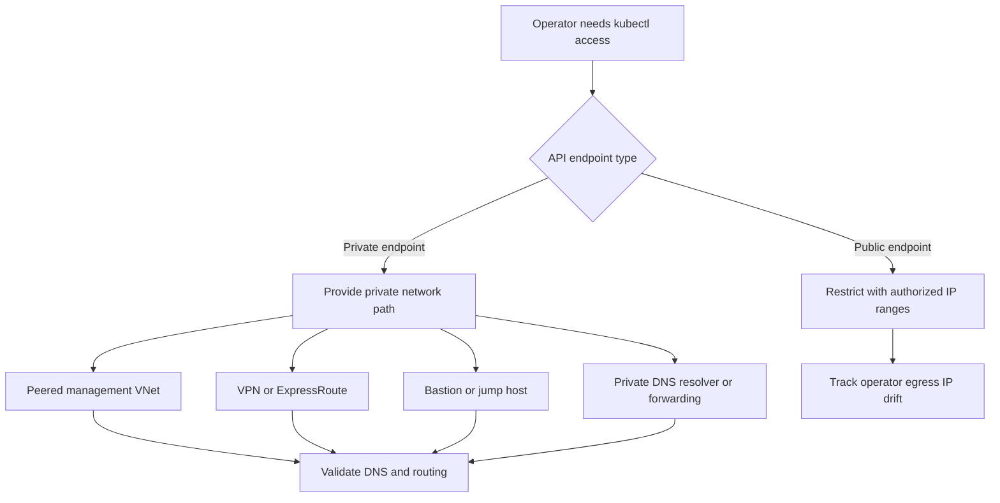

---
content_sources:
  diagrams:
    - id: best-practices-private-api-connectivity
      type: flowchart
      source: self-generated
      justification: Operator access path model synthesized from Microsoft Learn guidance for private clusters, authorized IP ranges, API Server VNet Integration, and restricted egress.
      based_on:
        - https://learn.microsoft.com/en-us/azure/aks/private-clusters
        - https://learn.microsoft.com/en-us/azure/aks/api-server-authorized-ip-ranges
        - https://learn.microsoft.com/en-us/azure/aks/api-server-vnet-integration
        - https://learn.microsoft.com/en-us/azure/aks/outbound-rules-control-egress
content_validation:
  status: verified
  last_reviewed: 2026-07-18
  reviewer: agent
  core_claims:
    - claim: "An AKS private cluster uses a private IP address for the API server endpoint."
      source: https://learn.microsoft.com/en-us/azure/aks/private-clusters
      verified: true
    - claim: "AKS supports API server authorized IP ranges to limit which public IP addresses can access the API server."
      source: https://learn.microsoft.com/en-us/azure/aks/api-server-authorized-ip-ranges
      verified: true
    - claim: "Private clusters require network connectivity from the client environment to the private API endpoint through options such as VNet connectivity, peering, VPN, or ExpressRoute."
      source: https://learn.microsoft.com/en-us/azure/aks/private-clusters
      verified: true
    - claim: "API Server VNet Integration enables API-server-to-node communication through a delegated subnet."
      source: https://learn.microsoft.com/en-us/azure/aks/api-server-vnet-integration
      verified: true
    - claim: "Restricted-egress AKS clusters must still allow the required outbound network rules and FQDNs."
      source: https://learn.microsoft.com/en-us/azure/aks/outbound-rules-control-egress
      verified: true
---

# Private Cluster API Connectivity

AKS API reachability is a networking design problem as much as an identity problem. Private clusters reduce exposure, but they replace internet reachability with explicit DNS, routing, and operator access-path requirements.

## Why This Matters

- `kubectl` succeeds only when the API endpoint is reachable from the operator path, not just when the user has valid credentials.
- Private clusters reduce public exposure, but they add dependency on private DNS resolution, VNet connectivity, and documented jump paths.
- API server authorized IP ranges protect public API endpoints, but they fail quietly when operator egress IPs drift.
- API Server VNet Integration and private cluster private endpoints solve different control-plane problems and should not be treated as interchangeable.

<!-- diagram-id: best-practices-private-api-connectivity -->

## Recommended Practices

### 1. Choose public-restricted API versus private API deliberately

Pick the API exposure model before cluster creation. A public API endpoint with authorized IP ranges can work well for stable operator egress paths. A private cluster is better when API exposure must stay on private address space, but it requires explicit connectivity and DNS design.

### 2. Design operator access paths as first-class infrastructure

Document how operators will reach the API server:

- Peered management VNet
- VPN or ExpressRoute
- Bastion or jump host inside the reachable network
- Private DNS resolver or forwarding path for private API names

Treat the access path as part of the cluster platform, not as an ad hoc on-call workaround.

### 3. Treat private DNS as part of the API contract

For private clusters, validate private FQDN resolution from every operator path. Document who owns the private DNS zone, how zone links or conditional forwarding are maintained, and which runbooks verify name resolution before investigating RBAC or kubeconfig issues.

### 4. Separate API reachability from cluster egress

Private API access does not remove outbound dependency requirements. The cluster still needs required AKS FQDNs and endpoints for cluster operations. If you route egress through UDR, Azure Firewall, or a proxy, keep those dependencies explicitly allowed.

### 5. Understand API Server VNet Integration correctly

API Server VNet Integration places API-server-to-node communication on a delegated subnet. It is not the same thing as the private endpoint model used by private clusters. Use it to reason about control-plane traffic paths, not as a substitute for private cluster connectivity design.

## Common Mistakes / Anti-Patterns

- Treating valid Microsoft Entra or Kubernetes RBAC credentials as proof that the API endpoint is reachable.
- Enabling a private cluster without documenting DNS zone ownership, forwarding, and validation steps.
- Assuming authorized IP ranges protect a private-endpoint-only access path.
- Conflating API Server VNet Integration with private cluster private endpoint behavior.
- Assuming private API access removes the need to allow required AKS outbound dependencies.

## Validation Checklist

- Confirm whether the cluster uses a public API endpoint with `--api-server-authorized-ip-ranges` or a private API endpoint with `--enable-private-cluster`.
- Validate name resolution for the API FQDN from each operator environment.
- Verify at least one tested break-glass path exists from a reachable network.
- Record the expected operator egress IPs if authorized IP ranges are used.
- Confirm outbound dependency allow rules remain in place for restricted-egress environments.

## See Also

- [Outbound Networking](../platform/outbound-networking.md)
- [Cluster Creation](../operations/cluster-creation.md)
- [API Server / kubectl Unreachable](../troubleshooting/playbooks/networking/api-server-kubectl-unreachable.md)

## Sources

- [Create a private Azure Kubernetes Service cluster](https://learn.microsoft.com/en-us/azure/aks/private-clusters)
- [Secure access to the API server using authorized IP address ranges in AKS](https://learn.microsoft.com/en-us/azure/aks/api-server-authorized-ip-ranges)
- [API Server VNet Integration in AKS](https://learn.microsoft.com/en-us/azure/aks/api-server-vnet-integration)
- [Control egress traffic for cluster nodes in AKS](https://learn.microsoft.com/en-us/azure/aks/outbound-rules-control-egress)
