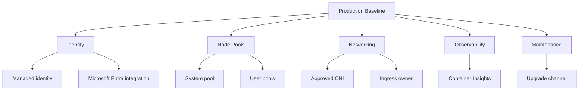

---
content_sources:
  diagrams:
  - id: best-practices-production-baseline
    type: flowchart
    source: mslearn-adapted
    mslearn_url: https://learn.microsoft.com/en-us/azure/aks/best-practices
    based_on:
    - https://learn.microsoft.com/en-us/azure/aks/best-practices
    - https://learn.microsoft.com/en-us/azure/architecture/reference-architectures/containers/aks/secure-baseline-aks
    - https://learn.microsoft.com/en-us/azure/aks/concepts-network
    - https://learn.microsoft.com/en-us/azure/aks/use-network-policies
    - https://learn.microsoft.com/en-us/azure/aks/operator-best-practices-pod-security
    - https://learn.microsoft.com/en-us/azure/aks/cluster-autoscaler
    - https://learn.microsoft.com/en-us/azure/azure-monitor/containers/container-insights-overview
    - https://learn.microsoft.com/en-us/azure/aks/learn/quick-kubernetes-deploy-cli
content_validation:
  status: verified
  last_reviewed: 2026-05-21
  reviewer: agent
  core_claims:
    - claim: "AKS uses a Microsoft-managed control plane and customer-managed worker nodes."
      source: https://learn.microsoft.com/azure/aks/concepts-clusters-workloads
      verified: true
    - claim: "The AKS secure baseline architecture includes identity, network, monitoring, and security controls for production clusters."
      source: https://learn.microsoft.com/azure/architecture/reference-architectures/containers/aks/secure-baseline-aks
      verified: true
    - claim: "AKS upgrade guidance recommends planned maintenance, surge settings, and validation to reduce production disruption."
      source: https://learn.microsoft.com/azure/aks/upgrade-cluster
      verified: true
---

# Production Baseline

A production baseline is the minimum cluster shape that teams can repeatedly deploy, operate, and audit. It should be boring, explicit, and easy to compare across environments.

## Why This Matters

Most AKS incidents are harder when every cluster has different identity settings, node pool layouts, logging defaults, ingress ownership, and upgrade behavior. A baseline turns those defaults into a reviewed platform contract.

<!-- diagram-id: best-practices-production-baseline -->

## Recommended Practices

### Practice 1: Define the supported cluster archetypes

Keep a short list of approved archetypes, such as public ingress, private ingress, regulated workload, batch workload, and GPU workload. Each archetype should define network mode, ingress pattern, node pool requirements, logging, policy, and upgrade expectations.

### Practice 2: Separate system and user pools

System add-ons need predictable capacity and taints should prevent general workloads from consuming that capacity. User pools should be sized and scaled around workload behavior, not cluster add-ons.

### Practice 3: Standardize identity at cluster creation

Use managed identity, Microsoft Entra integration, Kubernetes RBAC or Azure RBAC as appropriate, and workload identity for Azure resource access. Do not allow service principals or long-lived credentials to become the default deployment model.

### Practice 4: Enable observability before workload onboarding

Container Insights, control plane diagnostic settings, and alert routing should exist before the first production namespace is handed to an application team. Retrofitting logging during an incident usually leaves blind spots.

### Practice 5: Set an upgrade and maintenance policy

Document the Kubernetes version support plan, node image upgrade cadence, maintenance windows, surge settings, and who approves exceptions. A cluster that cannot be upgraded safely is not production-ready.

## Common Mistakes / Anti-Patterns

### Anti-Pattern 1: Baseline as a diagram only

A diagram is not a baseline unless it maps to deployable infrastructure, policy assignments, and operational checks.

### Anti-Pattern 2: Shared user workloads on the system pool

This saves a small amount of compute but risks CoreDNS, ingress, metrics, and other cluster-critical components during workload spikes.

### Anti-Pattern 3: Logging after go-live

If dashboards and alerts appear after the first outage, the baseline failed its operational purpose.

## Validation Checklist

- Approved archetype is recorded for the cluster.
- System and user pools are separated.
- Microsoft Entra and managed identity settings are visible in the cluster configuration.
- Container Insights and diagnostic settings are enabled.
- Upgrade channel, maintenance window, and owner are documented.

## See Also

- [Cluster Architecture](../platform/cluster-architecture.md)
- [Node Pools](../platform/node-pools.md)
- [Monitoring and Logging](../operations/monitoring-logging.md)
- [Security](security.md)
- [Reliability](reliability.md)

## Sources

- [AKS best practices](https://learn.microsoft.com/azure/aks/best-practices)
- [Baseline architecture for an AKS cluster](https://learn.microsoft.com/azure/architecture/reference-architectures/containers/aks/secure-baseline-aks)
- [AKS cluster architecture concepts](https://learn.microsoft.com/azure/aks/concepts-clusters-workloads)
