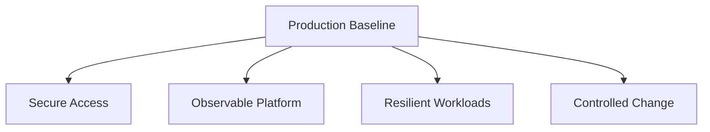

# Production Baseline

A production AKS cluster needs a baseline that covers identity, network boundaries, workload governance, observability, and recovery expectations before any application team goes live.

## Why This Matters

Without a baseline, every team re-invents cluster policy and the platform becomes inconsistent and hard to operate.

## Recommended Practices

- Use managed identity and Microsoft Entra ID integration.
- Keep dedicated system and user node pools.
- Enable monitoring, alerts, and audit log retention.
- Require resource requests, limits, probes, and PodDisruptionBudgets for critical workloads.
- Use private registries and approved ingress patterns.
- Define upgrade cadence, maintenance windows, and rollback expectations.

## Common Mistakes / Anti-Patterns

- One shared namespace with no quotas or ownership boundaries.
- Default-allow east-west traffic.
- No baseline node image or Kubernetes version policy.
- Logging enabled but never reviewed or alerted.

## Validation Checklist

- [ ] Cluster identity model is documented.
- [ ] Network plugin and ingress standard are documented.
- [ ] Namespace, RBAC, and quota standards exist.
- [ ] Upgrade and incident runbooks exist.
- [ ] Monitoring and alert ownership is assigned.

## See Also

- [Best Practices](index.md)
- [Security](security.md)
- [Resource Governance](resource-governance.md)
- [Cluster Creation](../operations/cluster-creation.md)

## Sources

- [AKS best practices overview](https://learn.microsoft.com/azure/aks/best-practices)
- [AKS secure baseline architecture](https://learn.microsoft.com/azure/architecture/reference-architectures/containers/aks/secure-baseline-aks)
