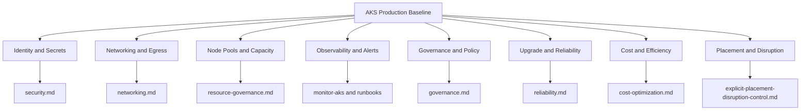

---
content_sources:
  diagrams:
    - id: best-practices-production-baseline
      type: flowchart
      source: mslearn-adapted
      mslearn_url: https://learn.microsoft.com/en-us/azure/aks/best-practices
      based_on:
        - https://learn.microsoft.com/en-us/azure/aks/best-practices
        - https://learn.microsoft.com/en-us/azure/architecture/reference-architectures/containers/aks/secure-baseline-aks
        - https://learn.microsoft.com/en-us/azure/aks/learn/quick-kubernetes-deploy-cli
        - https://learn.microsoft.com/en-us/azure/aks/monitor-aks
content_validation:
  status: verified
  last_reviewed: 2026-07-18
  reviewer: agent
  core_claims:
    - claim: "A system-assigned managed identity is enabled by default when you create a new AKS cluster."
      source: https://learn.microsoft.com/en-us/azure/aks/system-assigned-managed-identity
      verified: true
    - claim: "User node pools may contain zero or more nodes."
      source: https://learn.microsoft.com/en-us/azure/aks/create-node-pools
      verified: true
    - claim: "AKS control plane logs are available as Azure Monitor resource logs and aren't collected until you create a diagnostic setting."
      source: https://learn.microsoft.com/en-us/azure/aks/monitor-aks
      verified: true
    - claim: "You can enable Microsoft Entra ID and Azure RBAC for Kubernetes authorization when you create an AKS cluster."
      source: https://learn.microsoft.com/en-us/azure/aks/learn/quick-kubernetes-deploy-cli
      verified: true
---

# Production Baseline

Use this page as the umbrella go-live checklist for AKS platform readiness. It defines the minimum cluster baseline, the review questions that must be answered before workloads onboard, and where to hand off deeper design decisions to the focused best-practices pages.

## Why This Matters
<!-- diagram-id: best-practices-production-baseline -->


AKS production failures often start before the first workload deploys: missing ownership, unclear network posture, mixed system and application capacity, or no upgrade and monitoring gate. A concise platform baseline prevents every cluster from becoming a one-off exception that is harder to secure, operate, and review.

## Recommended Practices

### Practice 1: Define the go-live readiness gate before workload onboarding

Treat the baseline as a formal entry gate, not a best-effort aspiration. Before any workload is admitted, the platform team should be able to answer: which identity model is enabled, which network posture was chosen, where system components run, where logs and alerts land, how upgrades are rehearsed, and who approves exceptions.

What must exist before onboarding workloads:

| Baseline area | Minimum production expectation | Own the details here |
|---|---|---|
| Identity | Managed identity, Microsoft Entra integration, Azure RBAC, and Workload Identity enabled for the cluster baseline | [security.md](security.md) |
| Networking | Public or private cluster posture selected, ingress standard chosen, and egress path documented | [networking.md](networking.md) |
| Node pools | Separate system and user pools, with headroom for system services and onboarding capacity | [resource-governance.md](resource-governance.md) |
| Observability | Diagnostic settings, cluster monitoring, log destination, and baseline alerts configured | [../operations/monitoring-logging.md](../operations/monitoring-logging.md) |
| Upgrade readiness | Supported version plan, maintenance ownership, and rollback expectations defined | [reliability.md](reliability.md) |
| Governance | Required policy, security, and image-admission controls approved for the cluster class | [governance.md](governance.md) |
| Cost | Budget guardrails and cost-review cadence assigned before scale-out begins | [cost-optimization.md](cost-optimization.md) |

### Practice 2: Standardize the reference architecture posture for public and private baselines

Every production cluster should start from one of two approved postures: a public baseline with tightly defined ingress and control-plane exposure, or a private baseline with private API connectivity and explicit operator access paths. In both variants, keep system and user node pools separate, use managed identity, enable Azure RBAC and Workload Identity, and wire diagnostic settings plus baseline alerts from day one.

Use this command to confirm that the cluster baseline flags match the approved posture before onboarding workloads:

```bash
az aks show \
    --resource-group "$RG" \
    --name "$CLUSTER_NAME" \
    --query "{identity:identity.type,azureRbac:aadProfile.enableAzureRbac,privateCluster:apiServerAccessProfile.enablePrivateCluster,oidcIssuer:oidcIssuerProfile.enabled,workloadIdentity:securityProfile.workloadIdentity.enabled}" \
    --output yaml
```

| Command | Purpose |
| --- | --- |
| `az aks show` | Show the cluster identity and security posture. |
| `--resource-group` | Resource group that contains the AKS cluster. |
| `--name` | Name of the AKS cluster. |
| `--query` | Selects identity, RBAC, private cluster, and workload identity fields. |
| `--output` | Output format for the result. |

This verification is only the umbrella posture check. Delegate CNI, pod IP planning, ingress controller choice, outbound dependencies, and private API connectivity patterns to [networking.md](networking.md) and [private-cluster-api-connectivity.md](private-cluster-api-connectivity.md).

### Practice 3: Assign explicit platform ownership boundaries

Production AKS is an operating model, not just a cluster deployment. Make ownership explicit so cluster teams know who approves ingress changes, who manages policy rollouts, who owns namespace lifecycle, who executes upgrades, and who leads first response during incidents.

| Platform concern | Minimum owner question |
|---|---|
| Cluster baseline | Which team owns cluster creation, landing-zone integration, and approved add-ons? |
| Ingress | Which team owns ingress class standards, certificates, and external exposure changes? |
| Policy and security controls | Which team can enforce or exempt Azure Policy, Defender, Pod Security Standards, and image controls? |
| Namespaces and tenancy | Which team approves namespace creation, quotas, and tenancy boundaries? |
| Upgrades | Which team owns version cadence, maintenance windows, surge planning, and rollback communication? |
| Incident response | Which team is paged first for control-plane, node-pool, ingress, and policy-induced outages? |

The implementation mechanics for runtime hardening, secrets, quotas, PSS rollout, and upgrade safety belong in the focused pages: [security.md](security.md), [resource-governance.md](resource-governance.md), [governance.md](governance.md), and [reliability.md](reliability.md).

### Practice 4: Enable the mandatory baseline controls before application teams self-serve

The baseline should provide safe defaults before developer onboarding begins: system and user pool separation, managed identity, Azure RBAC, Workload Identity, cluster monitoring, control-plane diagnostic settings, and a starter alert set for API-server health, node readiness, and cluster capacity signals. That keeps new namespaces from inheriting an unobservable or weakly governed platform.

Use this command to confirm that namespaces are onboarding into an already-structured platform rather than an empty cluster shell:

```bash
kubectl get namespaces \
    --show-labels
```

Review this output to confirm that namespace ownership and tenancy conventions are present before application teams start deploying workloads. Then use [resource-governance.md](resource-governance.md) for quotas and requests or limits, [governance.md](governance.md) for policy controls, and [security.md](security.md) for runtime hardening, identity, and secrets.

### Practice 5: Use the umbrella page as a decision router, not an implementation dump

Keep this page short on purpose. During design review, use it to classify each unresolved decision and send the reader to the page that owns it instead of repeating detailed guidance here.

| If the question is about... | Go to |
|---|---|
| CNI choice, ingress, egress, routable pod IPs, or private API access | [networking.md](networking.md) and [private-cluster-api-connectivity.md](private-cluster-api-connectivity.md) |
| Runtime hardening, Workload Identity, or secret access patterns | [security.md](security.md) |
| Azure Policy, Defender, Pod Security Standards rollout, or image integrity | [governance.md](governance.md) |
| Namespace quotas, requests or limits, and capacity guardrails | [resource-governance.md](resource-governance.md) |
| Upgrade safety, maintenance windows, or resilience posture | [reliability.md](reliability.md) |
| HPA, cluster autoscaler, KEDA, or NAP mechanics | [autoscaling.md](autoscaling.md) |
| Cost review, SKU efficiency, or spot-pool economics | [cost-optimization.md](cost-optimization.md) |
| Topology spread, PDBs, zones, or workload placement rules | [explicit-placement-disruption-control.md](explicit-placement-disruption-control.md) |

## Common Mistakes / Anti-Patterns

- Treating cluster creation as production readiness. A running AKS cluster is not a go-live baseline unless ownership, monitoring, upgrade readiness, and governance are already assigned.
- Letting the first workload define the platform defaults. If ingress, namespace boundaries, or identity patterns are decided workload by workload, the platform becomes inconsistent immediately.
- Mixing system-critical services and application workloads on the same default pool without a deliberate exception process. This turns capacity spikes into shared outages.
- Enabling deep controls only after onboarding begins. Retrofitting policy, alerts, or Workload Identity after teams are already deployed creates avoidable migration and outage risk.

## Validation Checklist

Use this checklist for design review and go-live approval:

- [ ] The cluster is classified as an approved public or private production baseline.
- [ ] Managed identity, Microsoft Entra integration, Azure RBAC, OIDC issuer, and Workload Identity are enabled for the cluster baseline.
- [ ] System and user node pools are separated, and system capacity is reserved for cluster-critical components.
- [ ] Diagnostic settings and cluster monitoring are enabled, and baseline alerts exist for control-plane health, node readiness, and capacity symptoms.
- [ ] Namespace ownership, ingress ownership, policy ownership, upgrade ownership, and incident-response ownership are explicitly documented.
- [ ] Workload onboarding is blocked until the networking, security, governance, reliability, and resource-governance decisions have owners and approved patterns.
- [ ] Upgrade readiness is reviewed against supported versions, maintenance windows, and rollback communication paths.
- [ ] Budget guardrails and cost-review cadence exist before teams begin scaling out workloads.

## See Also

- [Best Practices overview](index.md)
- [Networking](networking.md)
- [Security](security.md)
- [Governance](governance.md)
- [Resource Governance](resource-governance.md)
- [Reliability](reliability.md)
- [Autoscaling](autoscaling.md)
- [Cost Optimization](cost-optimization.md)
- [Explicit Placement and Disruption Control](explicit-placement-disruption-control.md)
- [Private Cluster API Connectivity](private-cluster-api-connectivity.md)
- [Cluster Architecture](../platform/cluster-architecture.md)
- [Node Pools](../platform/node-pools.md)
- [Identity and Secrets](../platform/identity-and-secrets.md)
- [Monitoring and Logging](../operations/monitoring-logging.md)
- [Upgrade Failure playbook](../troubleshooting/playbooks/operations/upgrade-failure.md)

## Sources

- [AKS best practices](https://learn.microsoft.com/en-us/azure/aks/best-practices)
- [Secure baseline AKS architecture](https://learn.microsoft.com/en-us/azure/architecture/reference-architectures/containers/aks/secure-baseline-aks)
- [Quickstart: Deploy an AKS cluster by using Azure CLI](https://learn.microsoft.com/en-us/azure/aks/learn/quick-kubernetes-deploy-cli)
- [Monitor AKS](https://learn.microsoft.com/en-us/azure/aks/monitor-aks)
