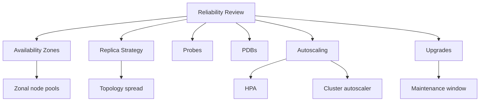

---
content_sources:
  diagrams:
  - id: best-practices-reliability
    type: flowchart
    source: mslearn-adapted
    mslearn_url: https://learn.microsoft.com/en-us/azure/aks/best-practices
    based_on:
    - https://learn.microsoft.com/en-us/azure/aks/best-practices
    - https://learn.microsoft.com/en-us/azure/architecture/reference-architectures/containers/aks/secure-baseline-aks
    - https://learn.microsoft.com/en-us/azure/aks/concepts-network
    - https://learn.microsoft.com/en-us/azure/aks/use-network-policies
    - https://learn.microsoft.com/en-us/azure/aks/concepts-security
    - https://learn.microsoft.com/en-us/azure/aks/cluster-autoscaler
    - https://learn.microsoft.com/en-us/azure/azure-monitor/containers/container-insights-overview
    - https://learn.microsoft.com/en-us/azure/aks/upgrade-cluster
content_validation:
  status: verified
  last_reviewed: 2026-05-21
  reviewer: agent
  core_claims:
    - claim: "AKS reliability best practices include PDBs, probes, topology spread constraints, multiple replicas, availability zones, and autoscaling."
      source: https://learn.microsoft.com/azure/aks/best-practices-app-cluster-reliability
      verified: true
    - claim: "The AKS cluster autoscaler watches unscheduled pods and scales node pools up or down as needed."
      source: https://learn.microsoft.com/azure/aks/cluster-autoscaler-overview
      verified: true
    - claim: "AKS upgrade recommendations include planned maintenance, max surge, PDBs, node drain timeout, and node soak time."
      source: https://learn.microsoft.com/azure/aks/upgrade-cluster
      verified: true
---

# Reliability

AKS reliability is the ability to keep workloads available during node failures, upgrades, scale events, zone incidents, and operator mistakes.

## Why This Matters

Kubernetes can reschedule workloads, but only when applications declare their needs and the cluster has enough capacity, topology, and maintenance discipline to honor them.

<!-- diagram-id: best-practices-reliability -->

## Recommended Practices

### Practice 1: Match availability goals to topology

Use availability zones and topology spread where the workload requires zone-level resilience. Verify storage choices because some persistent volumes are zone-bound.

### Practice 2: Require health probes and resource requests

Readiness, liveness, and startup probes tell Kubernetes when traffic should be sent and when a container needs restart. Resource requests make scheduling predictable and allow autoscalers to make useful decisions.

### Practice 3: Use Pod Disruption Budgets intentionally

PDBs protect workload availability during voluntary disruptions such as upgrades. They can also block maintenance if configured too strictly, so validate them before production changes.

### Practice 4: Combine HPA and cluster autoscaler carefully

HPA adds pods; the cluster autoscaler adds nodes when pending pods cannot be scheduled. Both need realistic requests, limits, and enough max capacity to react to demand.

### Practice 5: Plan upgrades as reliability events

Upgrade settings should include maintenance windows, max surge or max unavailable, node drain timeout, node soak time, and rollback expectations. Test in lower environments before production.

### Practice 6: Keep incident evidence close to the service

A reliability review should confirm dashboards for pod restarts, unschedulable pods, node pressure, API errors, ingress failures, and cluster autoscaler events.

## Common Mistakes / Anti-Patterns

### Anti-Pattern 1: One replica for a production service

A single replica removes Kubernetes' ability to keep service available during node drain or pod failure.

### Anti-Pattern 2: PDBs that block every drain

A PDB with no room for eviction can turn a routine upgrade into a failed maintenance window.

### Anti-Pattern 3: Autoscaler without requests

Autoscaling depends on resource signals. Missing or unrealistic requests make scheduling and scale behavior unpredictable.

### Anti-Pattern 4: Ignoring upgrade surge capacity

Upgrade surge can need extra compute, IP space, and quota. Plan for it before the maintenance window starts.

## Validation Checklist

- Critical workloads run more than one replica.
- Probes and resource requests are required for production deployments.
- PDBs are tested against planned node drain behavior.
- Autoscaler min and max values match expected demand.
- Upgrade settings are documented and tested outside production first.
- Dashboards show node, pod, ingress, and autoscaler health.

## Review Matrix

| Review area | Page-specific check |
|---|---|
| Scope | Confirm the guidance applies to Reliability. |
| Source basis | Validate the recommendation against the Microsoft Learn sources in this page. |
| Evidence | Capture command output, portal state, metrics, logs, or screenshots before treating the result as proven. |

## See Also

- [Scaling](../platform/scaling.md)
- [Node Pool Operations](../operations/node-pool-operations.md)
- [Upgrades](../operations/upgrades.md)
- [Cluster Autoscaler Issues](../troubleshooting/playbooks/cluster-autoscaler-issues.md)

## Sources

- [AKS reliability best practices](https://learn.microsoft.com/azure/aks/best-practices-app-cluster-reliability)
- [Cluster autoscaler overview](https://learn.microsoft.com/azure/aks/cluster-autoscaler-overview)
- [AKS upgrade options and recommendations](https://learn.microsoft.com/azure/aks/upgrade-cluster)
- [AKS patch and upgrade guidance](https://learn.microsoft.com/azure/architecture/operator-guides/aks/aks-upgrade-practices)
