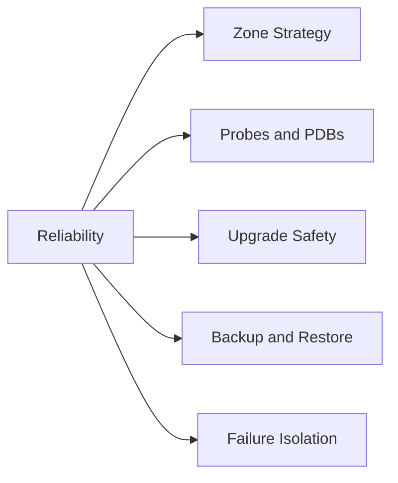

# Reliability

Reliable AKS platforms isolate failure domains, make health visible, and assume nodes, pods, and dependencies will fail regularly.

## Why This Matters

Availability targets are met by repeated operational habits, not by a single architecture diagram.

## Recommended Practices

- Spread critical workloads across zones when supported.
- Use readiness, liveness, and startup probes deliberately.
- Add PodDisruptionBudgets and anti-affinity for critical services.
- Practice upgrades and rollback plans in non-production first.
- Monitor node conditions, eviction pressure, and restart storms.

## Common Mistakes / Anti-Patterns

- Using liveness probes where startup probes are required.
- Treating HPA as a reliability mechanism instead of a capacity tool.
- Running singleton critical services with no disruption budget.
- Upgrading production first.

## Validation Checklist

- [ ] Probe strategy is reviewed.
- [ ] PDBs and replica topology support maintenance events.
- [ ] Backup/restore or data protection strategy exists.
- [ ] Upgrade sequence and rollback conditions are documented.

## See Also

- [Storage Options](../platform/storage-options.md)
- [Upgrades](../operations/upgrades.md)
- [Upgrade Failure](../troubleshooting/playbooks/operations/upgrade-failure.md)

## Sources

- [AKS best practices overview](https://learn.microsoft.com/azure/aks/best-practices)
- [AKS secure baseline architecture](https://learn.microsoft.com/azure/architecture/reference-architectures/containers/aks/secure-baseline-aks)
- [Create an AKS cluster](https://learn.microsoft.com/azure/aks/learn/quick-kubernetes-deploy-cli)
- [Upgrade an AKS cluster](https://learn.microsoft.com/azure/aks/upgrade-cluster)
- [Monitor AKS with Container insights](https://learn.microsoft.com/azure/azure-monitor/containers/container-insights-overview)
