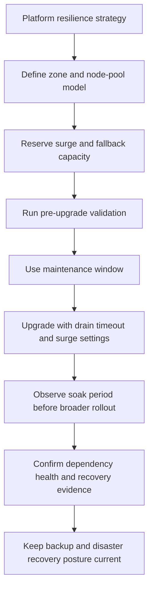

---
content_sources:
  diagrams:
    - id: best-practices-reliability
      type: flowchart
      source: self-generated
      justification: Platform resilience strategy synthesized from Microsoft Learn AKS reliability, zone resiliency, upgrade, planned maintenance, and backup guidance.
      based_on:
        - https://learn.microsoft.com/en-us/azure/aks/best-practices-app-cluster-reliability
        - https://learn.microsoft.com/en-us/azure/aks/reliability-zone-resiliency-recommendations
        - https://learn.microsoft.com/en-us/azure/aks/upgrade-options
        - https://learn.microsoft.com/en-us/azure/aks/planned-maintenance
        - https://learn.microsoft.com/en-us/azure/aks/backup-azure-kubernetes-service
content_validation:
  status: verified
  last_reviewed: 2026-07-18
  reviewer: agent
  core_claims:
    - claim: "AKS pre-upgrade validations check for deprecated Kubernetes APIs before an upgrade starts."
      source: https://learn.microsoft.com/en-us/azure/aks/upgrade-options
      verified: true
    - claim: "In AKS Standard, the default node drain timeout is 30 minutes."
      source: https://learn.microsoft.com/en-us/azure/aks/upgrade-options
      verified: true
    - claim: "AKS uses best-effort zone balancing in node pools."
      source: https://learn.microsoft.com/en-us/azure/aks/reliability-zone-resiliency-recommendations
      verified: true
    - claim: "AKS Backup can back up cluster resources and persistent volumes."
      source: https://learn.microsoft.com/en-us/azure/aks/backup-azure-kubernetes-service
      verified: true
---

# Reliability
Reliable AKS platforms are designed around controlled change, dependency failure, and recovery rehearsal. This page focuses on cluster-level resilience strategy: safe upgrades, planned-disruption readiness, dependency fallback, and recovery posture.
## Why This Matters
<!-- diagram-id: best-practices-reliability -->


Most AKS outages blamed on “the upgrade” actually come from weak preparation: no spare capacity, no maintenance window, brittle dependencies, or untested restore paths. Reliability at this layer is therefore less about one Kubernetes manifest and more about whether the platform can absorb planned and unplanned change without turning it into a prolonged incident.

Use [When You Need Explicit Placement and Disruption Control](explicit-placement-disruption-control.md) for exact Pod Disruption Budget, affinity, topology spread, and per-zone placement mechanics. Use [Autoscaling](autoscaling.md) for autoscaler convergence and spot-interruption behavior. Use [Cost Optimization](cost-optimization.md) when the primary question is resilience-versus-spend trade-offs.

## Recommended Practices

### Practice 1: Treat upgrades as a staged platform change, not a routine button click

**Why**: AKS version support, deprecated APIs, subnet headroom, quota, and drain behavior all affect whether an upgrade finishes cleanly. A supported version path is only the starting condition.

**How**:

- Define an environment order such as development, pre-production, and production.
- Check supported upgrade targets and run pre-upgrade validation before touching the cluster.
- Set surge, node drain timeout, and node soak time intentionally.
- Keep a rollback posture, which may mean halting rollout or restoring to a known-good cluster state rather than assuming an in-place downgrade exists.

```bash
az aks get-upgrades \
    --resource-group "$RG" \
    --name "$CLUSTER_NAME" \
    --output table
```

| Command | Purpose |
| --- | --- |
| `az aks get-upgrades` | List available Kubernetes upgrade versions for the cluster. |
| `--resource-group` | Resource group that contains the AKS cluster. |
| `--name` | Name of the AKS cluster. |
| `--output` | Output format for the result. |

Shows supported Kubernetes upgrade targets before the change window.

**Validation**:

- The team can name the supported source-to-target version path.
- Pre-upgrade validation output has been reviewed before the window opens.
- Surge and drain settings match workload shutdown behavior and subnet capacity.
- A rollback posture exists for upgrade failure or unacceptable post-upgrade error rate.

### Practice 2: Use maintenance windows and soak time to absorb planned disruption deliberately

**Why**: Auto-upgrades, node OS updates, and manual upgrades are safer when they happen inside a window that matches business tolerance and staffing coverage. Soak time between environments catches platform regressions before they spread.

**How**:

- Define maintenance windows for clusters that use automatic upgrade channels or planned node OS maintenance.
- Schedule windows when application owners, platform responders, and dependency owners are available.
- Keep soak time between lower and higher environments long enough to observe node health and key dependencies.
- Treat maintenance readiness as a dependency review, not just a calendar entry.

```bash
az aks maintenanceconfiguration add \
    --resource-group "$RG" \
    --cluster-name "$CLUSTER_NAME" \
    --name aksManagedAutoUpgradeSchedule \
    --schedule-type Weekly \
    --day-of-week Saturday \
    --interval-weeks 1 \
    --duration 4 \
    --start-time 02:00 \
    --utc-offset +00:00
```

| Command | Purpose |
| --- | --- |
| `az aks maintenanceconfiguration add` | Add a weekly auto-upgrade maintenance schedule. |
| `--resource-group` | Resource group that contains the AKS cluster. |
| `--cluster-name` | Name of the AKS cluster. |
| `--name` | Name of the maintenance configuration. |
| `--schedule-type` | Recurrence type for the schedule. |
| `--day-of-week` | Day of week the maintenance window opens. |
| `--interval-weeks` | Number of weeks between windows. |
| `--duration` | Length of the maintenance window in hours. |
| `--start-time` | Local start time of the window. |
| `--utc-offset` | UTC offset applied to the start time. |

Creates a weekly planned-maintenance window for cluster auto-upgrade activity. The `aksManagedAutoUpgradeSchedule` configuration requires schedule-type flags (`--schedule-type`, `--day-of-week`, `--interval-weeks`); the `--weekday`/`--start-hour` flags apply only to the `default` maintenance configuration.

**Validation**:

- Planned maintenance windows align to support coverage and known business quiet periods.
- Promotion from staging to production includes a defined soak interval.
- The change record identifies who verifies cluster, ingress, DNS, identity, and storage health after the window.

### Practice 3: Choose a zone strategy at the platform level before tuning workload placement

**Why**: Zonal pools, multi-zone pools, and regional assumptions change failure domains, surge behavior, and capacity expectations. The platform must decide what level of zone independence it is truly funding and operating.

**How**:

- Use multi-zone pools when you want a simpler regional default and can tolerate best-effort balancing.
- Use zonal pools when specific workloads require stronger zone targeting or more explicit failure-domain control.
- Plan for temporary imbalance during scaling or upgrade surge events.
- Document what “regional redundancy” means for your cluster instead of assuming identical behavior across all services.
- Link to [When You Need Explicit Placement and Disruption Control](explicit-placement-disruption-control.md) for exact placement mechanics.

```bash
az aks nodepool show \
    --resource-group "$RG" \
    --cluster-name "$CLUSTER_NAME" \
    --name system \
    --query "{mode:mode,count:count,zones:availabilityZones,maxSurge:upgradeSettings.maxSurge}"
```

| Command | Purpose |
| --- | --- |
| `az aks nodepool show` | Show the system node pool mode, zones, and surge settings. |
| `--resource-group` | Resource group that contains the AKS cluster. |
| `--cluster-name` | Name of the AKS cluster. |
| `--name` | Name of the node pool to show. |
| `--query` | Selects mode, count, zones, and max surge. |

Checks whether a node pool is zonal or multi-zone and whether upgrade surge is defined.

**Validation**:

- Platform owners can explain why each production pool is zonal or multi-zone.
- Upgrade plans account for possible zonal imbalance during surge.
- Regional redundancy expectations are written down instead of assumed.

### Practice 4: Build multi-pool resilience into the cluster baseline

**Why**: System services, ingress, DNS, monitoring agents, and business workloads should not all depend on one node-pool failure path. Separate pools reduce shared failure and create cleaner fallback options.

**How**:

- Keep system and user pools separate in every production cluster.
- Isolate critical add-ons when they have distinct scaling or disruption characteristics.
- Maintain at least one fallback pool design for emergency capacity.
- Use this page for pool-level resilience posture; use [Autoscaling](autoscaling.md) for detailed autoscaler convergence behavior.

```bash
az aks nodepool add \
    --resource-group "$RG" \
    --cluster-name "$CLUSTER_NAME" \
    --name fallback \
    --mode User \
    --node-vm-size Standard_D4s_v5 \
    --node-count 1 \
    --enable-cluster-autoscaler \
    --min-count 1 \
    --max-count 3
```

| Command | Purpose |
| --- | --- |
| `az aks nodepool add` | Add a small fallback user node pool. |
| `--resource-group` | Resource group that contains the AKS cluster. |
| `--cluster-name` | Name of the AKS cluster. |
| `--name` | Name of the new node pool. |
| `--mode` | Node pool mode, User for application workloads. |
| `--node-vm-size` | VM size for the pool nodes. |
| `--node-count` | Initial number of nodes in the pool. |
| `--enable-cluster-autoscaler` | Turn on the cluster autoscaler for the pool. |
| `--min-count` | Minimum node count for autoscaling. |
| `--max-count` | Maximum node count for autoscaling. |

Adds a small fallback pool that can host non-system workloads when a primary pool is constrained.

**Validation**:

- System pools are not the default landing zone for normal application workloads.
- Critical add-ons have an explicit placement and recovery plan.
- Capacity fallback is documented for quota exhaustion, zonal pressure, or hardware-family shortages.

### Practice 5: Review dependency resilience and recovery posture as one platform topic

**Why**: A healthy AKS control plane does not help if the cluster cannot pull from ACR, resolve DNS, reach ingress dependencies, mount storage, or obtain workload identity tokens. Backup and disaster recovery planning must include these external dependencies.

**How**:

- Review the failure effect of ACR, DNS, ingress, storage, and identity independently.
- Decide which dependencies need alternate paths, cached artifacts, secondary regions, or restore-time reconfiguration.
- Keep cluster backup, persistent volume backup, and restore testing tied to the actual disaster-recovery design.
- Plan at least one recovery path for cluster resource restore and one for full regional failure.

```bash
az k8s-extension show \
    --resource-group "$RG" \
    --cluster-name "$CLUSTER_NAME" \
    --cluster-type managedClusters \
    --name azure-aks-backup
```

| Command | Purpose |
| --- | --- |
| `az k8s-extension show` | Show the installed backup cluster extension. |
| `--resource-group` | Resource group that contains the AKS cluster. |
| `--cluster-name` | Name of the AKS cluster. |
| `--cluster-type` | Cluster type, managedClusters for AKS. |
| `--name` | Name of the cluster extension. |

Checks the AKS Backup extension state. To inspect a backup instance's protection status, use `az dataprotection backup-instance show` (or `list`) against the backup vault instead.

**Validation**:

- Dependency failure review covers ACR, DNS, ingress, storage, and identity.
- Backup scope for cluster resources and persistent volumes is documented.
- Restore drills prove more than object recovery; they prove the platform can resume service.
- Disaster recovery planning distinguishes same-region restore from cross-region recovery.

## Common Mistakes / Anti-Patterns

### Anti-Pattern 1: Upgrading without explicit surge, drain, and soak decisions

**What happens**: Teams approve the version change but never decide how much extra capacity is needed, how long drains may run, or how long to observe the result before broader rollout.

**Why it is wrong**: The upgrade path is treated as valid, but the operational safety controls are left undefined.

**Correct approach**: Set and review surge, drain timeout, soak time, validation evidence, and rollback posture as one change package.

### Anti-Pattern 2: Confusing multi-zone deployment with guaranteed zone-perfect resilience

**What happens**: A multi-zone pool is created and everyone assumes balancing, scaling, and recovery will always remain symmetric across zones.

**Why it is wrong**: AKS documents best-effort zone balancing, and real capacity events or surge operations can create temporary imbalance.

**Correct approach**: Document the zone strategy explicitly and use [When You Need Explicit Placement and Disruption Control](explicit-placement-disruption-control.md) when workloads need stronger placement guarantees.

### Anti-Pattern 3: Keeping critical add-ons and business workloads on the same failure path

**What happens**: DNS, ingress, telemetry agents, and application workloads all depend on one pool shape and one scaling path.

**Why it is wrong**: A single pool issue becomes a platform-wide outage multiplier.

**Correct approach**: Separate system and user pools, isolate critical add-ons where needed, and keep a documented fallback capacity plan.

### Anti-Pattern 4: Calling backup “done” without restore or disaster-recovery proof

**What happens**: Backup is enabled, but no one has tested restore ordering, dependency recovery, or cross-region decisions.

**Why it is wrong**: Backup configuration is not the same thing as operational recovery.

**Correct approach**: Pair backup policy with restore drills and disaster-recovery runbooks. For broader recurring anti-patterns, see [Common Anti-Patterns](common-anti-patterns.md).

## Validation Checklist

- [ ] Supported upgrade paths are reviewed before every cluster-version change.
- [ ] Pre-upgrade validation results are checked and tracked as part of the change record.
- [ ] Surge, drain timeout, and soak time are set intentionally for production clusters.
- [ ] Maintenance windows align with staffed support coverage and business tolerance.
- [ ] The platform zone strategy is documented without assuming perfect zonal symmetry.
- [ ] System pools, user pools, critical add-on isolation, and fallback-capacity plans are all documented.
- [ ] Dependency resilience has been reviewed for ACR, DNS, ingress, storage, and identity.
- [ ] Backup, restore, and disaster-recovery posture has been tested beyond configuration-only review.

## See Also

- [When You Need Explicit Placement and Disruption Control](explicit-placement-disruption-control.md)
- [Autoscaling](autoscaling.md)
- [Cost Optimization](cost-optimization.md)
- [Upgrades](../operations/upgrades.md)
- [Cluster Resource and PV Backup](../operations/cluster-resource-pv-backup.md)
- [Restore Drills](../operations/restore-drills.md)
- [Tutorial 05: AKS Disaster Recovery](../tutorials/lab-guides/lab-05-aks-disaster-recovery.md)

## Sources

- [Deployment and cluster reliability best practices for Azure Kubernetes Service (AKS)](https://learn.microsoft.com/en-us/azure/aks/best-practices-app-cluster-reliability)
- [Zone resiliency recommendations for Azure Kubernetes Service (AKS)](https://learn.microsoft.com/en-us/azure/aks/reliability-zone-resiliency-recommendations)
- [Upgrade options and recommendations for AKS clusters](https://learn.microsoft.com/en-us/azure/aks/upgrade-options)
- [Use planned maintenance to schedule maintenance windows for your Azure Kubernetes Service (AKS) cluster](https://learn.microsoft.com/en-us/azure/aks/planned-maintenance)
- [Back up Azure Kubernetes Service using Azure Backup](https://learn.microsoft.com/en-us/azure/aks/backup-azure-kubernetes-service)
