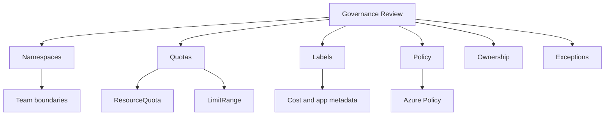

---
content_sources:
  diagrams:
  - id: best-practices-resource-governance
    type: flowchart
    source: mslearn-adapted
    mslearn_url: https://learn.microsoft.com/en-us/azure/aks/best-practices
    based_on:
    - https://learn.microsoft.com/en-us/azure/aks/best-practices
    - https://learn.microsoft.com/en-us/azure/architecture/reference-architectures/containers/aks/secure-baseline-aks
    - https://learn.microsoft.com/en-us/azure/aks/concepts-network
    - https://learn.microsoft.com/en-us/azure/aks/use-network-policies
    - https://learn.microsoft.com/en-us/azure/aks/concepts-security
    - https://learn.microsoft.com/en-us/azure/aks/cluster-autoscaler
    - https://learn.microsoft.com/en-us/azure/azure-monitor/containers/container-insights-overview
    - https://learn.microsoft.com/en-us/azure/governance/policy/concepts/policy-for-kubernetes
content_validation:
  status: verified
  last_reviewed: 2026-05-21
  reviewer: agent
  core_claims:
    - claim: "Azure Policy can apply and enforce built-in security policies on AKS clusters."
      source: https://learn.microsoft.com/azure/aks/use-azure-policy
      verified: true
    - claim: "AKS best practices include multi-tenancy and scheduler features as cluster operator concerns."
      source: https://learn.microsoft.com/azure/aks/best-practices
      verified: true
    - claim: "AKS cost optimization guidance includes multitenancy and cost visibility practices."
      source: https://learn.microsoft.com/azure/aks/optimize-aks-costs
      verified: true
---

# Resource Governance

Resource governance turns shared AKS clusters into manageable platforms by defining ownership, namespace boundaries, quotas, labels, policies, and review evidence.

## Why This Matters

Without governance, teams eventually fight over capacity, naming, access, cost attribution, and policy exceptions. Good governance lets teams move quickly without making the cluster impossible to operate.

<!-- diagram-id: best-practices-resource-governance -->

## Recommended Practices

### Practice 1: Make namespaces ownership boundaries

Namespaces should map to teams, environments, or applications with clear owners. Avoid catch-all namespaces for unrelated workloads.

### Practice 2: Use quotas and limits to prevent noisy neighbors

ResourceQuota and LimitRange should keep one team from consuming shared cluster capacity unintentionally. Quotas should be reviewed with product teams, not copied blindly.

### Practice 3: Standardize labels and annotations

Labels should support cost allocation, ownership, support routing, environment classification, and automation. If a label is required for operations, enforce it in admission or CI.

### Practice 4: Use Azure Policy for platform guardrails

Policies should enforce controls that are too important for manual review, such as allowed registries, privileged container restrictions, required resource settings, and namespace standards.

### Practice 5: Keep exception handling explicit

Every exception needs owner, reason, expiry, and compensating control. Long-lived exceptions should become either a policy change or a remediation item.

### Practice 6: Align governance with GitOps or deployment workflow

The place where teams deploy should also be the place where governance feedback appears. Late manual review creates delays and inconsistent enforcement.

## Common Mistakes / Anti-Patterns

### Anti-Pattern 1: Namespaces without owners

A namespace with no owner becomes a dumping ground for abandoned workloads and unclear cost.

### Anti-Pattern 2: Quotas that nobody can explain

Quotas should reflect capacity and service needs. Arbitrary quotas cause avoidable escalations.

### Anti-Pattern 3: Policy exceptions without expiry

Permanent exceptions become hidden standards.

### Anti-Pattern 4: Governance only in documents

If ownership, labels, quotas, and policies are not enforced or measured, they will drift.

## Validation Checklist

- Namespace owner and support contact are visible.
- ResourceQuota and LimitRange are set for shared environments.
- Required labels exist on namespaces and workloads.
- Azure Policy assignments match the cluster's risk tier.
- Exceptions include reason, owner, expiry date, and compensating control.
- Cost and incident dashboards can group data by owner or application.

## Review Matrix

| Review area | Page-specific check |
|---|---|
| Scope | Confirm the guidance applies to Resource Governance. |
| Source basis | Validate the recommendation against the Microsoft Learn sources in this page. |
| Evidence | Capture command output, portal state, metrics, logs, or screenshots before treating the result as proven. |

## See Also

- [Security](security.md)
- [Cost Optimization](cost-optimization.md)
- [Production Baseline](production-baseline.md)
- [Azure Policy for AKS Lab](../tutorials/lab-guides/lab-04-azure-policy-for-aks.md)

## Sources

- [AKS best practices](https://learn.microsoft.com/azure/aks/best-practices)
- [Azure Policy for AKS](https://learn.microsoft.com/azure/aks/use-azure-policy)
- [AKS cost optimization best practices](https://learn.microsoft.com/azure/aks/best-practices-cost)
- [AKS security baseline](https://learn.microsoft.com/en-us/security/benchmark/azure/baselines/azure-kubernetes-service-aks-security-baseline)
