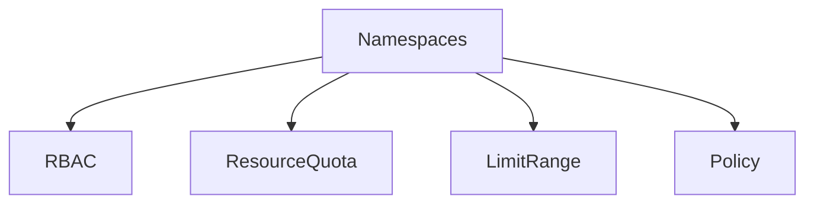

# Resource Governance

Shared clusters fail socially before they fail technically. Resource governance gives teams clear boundaries for capacity, access, and ownership.

## Why This Matters

Without governance, one namespace or team can dominate cluster resources and destabilize everyone else.

## Recommended Practices

- Assign namespaces by team, environment, or trust boundary.
- Use `ResourceQuota` and `LimitRange` in every multi-tenant namespace.
- Require labels and annotations for owner, environment, and cost center.
- Use admission policies or CI validation to reject incomplete manifests.
- Separate platform namespaces from application namespaces.

## Common Mistakes / Anti-Patterns

- No requests/limits in shared namespaces.
- Using cluster-admin to solve every access issue.
- Allowing workloads to deploy without ownership metadata.
- Mixing production and non-production workloads in one pool without intent.

## Validation Checklist

- [ ] Namespace ownership model is documented.
- [ ] Quotas and default limits exist.
- [ ] RBAC follows least privilege.
- [ ] Policy enforcement rejects unsafe manifests.

## See Also

- [Production Baseline](production-baseline.md)
- [Node Pools](../platform/node-pools.md)
- [Scaling](../platform/scaling.md)
- [Pending Pods](../troubleshooting/playbooks/pod-issues/pending-pods.md)

## Sources

- [AKS best practices overview](https://learn.microsoft.com/azure/aks/best-practices)
- [AKS secure baseline architecture](https://learn.microsoft.com/azure/architecture/reference-architectures/containers/aks/secure-baseline-aks)
