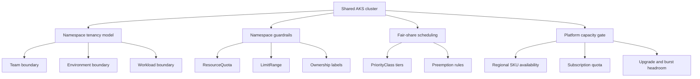

---
content_sources:
  diagrams:
    - id: best-practices-resource-governance
      type: flowchart
      source: self-generated
      justification: Namespace tenancy, quota, and fair-share capacity guardrails synthesized from Microsoft Learn AKS workload-isolation, resource-management, scheduler, quotas, and node-pool guidance.
      based_on:
        - https://learn.microsoft.com/en-us/azure/aks/developer-best-practices-resource-management
        - https://learn.microsoft.com/en-us/azure/aks/operator-best-practices-scheduler
        - https://learn.microsoft.com/en-us/azure/aks/quotas-skus-regions
        - https://learn.microsoft.com/en-us/azure/aks/concepts-clusters-workloads
        - https://learn.microsoft.com/en-us/azure/aks/create-node-pools
content_validation:
  status: verified
  last_reviewed: 2026-07-18
  reviewer: agent
  core_claims:
    - claim: "Namespaces provide a logical isolation boundary for teams and projects."
      source: https://learn.microsoft.com/en-us/azure/aks/concepts-clusters-workloads
      verified: true
    - claim: "Resource quotas can reserve and limit resources across development teams and projects."
      source: https://learn.microsoft.com/en-us/azure/aks/developer-best-practices-resource-management
      verified: true
    - claim: "Pod Priority indicates the importance of a pod relative to other pods."
      source: https://learn.microsoft.com/en-us/azure/aks/operator-best-practices-scheduler
      verified: true
    - claim: "AKS regions can have a limited number of available VM SKUs."
      source: https://learn.microsoft.com/en-us/azure/aks/quotas-skus-regions
      verified: true
---

# Resource Governance

Resource governance for shared AKS clusters is about fair-share tenancy, not policy enforcement. Use this page to define namespace boundaries, quota defaults, and platform-capacity guardrails so one tenant cannot exhaust cluster resources for everyone else.

## Why This Matters
<!-- diagram-id: best-practices-resource-governance -->


Noisy-neighbor failures usually start with weak tenancy: mixed environments in one namespace, pods without requests, unrestricted priority, and quotas that ignore real AKS regional capacity.

## Recommended Practices

### Practice 1: Define namespaces by team, environment, and workload boundary

Use namespaces to separate ownership and lifecycle, not just to group manifests. For shared clusters, the default pattern is one namespace per team and environment, with extra splits only when APIs, batch jobs, or platform add-ons need different quota or scheduling rules.

Keep showback or chargeback labels as ownership metadata only:

```yaml
apiVersion: v1
kind: Namespace
metadata:
  name: payments-prod
  labels:
    owner-team: payments
    environment: prod
    workload-class: api
    cost-center: cc-042
```

Create or update the namespace manifest:

```bash
kubectl apply \
    --filename namespace-payments-prod.yaml
```

Review namespace labels before onboarding workloads:

```bash
kubectl get namespaces \
    --show-labels
```

For Azure Policy, Defender, Pod Security Standards, and image controls, continue to [Governance](governance.md).

### Practice 2: Put ResourceQuota and LimitRange on every shared namespace

ResourceQuota caps aggregate namespace consumption. LimitRange sets default and maximum per-container behavior. Shared namespaces need both.

```yaml
apiVersion: v1
kind: ResourceQuota
metadata:
  name: payments-prod-quota
  namespace: payments-prod
spec:
  hard:
    requests.cpu: "8"
    requests.memory: 16Gi
    limits.cpu: "16"
    limits.memory: 32Gi
    pods: "60"
```

```yaml
apiVersion: v1
kind: LimitRange
metadata:
  name: payments-prod-defaults
  namespace: payments-prod
spec:
  limits:
    - type: Container
      defaultRequest:
        cpu: 250m
        memory: 256Mi
      default:
        cpu: 500m
        memory: 512Mi
      max:
        cpu: "2"
        memory: 2Gi
```

Apply and inspect the namespace guardrails:

```bash
kubectl apply \
    --filename payments-prod-quota.yaml
```

```bash
kubectl apply \
    --filename payments-prod-limitrange.yaml
```

```bash
kubectl describe resourcequota payments-prod-quota \
    --namespace payments-prod
```

Keep node-pool shape standardization in [Production Baseline](production-baseline.md); this page decides how much shared capacity each namespace may consume.

### Practice 3: Require requests and limits so BestEffort workloads do not spread

Without requests and limits, the scheduler cannot place workloads predictably and namespace quotas stop reflecting real demand. BestEffort sprawl is a shared-cluster anti-pattern.

Shared production standard:
- Require CPU and memory requests.
- Require CPU and memory limits unless a reviewed exception exists.
- Do not allow BestEffort workloads in shared production namespaces.
- Use Burstable for most services and Guaranteed where eviction resistance matters most.

Review declared versus observed consumption:

```bash
kubectl top pods \
    --namespace payments-prod \
    --containers
```

Use [Autoscaling](autoscaling.md) for HPA, KEDA, and autoscaler tuning.

### Practice 4: Use PriorityClass and preemption deliberately

Priority is a fairness tool, not a badge every team can request. Define a small approved set of priority tiers so critical workloads schedule first without collapsing shared-cluster discipline.

Suggested model:
- Reserve platform-critical classes for platform-owned add-ons only.
- Use a reviewed shared-production class for customer-facing services.
- Use lower or non-preempting classes for retryable batch work.

Apply and review approved classes:

```bash
kubectl apply \
    --filename priorityclass-shared-batch.yaml
```

```bash
kubectl get priorityclass \
    --output wide
```

Use [Governance](governance.md) only if you need policy-based restrictions on who may use a class.

### Practice 5: Size namespace quotas against real AKS capacity constraints

Namespace budgets must fit inside actual cluster capacity, and actual capacity is constrained by region, VM SKU availability, and subscription quota. Before onboarding, confirm the approved node pool shape in [Production Baseline](production-baseline.md), verify regional SKU availability, verify subscription quota, and leave headroom for platform add-ons plus temporary burst.

Inspect current node pools:
```bash
az aks nodepool list \
    --resource-group "$RG" \
    --cluster-name "$CLUSTER_NAME" \
    --output table
```

| Command | Purpose |
| --- | --- |
| `az aks nodepool list` | List the node pools in the cluster. |
| `--resource-group` | Resource group that contains the AKS cluster. |
| `--cluster-name` | Name of the AKS cluster. |
| `--output` | Output format for the result. |

Inspect regional SKU restrictions:

```bash
az vm list-skus \
    --location "$LOCATION" \
    --resource-type virtualMachines \
    --query "[?name=='Standard_D4s_v5'].{name:name,restrictions:restrictions}" \
    --output table
```

| Command | Purpose |
| --- | --- |
| `az vm list-skus` | List VM SKU availability and restrictions in the region. |
| `--location` | Azure region to query. |
| `--resource-type` | Resource type to filter, virtualMachines. |
| `--query` | Selects the SKU name and restrictions. |
| `--output` | Output format for the result. |

Use [Cost Optimization](cost-optimization.md) for economics, waste removal, and price trade-offs.

## Common Mistakes / Anti-Patterns

- Using one namespace for multiple teams or multiple environments.
- Creating `ResourceQuota` without matching `LimitRange` defaults.
- Treating requests and limits as optional, which allows BestEffort sprawl.
- Giving every important workload the highest PriorityClass.
- Summing namespace quotas to theoretical cluster maximum and leaving no headroom for upgrades or regional SKU constraints.

For broader AKS failure patterns, see [Common Anti-Patterns](common-anti-patterns.md).

## Validation Checklist

- [ ] Every shared namespace has owner-team, environment, and workload-class metadata.
- [ ] Showback or chargeback labels exist as ownership metadata only.
- [ ] Every shared namespace has both a `ResourceQuota` and a `LimitRange`.
- [ ] Production workloads define CPU and memory requests, and exceptions for missing limits are reviewed.
- [ ] BestEffort workloads are not allowed to spread through shared production namespaces.
- [ ] PriorityClass use is limited to a small approved set with clear ownership.
- [ ] Namespace quotas are reviewed against node-pool capacity, regional SKU availability, and subscription quota before onboarding.
- [ ] Autoscaling, policy enforcement, and cost trade-offs are delegated to their owning pages.

## See Also

- [Best Practices overview](index.md)
- [Production Baseline](production-baseline.md)
- [Autoscaling](autoscaling.md)
- [Cost Optimization](cost-optimization.md)
- [Governance](governance.md)
- [Common Anti-Patterns](common-anti-patterns.md)
- [Cluster Architecture](../platform/cluster-architecture.md)
- [Node Pools](../platform/node-pools.md)
- [Scaling](../platform/scaling.md)

## Sources

- [AKS best practices for resource management](https://learn.microsoft.com/en-us/azure/aks/developer-best-practices-resource-management)
- [AKS best practices for advanced scheduler features](https://learn.microsoft.com/en-us/azure/aks/operator-best-practices-scheduler)
- [AKS quotas, SKU restrictions, and region availability](https://learn.microsoft.com/en-us/azure/aks/quotas-skus-regions)
- [AKS clusters and workloads](https://learn.microsoft.com/en-us/azure/aks/concepts-clusters-workloads)
- [Create and manage node pools for AKS](https://learn.microsoft.com/en-us/azure/aks/create-node-pools)
