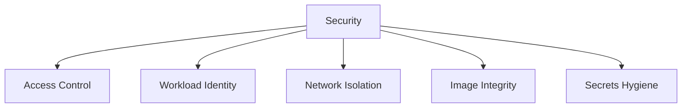

# Security

AKS security is layered across cluster access, node hardening, workload identity, network boundaries, and supply chain controls. No single feature makes the cluster secure.

## Why This Matters

A cluster that is operationally healthy can still be high-risk if identity and secret boundaries are weak.

## Recommended Practices

- Use Microsoft Entra ID and Kubernetes RBAC groups instead of shared admin credentials.
- Prefer workload identity over static credentials in Kubernetes Secrets.
- Restrict privileged containers, hostPath mounts, and broad capabilities.
- Scan images before deployment and use approved registries.
- Apply network policies for east-west segmentation.
- Rotate certificates and secrets on a schedule.

## Common Mistakes / Anti-Patterns

- Granting cluster-admin broadly to development teams.
- Mounting cloud credentials into pods as files or environment variables.
- Running everything in the default namespace.
- Trusting image tags without provenance or policy.

## Validation Checklist

- [ ] Cluster access is group-based and auditable.
- [ ] Secret retrieval path avoids long-lived embedded credentials.
- [ ] Pod security controls are defined for privileged workloads.
- [ ] Image supply chain review exists.
- [ ] Rotation procedures are documented.

## See Also

- [Identity and Secrets](../platform/identity-and-secrets.md)
- [Production Baseline](production-baseline.md)
- [Credential Rotation](../operations/credential-rotation.md)
- [Common Anti-Patterns](common-anti-patterns.md)

## Sources

- [AKS security baseline](https://learn.microsoft.com/security/benchmark/azure/baselines/azure-kubernetes-service-security-baseline)
- [Best practices for cluster security in AKS](https://learn.microsoft.com/azure/aks/operator-best-practices-cluster-security)
- [Best practices for pod security in AKS](https://learn.microsoft.com/azure/aks/operator-best-practices-pod-security)
