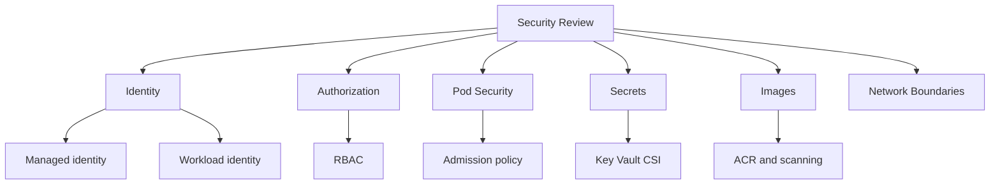

---
content_sources:
  diagrams:
  - id: best-practices-security
    type: flowchart
    source: mslearn-adapted
    mslearn_url: https://learn.microsoft.com/en-us/azure/aks/best-practices
    based_on:
    - https://learn.microsoft.com/en-us/azure/aks/best-practices
    - https://learn.microsoft.com/en-us/azure/architecture/reference-architectures/containers/aks/secure-baseline-aks
    - https://learn.microsoft.com/en-us/azure/aks/concepts-network
    - https://learn.microsoft.com/en-us/azure/aks/use-network-policies
    - https://learn.microsoft.com/en-us/azure/aks/concepts-security
    - https://learn.microsoft.com/en-us/azure/aks/cluster-autoscaler
    - https://learn.microsoft.com/en-us/azure/azure-monitor/containers/container-insights-overview
    - https://learn.microsoft.com/en-us/security/benchmark/azure/baselines/azure-kubernetes-service-aks-security-baseline
content_validation:
  status: verified
  last_reviewed: 2026-05-21
  reviewer: agent
  core_claims:
    - claim: "Microsoft Entra Workload ID lets workloads running in pods authenticate to Azure services."
      source: https://learn.microsoft.com/azure/aks/csi-secrets-store-identity-access
      verified: true
    - claim: "Azure Policy can apply and enforce built-in security policies on AKS clusters."
      source: https://learn.microsoft.com/azure/aks/use-azure-policy
      verified: true
    - claim: "AKS pod security guidance covers container security context and least-privilege pod settings."
      source: https://learn.microsoft.com/azure/aks/developer-best-practices-pod-security
      verified: true
---

# Security

AKS security depends on identity, admission control, pod runtime settings, image trust, secret access, network boundaries, and evidence that those controls stay enabled.

## Why This Matters

A cluster can look secure at creation time and drift quickly after workload onboarding. Security controls must be enforceable by policy, visible in audit data, and understandable to application teams.

<!-- diagram-id: best-practices-security -->

## Recommended Practices

### Practice 1: Use Microsoft Entra identities for people and workloads

Human access should go through Microsoft Entra and role assignment, not shared kubeconfigs. Workloads that need Azure resources should use workload identity instead of embedded secrets or broad cluster-level credentials.

### Practice 2: Keep authorization least-privilege and auditable

Map Kubernetes permissions to team responsibilities. Avoid cluster-admin for application teams. Namespace-scoped roles should be the default unless the team truly owns cluster-wide behavior.

### Practice 3: Enforce pod security through admission controls

Security context expectations should be enforced before deployment: non-root users, restricted capabilities, read-only file systems where possible, and no host namespace access unless explicitly approved.

### Practice 4: Store secrets outside workload manifests

Use Azure Key Vault integration where the workload needs external secrets. Kubernetes Secrets still require access control and rotation discipline; they should not become a long-term vault replacement.

### Practice 5: Control image provenance

Use approved registries, immutable image references where possible, and vulnerability scanning in the delivery pipeline. Reject workloads that pull from unapproved public registries unless an exception exists.

### Practice 6: Pair security policy with observability

Security controls need evidence. Track denied deployments, high-risk pod settings, privileged access changes, and unexpected image sources in the same operating model as incidents.

## Common Mistakes / Anti-Patterns

### Anti-Pattern 1: Shared admin kubeconfig

Shared kubeconfigs remove accountability and make incident response harder.

### Anti-Pattern 2: Secrets in manifests or pipeline logs

Any secret that appears in source control, build logs, or copied YAML should be treated as exposed.

### Anti-Pattern 3: Policy in audit mode forever

Audit mode is useful for rollout. Leaving critical controls in audit mode after the adoption period normalizes insecure workloads.

### Anti-Pattern 4: Privileged containers as a convenience

Privileged access should be exceptional and tied to a documented operational requirement.

## Validation Checklist

- Microsoft Entra integration and managed identity are enabled.
- Workload identity is the default for Azure resource access.
- Application teams do not receive cluster-admin by default.
- Admission policy blocks privileged or host-level pod settings unless exempted.
- Secret access path and rotation owner are documented.
- Image registry and vulnerability scanning expectations are enforced.

## Review Matrix

| Review area | Page-specific check |
|---|---|
| Scope | Confirm the guidance applies to Security. |
| Source basis | Validate the recommendation against the Microsoft Learn sources in this page. |
| Evidence | Capture command output, portal state, metrics, logs, or screenshots before treating the result as proven. |

## See Also

- [Identity and Secrets](../platform/identity-and-secrets.md)
- [Resource Governance](resource-governance.md)
- [Networking](networking.md)
- [Pod CrashLoopBackOff](../troubleshooting/playbooks/pod-crashloopbackoff.md)

## Sources

- [AKS best practices for pod security](https://learn.microsoft.com/azure/aks/developer-best-practices-pod-security)
- [Azure Policy for AKS](https://learn.microsoft.com/azure/aks/use-azure-policy)
- [Key Vault CSI driver identity access](https://learn.microsoft.com/azure/aks/csi-secrets-store-identity-access)
- [AKS security baseline](https://learn.microsoft.com/en-us/security/benchmark/azure/baselines/azure-kubernetes-service-aks-security-baseline)
