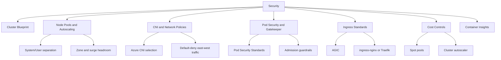

---
content_sources:
  diagrams:
  - id: best-practices-security
    type: flowchart
    source: mslearn-adapted
    mslearn_url: https://learn.microsoft.com/en-us/azure/aks/best-practices
    based_on:
    - https://learn.microsoft.com/en-us/azure/aks/best-practices
    - https://learn.microsoft.com/en-us/azure/architecture/reference-architectures/containers/aks/secure-baseline-aks
    - https://learn.microsoft.com/en-us/azure/aks/concepts-network
    - https://learn.microsoft.com/en-us/azure/aks/use-network-policies
    - https://learn.microsoft.com/en-us/azure/aks/operator-best-practices-pod-security
    - https://learn.microsoft.com/en-us/azure/aks/cluster-autoscaler
    - https://learn.microsoft.com/en-us/azure/azure-monitor/containers/container-insights-overview
    - https://learn.microsoft.com/security/benchmark/azure/baselines/azure-kubernetes-service-security-baseline
---


# Security

AKS security is a layered system: control plane access, workload identity, pod restrictions, network segmentation, secret handling, and continuous policy enforcement all matter together.

## Why This Matters
<!-- diagram-id: best-practices-security -->

<!-- diagram-id: best-practices-security -->


Reduce cluster attack surface and make risky configuration drift impossible to miss.

Typical operating questions this page answers:

- Which node pool model should be considered the default for production?
- When should the team choose Azure CNI Overlay versus routable pod IP models?
- How should network policies, Pod Security Standards, and Gatekeeper combine?
- Which ingress controller patterns are acceptable and who owns them?
- How do cost optimization and cluster autoscaler settings avoid harming reliability?
- Which Container Insights signals should first responders trust during an incident?

## Prerequisites

- Azure subscription with permission to manage AKS, networking, and Log Analytics resources
- Existing or planned resource group, virtual network, and Log Analytics workspace
- Azure CLI 2.57 or later with the `aks-preview` extension only where Microsoft Learn requires it
- Access to `kubectl` configured for the target cluster
- Agreement between platform, security, and network teams on ownership boundaries
- Variables defined for examples: `$RG`, `$CLUSTER_NAME`, `$LOCATION`, `$VNET_NAME`, `$AKS_SUBNET_NAME`, `$WORKSPACE_ID`, `$APPGW_RG`, `$APPGW_NAME`

## Recommended Practices

### Practice 1: Establish a standard production cluster blueprint

**Why**: Standard cluster blueprints reduce one-off design drift. They make it easier to review new environments because identity, node pool separation, logging, and ingress follow the same known-good pattern.

**Real-world scenario**: A platform team supports six product squads. When each squad creates its own AKS defaults, on-call engineers cannot quickly tell whether an outage is caused by workload behavior or by cluster-by-cluster configuration differences. A blueprint removes that ambiguity.

**Focus for identity, pod security, and admission control**: This practice should be interpreted through the lens of identity, pod security, and admission control. Reviewers should ask whether the chosen implementation strengthens or weakens that focus area.

**How**:

```bash
az aks create \
    --resource-group "$RG" \
    --name "$CLUSTER_NAME" \
    --location "$LOCATION" \
    --enable-managed-identity \
    --enable-aad \
    --enable-azure-rbac \
    --network-plugin azure \
    --network-plugin-mode overlay \
    --nodepool-name system \
    --node-count 3 \
    --node-vm-size Standard_D4s_v5 \
    --zones 1 2 3 \
    --enable-cluster-autoscaler \
    --min-count 3 \
    --max-count 6 \
    --tier standard \
    --enable-oidc-issuer \
    --enable-workload-identity \
    --workspace-resource-id "$WORKSPACE_ID"
```

```bash
az aks show \
    --resource-group "$RG" \
    --name "$CLUSTER_NAME" \
    --query "{kubernetesVersion:kubernetesVersion,privateFqdn:privateFqdn,networkPlugin:networkProfile.networkPlugin,networkMode:networkProfile.networkPluginMode,identity:identity.type}" \
    --output json
```

**Validation**:

- Control plane identity is managed, not service principal based.
- System and user workloads are not sharing the same pool by default.
- Microsoft Entra integration, Azure RBAC, and Container Insights are visible from day one.

### Practice 2: Right-size node pools and keep roles separate

**Why**: Node pool separation prevents noisy application bursts from starving cluster-critical add-ons. It also lets you scale stateful, CPU-heavy, GPU, or spot workloads independently.

**Real-world scenario**: A bursty CI runner workload lands on the same nodes as CoreDNS and ingress. Cluster DNS latency spikes and every application looks unhealthy even though the real problem is node contention. Dedicated pools prevent that kind of shared failure.

**Focus for identity, pod security, and admission control**: This practice should be interpreted through the lens of identity, pod security, and admission control. Reviewers should ask whether the chosen implementation strengthens or weakens that focus area.

**How**:

```bash
az aks nodepool add \
    --resource-group "$RG" \
    --cluster-name "$CLUSTER_NAME" \
    --name userapps \
    --mode User \
    --node-vm-size Standard_D8s_v5 \
    --node-count 2 \
    --enable-cluster-autoscaler \
    --min-count 2 \
    --max-count 10 \
    --labels workload=app team=platform
```

```bash
kubectl get nodes \
    --selector kubernetes.azure.com/mode=user \
    --output wide
```

```bash
kubectl describe node <node-name>
```

**Validation**:

- System pool keeps enough headroom for CoreDNS, metrics agents, and ingress control planes.
- User pools map to workload classes such as general, memory-optimized, GPU, or spot.
- Requests and limits align with the VM SKU so cluster autoscaler can make sensible choices.

Sizing guidance for review meetings:

| Workload profile | Suggested starting pool | Why it works | Watch-outs |
|---|---|---|---|
| Cluster-critical add-ons | `system` pool, 3 nodes across zones | Preserves DNS, CNI, and ingress health during drain or surge events | Do not schedule business workloads here by default |
| General web APIs | `userapps` pool, `Standard_D4s_v5` or `Standard_D8s_v5` | Balanced CPU and memory for HPA-driven services | Review memory pressure before increasing replicas only |
| Memory-heavy services | Dedicated memory-optimized pool | Prevents eviction storms on general pools | Requests must match observed usage, not guesses |
| Batch or interruptible jobs | Spot pool with min count `0` | Keeps costs low for disposable work | Never place ingress, DNS, or stateful services here |

### Practice 3: Choose the right CNI mode and reserve enough IP space

**Why**: AKS networking problems usually begin with an under-sized address plan or an unsupported assumption about how pods receive addresses. CNI mode affects scale limits, routing, and operational ownership.

**Real-world scenario**: A team uses Azure CNI traditional mode in a subnet sized only for initial node count. Two months later autoscaler cannot add nodes because pod IP reservations have consumed the subnet. The incident looks like a compute failure but is really IP planning debt.

**Focus for identity, pod security, and admission control**: This practice should be interpreted through the lens of identity, pod security, and admission control. Reviewers should ask whether the chosen implementation strengthens or weakens that focus area.

**How**:

```bash
az aks show \
    --resource-group "$RG" \
    --name "$CLUSTER_NAME" \
    --query "networkProfile" \
    --output json
```

```bash
az network vnet subnet show \
    --resource-group "$RG" \
    --vnet-name "$VNET_NAME" \
    --name "$AKS_SUBNET_NAME" \
    --query "{addressPrefix:addressPrefix,delegations:delegations}" \
    --output json
```

```bash
kubectl get pods \
    --all-namespaces \
    --output wide
```

**Validation**:

- Azure CNI Overlay is chosen for large pod scale with simpler IP planning, or Azure CNI Pod Subnet is chosen intentionally for routable pod IPs.
- Subnet growth model documents node, surge upgrade, and autoscaler headroom.
- Network team and platform team agree on route ownership, DNS, and private endpoint strategy.

CNI selection heuristics:

| Requirement | Recommended choice | Reason |
|---|---|---|
| Large pod scale with simpler subnet planning | Azure CNI Overlay | Pods consume overlay addresses instead of VNet IPs |
| Need routable pod IPs on a dedicated subnet | Azure CNI Pod Subnet | Best when network teams need first-class pod addresses |
| Small learning environment | Kubenet only if still supported in your landing zone standards | Simpler for labs, but less aligned with current enterprise patterns |

### Practice 4: Enforce network policies for east-west isolation

**Why**: Default-allow pod traffic makes lateral movement and blast radius much worse during incidents. Network policy gives teams a way to prove what should and should not talk inside the cluster.

**Real-world scenario**: A compromised pod in a shared namespace scans every service in the cluster because no policy exists. The initial security event becomes a platform-wide outage investigation. Simple default-deny rules would have limited the spread and the scope of triage.

**Focus for identity, pod security, and admission control**: This practice should be interpreted through the lens of identity, pod security, and admission control. Reviewers should ask whether the chosen implementation strengthens or weakens that focus area.

**How**:

```bash
az aks update \
    --resource-group "$RG" \
    --name "$CLUSTER_NAME" \
    --network-policy azure
```

```bash
kubectl apply \
    --filename networkpolicy-default-deny.yaml
```

```bash
kubectl get networkpolicy \
    --all-namespaces \
    --output wide
```

**Validation**:

- Every production namespace has a default-deny baseline and explicit allow rules.
- Ingress controllers, DNS, and monitoring agents are accounted for in allow lists.
- Teams test policy behavior in pre-production before rollout.

Minimal network policy sequence for a new namespace:

1. Apply a default-deny ingress and egress policy.
2. Add DNS egress to `kube-system` CoreDNS endpoints.
3. Add ingress from the approved ingress controller namespace only.
4. Add egress to required private endpoints or service CIDRs explicitly.
5. Validate with application smoke tests and Container Insights logs before rollout.

### Practice 5: Apply pod security standards and admission controls

**Why**: The easiest container escape paths come from privileged pods, hostPath mounts, and broad Linux capability sets. Pod Security Standards and Gatekeeper rules keep risky manifests from reaching production.

**Real-world scenario**: A developer deploys a debugging DaemonSet with privileged access and host networking into a shared cluster. The cluster remains working, but the security posture collapses instantly. Admission control catches this before it becomes an incident.

**Focus for identity, pod security, and admission control**: This practice should be interpreted through the lens of identity, pod security, and admission control. Reviewers should ask whether the chosen implementation strengthens or weakens that focus area.

**How**:

```bash
kubectl label namespace production \
    pod-security.kubernetes.io/enforce=restricted \
    pod-security.kubernetes.io/audit=restricted \
    pod-security.kubernetes.io/warn=baseline \
    --overwrite
```

```bash
kubectl apply \
    --filename gatekeeper-constrainttemplate.yaml
```

```bash
kubectl apply \
    --filename gatekeeper-k8spspprivilegedcontainer.yaml
```

```bash
kubectl get constrainttemplates \
    --output wide
```

**Validation**:

- Restricted namespaces reject privileged, hostPath, and root-user workloads unless explicitly exempted.
- Exemptions are tracked, approved, and time-bound.
- Security review includes image provenance, workload identity, and secret mount strategy.

Pod security review prompts:

- Does the workload run as non-root and drop unnecessary Linux capabilities?
- Are host namespaces, host networking, or hostPath volumes truly required?
- Is the workload using Microsoft Entra Workload ID or another approved identity path instead of static secrets?
- If Gatekeeper requires an exception, who owns removal of that exception?

### Practice 6: Standardize ingress controller patterns

**Why**: Ingress is where application routing, TLS, private and public exposure, and operational ownership meet. Running multiple controllers without documented intent multiplies certificate, DNS, and support complexity.

**Real-world scenario**: One team deploys ingress-nginx, another installs Traefik, and a third expects Application Gateway Ingress Controller (AGIC) to own north-south traffic. Certificate renewals and DNS records drift because nobody knows which controller is authoritative.

**Focus for identity, pod security, and admission control**: This practice should be interpreted through the lens of identity, pod security, and admission control. Reviewers should ask whether the chosen implementation strengthens or weakens that focus area.

**How**:

```bash
az aks approuting enable \
    --resource-group "$RG" \
    --name "$CLUSTER_NAME"
```

```bash
kubectl get ingressclass \
    --output wide
```

```bash
kubectl get ingress \
    --all-namespaces \
    --output wide
```

```bash
az network application-gateway show \
    --resource-group "$APPGW_RG" \
    --name "$APPGW_NAME" \
    --query "{provisioningState:provisioningState,frontendIpConfigurations:frontendIpConfigurations[].privateIPAddress}" \
    --output json
```

**Validation**:

- Public ingress standard and internal ingress standard are both documented.
- AGIC is chosen when teams need Application Gateway features such as WAF and central network ownership.
- Ingress-nginx or Traefik are chosen when Kubernetes-native routing flexibility is more important than Azure-managed edge features.

Ingress controller comparison:

| Pattern | Strengths | Best fit | Operational note |
|---|---|---|---|
| AGIC | Reuses Application Gateway, WAF, centralized network ownership | Enterprise north-south traffic where network teams own edge controls | Coordinate listener, backend, and certificate lifecycle with network teams |
| ingress-nginx | Mature Kubernetes-native annotations and broad community patterns | Teams needing flexible in-cluster routing and fast iteration | Watch for duplicate ingress classes and unmanaged public load balancers |
| Traefik | Strong CRD-driven routing and middleware features | API gateway-like use cases and developer-driven routing logic | Keep TLS, observability, and support boundaries explicit |

### Practice 7: Tune cost optimization with autoscaler and spot pools

**Why**: Healthy clusters still waste money if requests are inflated, min counts are too high, or spot capacity is not isolated from critical services. Cost discipline must preserve SLOs, not undercut them.

**Real-world scenario**: A batch team moves low-priority workers onto the system pool because spot nodes were never introduced. The cluster pays premium rates for interruptible work and still risks starving critical add-ons during demand spikes.

**Focus for identity, pod security, and admission control**: This practice should be interpreted through the lens of identity, pod security, and admission control. Reviewers should ask whether the chosen implementation strengthens or weakens that focus area.

**How**:

```bash
az aks nodepool add \
    --resource-group "$RG" \
    --cluster-name "$CLUSTER_NAME" \
    --name spotpool \
    --mode User \
    --priority Spot \
    --eviction-policy Delete \
    --spot-max-price -1 \
    --node-vm-size Standard_D4s_v5 \
    --enable-cluster-autoscaler \
    --min-count 0 \
    --max-count 20 \
    --labels workload=batch capacity=spot
```

```bash
kubectl top nodes
```

```bash
kubectl get pods \
    --all-namespaces \
    --output custom-columns=NAMESPACE:.metadata.namespace,NAME:.metadata.name,REQUEST_CPU:.spec.containers[*].resources.requests.cpu,REQUEST_MEMORY:.spec.containers[*].resources.requests.memory
```

**Validation**:

- Critical services avoid spot pools and use PodDisruptionBudgets.
- Autoscaler min and max counts are reviewed against actual hourly utilization.
- Teams remove idle node pools, unused load balancers, and stale public IPs from the node resource group.

Cost governance checkpoints:

- Compare requested CPU and memory to actual `kubectl top` usage every sprint.
- Review autoscaler min counts before assuming the cluster is already optimized.
- Check node resource group artifacts for orphaned disks, load balancers, and public IP addresses.
- Separate developer convenience add-ons from mandatory production add-ons so platform cost discussions stay honest.

### Practice 8: Use Container Insights as the operational baseline

**Why**: Without baseline monitoring, AKS incidents start with guesswork. Container Insights gives a shared first responder view of node health, restart trends, and container logs even before application-specific dashboards are ready.

**Real-world scenario**: An application team says the cluster is broken, but nobody can answer whether nodes are Ready, pods are restarting, or one namespace alone is failing. Container Insights shortens that first ten minutes dramatically.

**Focus for identity, pod security, and admission control**: This practice should be interpreted through the lens of identity, pod security, and admission control. Reviewers should ask whether the chosen implementation strengthens or weakens that focus area.

**How**:

```bash
az aks enable-addons \
    --resource-group "$RG" \
    --name "$CLUSTER_NAME" \
    --addons monitoring \
    --workspace-resource-id "$WORKSPACE_ID"
```

```bash
az monitor log-analytics query \
    --workspace "$WORKSPACE_ID" \
    --analytics-query "KubePodInventory | where TimeGenerated > ago(15m) | summarize Pods=dcount(PodUid) by Namespace | order by Pods desc" \
    --timespan "PT15M"
```

```bash
az monitor log-analytics query \
    --workspace "$WORKSPACE_ID" \
    --analytics-query "ContainerLogV2 | where TimeGenerated > ago(15m) | summarize RestartSignals=countif(LogMessage has 'Back-off') by Namespace" \
    --timespan "PT15M"
```

**Validation**:

- Node inventory, pod inventory, and container logs appear within expected delay windows.
- The operations team has saved KQL queries for crash loops, node pressure, ingress failures, and autoscaler anomalies.
- Action groups and runbooks are linked to the monitoring data that first responders actually use.

Container Insights signals to bookmark:

- `KubePodInventory` for namespace-level pod count and restart context
- `KubeNodeInventory` for node readiness and OS details
- `ContainerLogV2` for recent app and platform errors
- `InsightsMetrics` for CPU, memory, and disk telemetry from the monitored cluster
- `KubeEvents` for scheduling failures, image pull errors, and probe churn

## Common Mistakes / Anti-Patterns

### Anti-Pattern 1: Single shared pool for everything

**What happens**: System add-ons, production APIs, batch jobs, and test workloads all land on the same nodes.

**Why it is wrong**: This collapses isolation. Node pressure, kernel upgrades, or noisy neighbors affect every workload simultaneously and make incident ownership unclear.

**Correct approach**: Create dedicated system and user pools, add taints where needed, and schedule sensitive workloads deliberately.

```bash
kubectl get events \
    --all-namespaces \
    --sort-by=.lastTimestamp
```

### Anti-Pattern 2: Default-allow networking

**What happens**: Pods can talk to any other pod or external destination because no policy was ever introduced.

**Why it is wrong**: Security incidents become cluster-wide investigations and troubleshooting is slower because expected communication paths were never defined.

**Correct approach**: Start with namespace default-deny and then add allow rules for DNS, ingress, telemetry, and explicit app dependencies.

```bash
kubectl get events \
    --all-namespaces \
    --sort-by=.lastTimestamp
```

### Anti-Pattern 3: Policy after the incident

**What happens**: Platform teams wait until after a privileged workload or bad manifest reaches production before thinking about admission control.

**Why it is wrong**: Retrospective policy design usually creates exceptions for the exact unsafe behavior that caused the issue.

**Correct approach**: Adopt Pod Security Standards and Gatekeeper constraints before the first production namespace is onboarded.

```bash
kubectl get events \
    --all-namespaces \
    --sort-by=.lastTimestamp
```

### Anti-Pattern 4: Observability as an optional add-on

**What happens**: Teams promise to enable monitoring later, after the first release is stable.

**Why it is wrong**: The first production incident then happens with no restart history, no node condition trend, and no shared KQL runbooks.

**Correct approach**: Enable Container Insights and define ownership for alerts, dashboards, and troubleshooting queries before go-live.

```bash
kubectl get events \
    --all-namespaces \
    --sort-by=.lastTimestamp
```

## Validation Checklist

- [ ] Node pool strategy documents system, general, specialized, and spot capacity separately.
- [ ] Cluster autoscaler min and max values have been reviewed against business recovery and upgrade requirements.
- [ ] Azure CNI choice is documented together with subnet or overlay growth assumptions.
- [ ] Every production namespace uses network policies and Pod Security Standard labels.
- [ ] OPA Gatekeeper or Azure Policy for Kubernetes rejects unsafe manifests before rollout.
- [ ] Ingress controller ownership, certificate source, and DNS workflow are documented.
- [ ] Container Insights is enabled and first-responder KQL queries are tested.
- [ ] Cost reviews include node resource group artifacts, observability volume, and spot-pool safety checks.
- [ ] Application teams know which standards are mandatory and which require exception approval.
- [ ] See Also and Sources sections are updated when this page changes so navigational context stays accurate.

## Cost Impact

These practices are designed to improve both resilience and spend efficiency. Dedicated system pools increase baseline cost a little, but they prevent expensive outage escalation. Azure CNI planning avoids emergency subnet rebuilds. Network policy and pod security reduce breach scope. Standard ingress patterns prevent duplicate load balancers and certificate sprawl. Container Insights adds monitoring cost, but it often pays for itself the first time responders can isolate a node, namespace, or image problem in minutes instead of hours.

A practical FinOps review for AKS should therefore compare cost to avoided risk, not only monthly node price. Spot node pools, autoscaler tuning, and request-rightsizing provide the main savings lever, while governance and security controls prevent hidden operational waste.

## See Also

- [Production Baseline](production-baseline.md)
- [Identity and Secrets](../platform/identity-and-secrets.md)
- [Credential Rotation](../operations/credential-rotation.md)
- [Common Anti-Patterns](common-anti-patterns.md)
- [Lab 03: Azure Key Vault CSI Driver](../tutorials/lab-guides/lab-03-azure-key-vault-csi-driver.md)

## Sources

- [Azure / Aks / Best Practices](https://learn.microsoft.com/azure/aks/best-practices)
- [Azure / Architecture / Reference Architectures / Containers / Aks / Secure Baseline Aks](https://learn.microsoft.com/azure/architecture/reference-architectures/containers/aks/secure-baseline-aks)
- [Azure / Aks / Concepts Network](https://learn.microsoft.com/azure/aks/concepts-network)
- [Azure / Aks / Use Network Policies](https://learn.microsoft.com/azure/aks/use-network-policies)
- [Azure / Aks / Operator Best Practices Pod Security](https://learn.microsoft.com/azure/aks/operator-best-practices-pod-security)
- [Azure / Aks / Cluster Autoscaler](https://learn.microsoft.com/azure/aks/cluster-autoscaler)
- [Azure / Azure Monitor / Containers / Container Insights Overview](https://learn.microsoft.com/azure/azure-monitor/containers/container-insights-overview)
- [Security / Benchmark / Azure / Baselines / Azure Kubernetes Service Security Baseline](https://learn.microsoft.com/security/benchmark/azure/baselines/azure-kubernetes-service-security-baseline)
