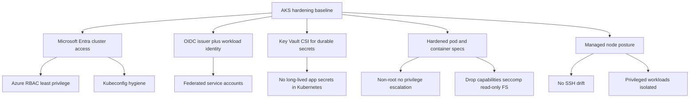

---
content_sources:
  diagrams:
    - id: best-practices-security
      type: flowchart
      source: self-generated
      justification: AKS hardening model synthesized from Microsoft Learn guidance for workload identity, Key Vault CSI, pod security, Azure RBAC, and the AKS security baseline.
      based_on:
        - https://learn.microsoft.com/en-us/security/benchmark/azure/baselines/azure-kubernetes-service-security-baseline
        - https://learn.microsoft.com/en-us/azure/aks/workload-identity-overview
        - https://learn.microsoft.com/en-us/azure/aks/csi-secrets-store-driver
        - https://learn.microsoft.com/en-us/azure/aks/developer-best-practices-pod-security
        - https://learn.microsoft.com/en-us/azure/aks/operator-best-practices-pod-security
        - https://learn.microsoft.com/en-us/azure/aks/manage-azure-rbac
content_validation:
  status: verified
  last_reviewed: 2026-07-18
  reviewer: agent
  core_claims:
    - claim: "An AKS cluster must have its OIDC issuer enabled to use Microsoft Entra Workload ID."
      source: https://learn.microsoft.com/en-us/azure/aks/workload-identity-overview
      verified: true
    - claim: "The Azure Key Vault provider for Secrets Store CSI Driver supports Linux and Windows containers in AKS."
      source: https://learn.microsoft.com/en-us/azure/aks/csi-secrets-store-driver
      verified: true
    - claim: "Azure RBAC for Kubernetes Authorization integrates with Microsoft Entra ID."
      source: https://learn.microsoft.com/en-us/azure/aks/manage-azure-rbac
      verified: true
    - claim: "AKS security best practices recommend avoiding privileged containers."
      source: https://learn.microsoft.com/en-us/azure/aks/operator-best-practices-pod-security
      verified: true
---

# Security

AKS security hardening starts before governance tooling ever blocks a deployment. This page focuses on the baseline workload and access choices teams should implement directly in cluster configuration and manifests: identity, secrets, cluster access, pod hardening, and node posture.

## Why This Matters

<!-- diagram-id: best-practices-security -->


Most AKS security incidents start with unsafe defaults already baked into manifests or access patterns: pods using static credentials, shared admin kubeconfigs, root containers, or node-level break-glass habits. Use [Governance](governance.md) for enforcement rollout, Defender triage, Pod Security Standards rollout strategy, and image signing or provenance controls.

## Recommended Practices

### Practice 1: Default to Workload Identity with the OIDC issuer for Azure resource access

**Why**: Workloads should authenticate to Azure resources with federated identity instead of embedded secrets. This removes durable client secrets from pod specs and keeps identity tied to a Kubernetes service account.

**How**:

Create or update the cluster so the OIDC issuer and workload identity are enabled.

```bash
az aks update \
    --resource-group "$RG" \
    --name "$CLUSTER_NAME" \
    --enable-oidc-issuer \
    --enable-workload-identity
```

Confirm the cluster exposes the issuer endpoint and workload identity support.

```bash
az aks show \
    --resource-group "$RG" \
    --name "$CLUSTER_NAME" \
    --query "{oidcIssuerProfile:oidcIssuerProfile,securityProfile:securityProfile}" \
    --output json
```

Baseline guidance:

- Treat Workload Identity as the default pattern for pods that call Azure services.
- Keep service account names explicit and workload-specific.

### Practice 2: Keep durable secrets out of Kubernetes Secrets when Key Vault CSI is the better fit

**Why**: Kubernetes Secrets are useful cluster objects, but they should not become the long-term system of record for durable application secrets. For credentials and certificates that already belong in Azure Key Vault, mount or sync them through the Secrets Store CSI Driver path instead of copying them manually into manifests.

**How**:

Enable the Azure Key Vault provider for the Secrets Store CSI Driver on the cluster.

```bash
az aks enable-addons \
    --resource-group "$RG" \
    --name "$CLUSTER_NAME" \
    --addons azure-keyvault-secrets-provider
```

Verify the CSI components are running before application teams depend on them.

```bash
kubectl get pods \
    --namespace kube-system \
    --selector app in (secrets-store-csi-driver,secrets-store-provider-azure) \
    --output wide
```

Baseline guidance:

- Use Key Vault CSI for durable sensitive data such as connection credentials, certificates, and externally rotated secrets.
- Avoid checking base64-encoded secrets into Git or templating them into long-lived release values.
- Secret rotation and audit workflows belong in [Governance](governance.md).

### Practice 3: Lock cluster access to Microsoft Entra identities and Azure RBAC with kubeconfig hygiene

**Why**: Cluster access is part of runtime hardening. A strong workload posture can still be undone by broad admin access, stale kubeconfig files, or local credentials passed around outside Microsoft Entra and Azure RBAC.

**How**:

Inspect whether the cluster is using Microsoft Entra integration and Azure RBAC for Kubernetes authorization.

```bash
az aks show \
    --resource-group "$RG" \
    --name "$CLUSTER_NAME" \
    --query "{managedEntra:aadProfile.managed,azureRbacEnabled:aadProfile.enableAzureRbac}" \
    --output json
```

Retrieve user credentials only when needed and avoid sharing generated kubeconfig files.

```bash
az aks get-credentials \
    --resource-group "$RG" \
    --name "$CLUSTER_NAME" \
    --overwrite-existing
```

Baseline guidance:

- Use Microsoft Entra integration and Azure RBAC as the standard operator access model.
- Grant namespace-scoped or read-only roles wherever possible instead of defaulting to cluster-wide admin.
- Treat kubeconfig files as sensitive local credentials: avoid committing them, syncing them broadly, or leaving unused contexts behind.

### Practice 4: Make pod and container hardening explicit in every workload manifest

**Why**: Secure workload behavior should be visible in the manifest itself. Teams should not wait for a later policy rollout to discover that their application still assumes root, writable root filesystems, extra Linux capabilities, or privilege escalation.

**How**:

Use `kubectl explain` during manifest reviews to verify the hardening fields being set.

```bash
kubectl explain pod.spec.containers.securityContext
```

Hardened baseline example:

```yaml
apiVersion: apps/v1
kind: Deployment
metadata:
  name: api
spec:
  template:
    spec:
      serviceAccountName: api-workload
      securityContext:
        seccompProfile:
          type: RuntimeDefault
      containers:
        - name: api
          image: contoso.azurecr.io/api:1.0.0
          securityContext:
            runAsNonRoot: true
            allowPrivilegeEscalation: false
            readOnlyRootFilesystem: true
            capabilities:
              drop:
                - ALL
```

Baseline guidance:

- Run as non-root unless the image has a documented technical exception.
- Set `allowPrivilegeEscalation: false` by default.
- Drop unnecessary capabilities and prefer `RuntimeDefault` seccomp.
- Keep Pod Security Standards rollout mechanics in [Governance](governance.md), not here.

### Practice 5: Keep nodes appliance-like and isolate privileged workloads

**Why**: Node-level access is a last resort, not a daily operating model. AKS nodes should stay close to the managed baseline so platform teams are not debugging self-inflicted drift. When privileged workloads are unavoidable, they should be isolated away from general application pools.

**How**:

Review node pool details through the AKS control plane instead of treating SSH as the first troubleshooting tool.

```bash
az aks nodepool list \
    --resource-group "$RG" \
    --cluster-name "$CLUSTER_NAME" \
    --output table
```

Inspect node scheduling boundaries for privileged or infrastructure workloads.

```bash
kubectl get nodes \
    --show-labels
```

Baseline guidance:

- Avoid SSH-based node administration except for rare break-glass events.
- Prefer managed node images and normal AKS upgrade flows over custom node drift.
- Separate privileged agents, infrastructure DaemonSets, or special hardware workloads onto dedicated pools when they cannot meet the general baseline.
- Namespace quotas and multi-team capacity boundaries belong in [Resource Governance](resource-governance.md).

## Common Mistakes / Anti-Patterns

- Giving pods Azure access through stored client secrets when Workload Identity would remove that secret entirely.
- Treating Kubernetes Secrets as the default long-term vault for database passwords, certificates, or other durable sensitive data.
- Sharing broad-access kubeconfig files or normalizing cluster-admin for everyday troubleshooting.
- Shipping workloads that still require root, privilege escalation, writable root filesystems, or broad Linux capabilities.
- Using SSH and hand-tuned node changes as routine operations instead of preserving the managed node baseline.

## Validation Checklist

- [ ] The cluster has the OIDC issuer enabled for Workload Identity.
- [ ] New workloads that call Azure resources use federated identity instead of embedded credentials by default.
- [ ] Durable sensitive data is sourced from Key Vault CSI when that secret already belongs in Azure Key Vault.
- [ ] Cluster access uses Microsoft Entra identities and Azure RBAC rather than shared local admin habits.
- [ ] Application manifests set non-root, no privilege escalation, capability drop, seccomp, and read-only filesystem defaults where the app supports them.
- [ ] Node troubleshooting procedures prefer managed AKS workflows before SSH-based break glass.
- [ ] Enforcement rollout, Defender triage, and signed-image policy decisions are tracked in [Governance](governance.md), not hidden inside this hardening baseline.

## See Also

- [Governance](governance.md)
- [Networking](networking.md)
- [Resource Governance](resource-governance.md)
- [Identity and Secrets](../platform/identity-and-secrets.md)

## Sources

- [Azure Kubernetes Service (AKS) security baseline](https://learn.microsoft.com/en-us/security/benchmark/azure/baselines/azure-kubernetes-service-security-baseline)
- [Microsoft Entra Workload ID overview](https://learn.microsoft.com/en-us/azure/aks/workload-identity-overview)
- [Use the Azure Key Vault provider for Secrets Store CSI Driver in an Azure Kubernetes Service (AKS) cluster](https://learn.microsoft.com/en-us/azure/aks/csi-secrets-store-driver)
- [Developer best practices for pod security in Azure Kubernetes Service (AKS)](https://learn.microsoft.com/en-us/azure/aks/developer-best-practices-pod-security)
- [Operator best practices for pod security in Azure Kubernetes Service (AKS)](https://learn.microsoft.com/en-us/azure/aks/operator-best-practices-pod-security)
- [Use Azure RBAC for Kubernetes Authorization](https://learn.microsoft.com/en-us/azure/aks/manage-azure-rbac)
