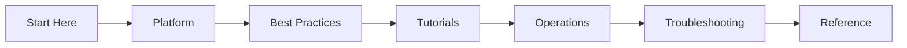

---
hide:
  - toc
content_sources:
  diagrams:
  - id: home-learning-flow
    type: flowchart
    source: self-generated
    justification: Navigation flow synthesized from the linked AKS topics and workflows
      on this page.
    based_on:
    - https://learn.microsoft.com/en-us/azure/aks/
    - https://learn.microsoft.com/en-us/azure/aks/intro-kubernetes
---

# Azure Kubernetes Service Practical Guide

Comprehensive, practical documentation for designing, deploying, operating, and troubleshooting containerized applications on Azure Kubernetes Service (AKS).

This site is organized as a learning and operations guide so you can move from fundamentals to production troubleshooting with clear, repeatable workflows.

-   :material-rocket-launch:{ .lg .middle } **New to AKS?**

    ---

    Start with platform fundamentals, understand cluster architecture and node pools, and deploy your first AKS cluster.

    [:octicons-arrow-right-24: Start Here](start-here/overview.md)

-   :material-server:{ .lg .middle } **Running Production Workloads?**

    ---

    Apply battle-tested patterns for security, networking, resource governance, reliability, and cost optimization.

    [:octicons-arrow-right-24: Best Practices](best-practices/index.md)

-   :material-bug:{ .lg .middle } **Investigating an Incident?**

    ---

    Jump straight to hypothesis-driven playbooks with real KQL queries and evidence patterns.

    [:octicons-arrow-right-24: Troubleshooting](troubleshooting/index.md)

## Navigate the Guide

| Section | Purpose |
|---|---|
| [Start Here](start-here/overview.md) | Orientation, learning paths, prerequisites, and AKS vs other compute comparison. |
| [Platform](platform/index.md) | Understand core AKS architecture, node pools, networking, ingress, identity, storage, and scaling. |
| [Best Practices](best-practices/index.md) | Apply production patterns for security, networking, resource governance, reliability, and cost. |
| [Tutorials](tutorials/lab-guides/lab-01-aks-cluster-deployment.md) | Follow hands-on lab guides for cluster deployment, ingress, secrets, policy, and disaster recovery. |
| [Operations](operations/index.md) | Run production clusters with upgrades, scaling, monitoring, maintenance, and credential rotation. |
| [Troubleshooting](troubleshooting/index.md) | Diagnose pod failures, connectivity issues, node problems, and scaling failures quickly. |
| [Reference](reference/index.md) | Use quick lookups for CLI, limits, version support, glossary, and diagnostic commands. |

For orientation and study order, start with [Start Here](start-here/overview.md).

## Learning flow
<!-- diagram-id: home-learning-flow -->

<!-- diagram-id: home-learning-flow -->

## Scope and disclaimer

This is an independent community project. Not affiliated with or endorsed by Microsoft.

Primary product reference: [Azure Kubernetes Service (AKS) documentation (Microsoft Learn)](https://learn.microsoft.com/azure/aks/)

## See Also

- [Start Here](start-here/overview.md)
- [Platform](platform/index.md)
- [Best Practices](best-practices/index.md)
- [Tutorials](tutorials/lab-guides/lab-01-aks-cluster-deployment.md)
- [Operations](operations/index.md)
- [Troubleshooting](troubleshooting/index.md)
- [Reference](reference/index.md)

## Sources

- [Azure Kubernetes Service (AKS) documentation](https://learn.microsoft.com/azure/aks/)
- [What is Azure Kubernetes Service (AKS)?](https://learn.microsoft.com/azure/aks/intro-kubernetes)
