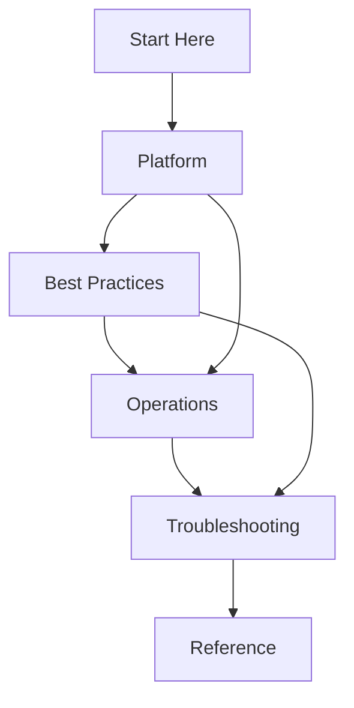

# Azure AKS Practical Guide

Comprehensive guide for designing, deploying, operating, and troubleshooting Azure Kubernetes Service (AKS) clusters for production workloads.



## What This Guide Covers

| Section | Purpose | Start With |
|---|---|---|
| Start Here | Scope, prerequisites, learning sequence, service comparison | [Start Here](start-here/index.md) |
| Platform | AKS architecture, node pools, networking, ingress, identity, storage, scaling | [Platform](platform/index.md) |
| Best Practices | Production standards for security, governance, reliability, and cost | [Best Practices](best-practices/index.md) |
| Operations | Cluster creation, upgrades, scaling, monitoring, maintenance, credential rotation | [Operations](operations/index.md) |
| Troubleshooting | Decision trees, first-response checklists, and symptom-based playbooks | [Troubleshooting](troubleshooting/index.md) |
| Reference | CLI, limits, version support, glossary, and diagnostics | [Reference](reference/index.md) |

## Quick Start

```bash
export RG="rg-aks-demo"
export CLUSTER_NAME="aks-demo"
export LOCATION="koreacentral"

az group create --name $RG --location $LOCATION
az aks create     --resource-group $RG     --name $CLUSTER_NAME     --location $LOCATION     --node-count 3     --enable-managed-identity     --network-plugin azure     --network-plugin-mode overlay     --generate-ssh-keys
az aks get-credentials --resource-group $RG --name $CLUSTER_NAME --overwrite-existing
kubectl get nodes -o wide
```

## How to Use This Repository

1. Read **Start Here** if you are new to AKS or comparing Azure compute choices.
2. Read **Platform** before making design decisions.
3. Use **Best Practices** to turn concepts into standards.
4. Use **Operations** for day-2 runbooks.
5. Use **Troubleshooting** during incidents.
6. Keep **Reference** open for commands and terminology.

## See Also

- [Start Here](start-here/index.md)
- [Platform](platform/index.md)
- [Best Practices](best-practices/index.md)
- [Operations](operations/index.md)
- [Troubleshooting](troubleshooting/index.md)
- [Reference](reference/index.md)

## Sources

- [Azure Kubernetes Service (AKS) documentation](https://learn.microsoft.com/azure/aks/)
- [What is Azure Kubernetes Service (AKS)?](https://learn.microsoft.com/azure/aks/intro-kubernetes)
