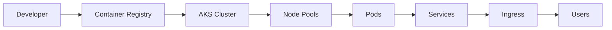

# Azure AKS Practical Guide

Comprehensive guide for running containerized applications on Azure Kubernetes Service (AKS) — from first deployment to production operations.



## What You'll Learn

- How AKS architecture works
- Best practices for production workloads
- Day-2 operations and maintenance
- Troubleshooting common issues

## Quick Start

```bash
# Create an AKS cluster
az aks create \
    --resource-group myResourceGroup \
    --name myAKSCluster \
    --node-count 3 \
    --enable-managed-identity \
    --generate-ssh-keys

# Get credentials
az aks get-credentials \
    --resource-group myResourceGroup \
    --name myAKSCluster
```

## See Also

- [Platform Overview](platform/index.md)
- [Best Practices](best-practices/index.md)
- [Troubleshooting](troubleshooting/index.md)

## Sources

- [Azure Kubernetes Service documentation](https://learn.microsoft.com/en-us/azure/aks/)
