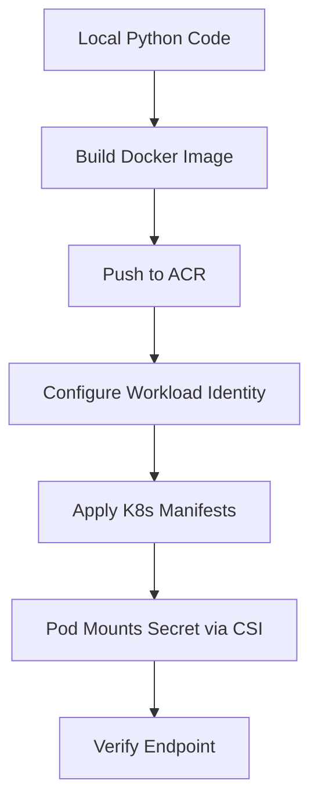

# Python on AKS

This guide walks through containerizing a Python FastAPI application and deploying it to Azure Kubernetes Service (AKS). You'll implement a production-ready pattern using Microsoft Entra Workload Identity and the Azure Key Vault Secrets Store CSI Driver.

## Prerequisites

- An existing AKS cluster with the following features enabled:
    - OIDC Issuer and Workload Identity
    - Azure Key Vault Secrets Store CSI Driver add-on
- Azure Container Registry (ACR) for hosting your container images.
- Local tools: Azure CLI, Docker (or similar), and `kubectl`.
- Environment variables set from previous labs: `$RG`, `$CLUSTER_NAME`, `$LOCATION`, `$ACR_NAME`, `$KEYVAULT_NAME`.

## What You'll Build

You will deploy the [Python Reference App](https://github.com/yeongseon/azure-kubernetes-service-practical-guide/blob/main/apps/python/README.md), a minimal FastAPI service that:

- Retrieves a secret from Azure Key Vault without using connection strings.
- Uses a non-root container image for improved security.
- Scales automatically based on CPU utilization.
- Exposes an endpoint via a Kubernetes Service and Ingress.

### Build and Deployment Flow

<!-- diagram-id: python-on-aks-build-deploy-flow -->


## Steps

### 1. Explore the Application

The reference app is located in [apps/python/](https://github.com/yeongseon/azure-kubernetes-service-practical-guide/tree/main/apps/python). It uses FastAPI to expose a `/secret` endpoint that checks for a mounted secret file.

- **Source**: [apps/python/src/main.py](https://github.com/yeongseon/azure-kubernetes-service-practical-guide/blob/main/apps/python/src/main.py)
- **Container**: [apps/python/Dockerfile](https://github.com/yeongseon/azure-kubernetes-service-practical-guide/blob/main/apps/python/Dockerfile)
- **Manifests**: [apps/python/manifests/](https://github.com/yeongseon/azure-kubernetes-service-practical-guide/tree/main/apps/python/manifests)

### 2. Build and Push the Image

Navigate to the application directory and use Azure Container Registry to build your image. This avoids the need for a local Docker installation if you use `az acr build`.

```bash
# Set image variables
export IMAGE_NAME="aks-keyvault-csi-sample"
export IMAGE_TAG="0.1.0"

# Build and push using ACR Task
az acr build \
    --registry "$ACR_NAME" \
    --image "$IMAGE_NAME:$IMAGE_TAG" \
    ../../apps/python/
```

| Command | Purpose |
| --- | --- |
| `az acr build` | Build and push the container image using an ACR Task. |
| `--registry` | Azure Container Registry that runs the build. |
| `--image` | Image name and tag to produce. |

### 3. Configure Workload Identity

The application needs a User-Assigned Managed Identity (UAMI) to access Key Vault.

```bash
export IDENTITY_NAME="keyvault-reader-uami"

# Create the identity
az identity create \
    --resource-group "$RG" \
    --name "$IDENTITY_NAME" \
    --location "$LOCATION"

# Get identity metadata
export UAMI_CLIENT_ID="$(az identity show --resource-group "$RG" --name "$IDENTITY_NAME" --query "clientId" --output tsv)"
export IDENTITY_PRINCIPAL_ID="$(az identity show --resource-group "$RG" --name "$IDENTITY_NAME" --query "principalId" --output tsv)"
export TENANT_ID="$(az account show --query "tenantId" --output tsv)"

# Establish federation with the Kubernetes ServiceAccount
export OIDC_ISSUER="$(az aks show --resource-group "$RG" --name "$CLUSTER_NAME" --query "oidcIssuerProfile.issuerUrl" --output tsv)"

az identity federated-credential create \
    --resource-group "$RG" \
    --identity-name "$IDENTITY_NAME" \
    --name aks-python-federation \
    --issuer "$OIDC_ISSUER" \
    --subject system:serviceaccount:workload:keyvault-reader \
    --audience api://AzureADTokenExchange
```

| Command | Purpose |
| --- | --- |
| `az identity create` | Create the user-assigned managed identity. |
| `--resource-group` | Resource group that contains the identity. |
| `--name` | Name of the managed identity. |
| `--location` | Azure region for the identity. |
| `az identity show` | Read the identity client and principal IDs. |
| `--resource-group` | Resource group that contains the identity. |
| `--name` | Name of the managed identity. |
| `--query` | Selects the client ID or principal ID. |
| `--output` | Output format for the result. |
| `az account show` | Read the current subscription tenant ID. |
| `--query` | Selects the tenant ID. |
| `--output` | Output format for the result. |
| `az aks show` | Read the cluster OIDC issuer URL. |
| `--resource-group` | Resource group that contains the AKS cluster. |
| `--name` | Name of the AKS cluster. |
| `--query` | Selects the OIDC issuer URL. |
| `--output` | Output format for the result. |
| `az identity federated-credential create` | Federate the identity with the Kubernetes service account. |
| `--resource-group` | Resource group that contains the identity. |
| `--identity-name` | Managed identity to federate. |
| `--name` | Name of the federated credential. |
| `--issuer` | OIDC issuer URL of the cluster. |
| `--subject` | Kubernetes service account subject to trust. |
| `--audience` | Token audience for the federation. |

### 4. Grant Key Vault Permissions

Authorize the identity to read secrets from your Key Vault.

```bash
export KEYVAULT_ID="$(az keyvault show --name "$KEYVAULT_NAME" --query "id" --output tsv)"

az role assignment create \
    --assignee-object-id "$IDENTITY_PRINCIPAL_ID" \
    --assignee-principal-type ServicePrincipal \
    --role "Key Vault Secrets User" \
    --scope "$KEYVAULT_ID"
```

| Command | Purpose |
| --- | --- |
| `az keyvault show` | Read the Key Vault resource ID for the role scope. |
| `--name` | Name of the Key Vault. |
| `--query` | Selects the Key Vault resource ID. |
| `--output` | Output format for the result. |
| `az role assignment create` | Grant the identity access to Key Vault secrets. |
| `--assignee-object-id` | Object ID of the identity to grant. |
| `--assignee-principal-type` | Principal type of the assignee. |
| `--role` | Role to assign. |
| `--scope` | Resource scope the role applies to. |

### 5. Deploy Manifests

Update the placeholders in the provided manifests and apply them to your cluster.

```bash
# Create the namespace first
kubectl apply \
    --filename ../../apps/python/manifests/namespace.yaml

# Apply the remaining manifests
# Note: You must replace <UAMI_CLIENT_ID>, <KEYVAULT_NAME>, <TENANT_ID>, <ACR_NAME>, and <APP_HOSTNAME> in the files first.
kubectl apply \
    --filename ../../apps/python/manifests/
```

### Environment and Configuration

The sample keeps non-secret runtime settings in the pod spec and secret material in Azure Key Vault.

- `PYTHONUNBUFFERED=1` is set through the Deployment `env:` block so Python writes logs directly to stdout and stderr.
- Secret values stay out of the manifest and are mounted from Azure Key Vault through the Secrets Store CSI Driver.
- If you need non-secret application settings beyond simple environment variables, add a ConfigMap and mount or reference it from the Deployment.

## Verification

### 1. Check Pod Status

Ensure the pods are running and the secret is mounted correctly.

```bash
kubectl get pods \
    --namespace workload \
    --selector app=keyvault-app
```

### 2. Health Probes

The Deployment already defines HTTP probes against the FastAPI endpoints in `apps/python/manifests/deployment.yaml`:

- **Readiness probe**: `GET /readyz` on port `http`, `initialDelaySeconds: 5`, `periodSeconds: 10`
- **Liveness probe**: `GET /healthz` on port `http`, `initialDelaySeconds: 10`, `periodSeconds: 10`

Readiness determines when the pod is added to Service endpoints, while liveness tells the kubelet when the container should be restarted after it becomes unhealthy.

### 3. Review Logs and Metrics

Use pod logs for workload-level verification and Container Insights or Azure Monitor metrics for cluster-level behavior.

```bash
kubectl logs \
    --namespace workload \
    --selector app=keyvault-app
```

In Azure Monitor, confirm that Container Insights is collecting pod and node metrics so you can watch CPU usage, restart counts, and request health during rollout validation.

### 4. Test the Secret Endpoint

Use `kubectl port-forward` to access the application locally and verify it can see the secret mounted from Key Vault.

```bash
kubectl port-forward \
    --namespace workload \
    service/keyvault-app 8000:80
```

In a separate terminal:

```bash
curl http://127.0.0.1:8000/secret
```

Expected response:
```json
{"secretPresent":true,"secretLength":10,"secretPath":"/mnt/secrets-store/app-secret"}
```

## Next Steps

- **Scale the App**: Check the [HorizontalPodAutoscaler](https://github.com/yeongseon/azure-kubernetes-service-practical-guide/blob/main/apps/python/manifests/hpa.yaml) to see how the app scales under load.
- **Implement Ingress**: Configure your DNS to point to the Ingress controller to access the app via its hostname.
- **Review Security**: Explore [Best Practices: Security](../best-practices/security.md) for more on pod security standards.

## See Also

- [Tutorial 03: Azure Key Vault CSI Driver](../tutorials/lab-guides/lab-03-azure-key-vault-csi-driver.md)
- [Identity and Secrets](../platform/identity-and-secrets.md)
- [Production Baseline](../best-practices/production-baseline.md)

## Sources

- https://learn.microsoft.com/en-us/azure/aks/workload-identity-deploy-cluster
- https://learn.microsoft.com/en-us/azure/aks/csi-secrets-store-driver
- https://learn.microsoft.com/en-us/azure/aks/learn/quick-kubernetes-deploy-cli
- https://learn.microsoft.com/en-us/azure/aks/best-practices-app-cluster-reliability
- https://learn.microsoft.com/en-us/azure/aks/monitor-aks
- https://learn.microsoft.com/en-us/azure/azure-monitor/containers/container-insights-overview
