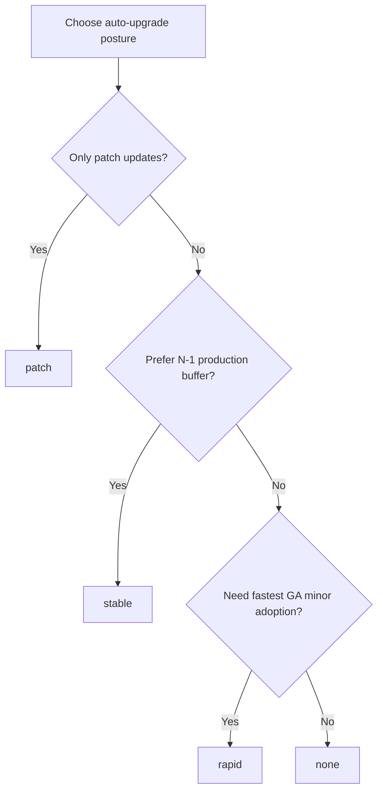

---
content_sources:
  diagrams:
    - id: operations-auto-upgrade-channel-selection
      type: flowchart
      source: self-generated
      justification: AKS cluster auto-upgrade channel selection flow synthesized from Microsoft Learn auto-upgrade and version-support guidance.
      based_on:
        - https://learn.microsoft.com/en-us/azure/aks/auto-upgrade-cluster
        - https://learn.microsoft.com/en-us/azure/aks/supported-kubernetes-versions
        - https://learn.microsoft.com/en-us/azure/aks/release-tracker
content_validation:
  status: verified
  last_reviewed: 2026-07-18
  reviewer: agent
  core_claims:
    - claim: "AKS Standard supports the cluster auto-upgrade channels none, patch, stable, rapid, and node-image, with node-image documented as a legacy channel that is no longer recommended."
      source: https://learn.microsoft.com/en-us/azure/aks/auto-upgrade-cluster
      verified: true
    - claim: "The patch channel keeps the cluster on the same minor version and upgrades to the latest supported patch release for that minor version."
      source: https://learn.microsoft.com/en-us/azure/aks/auto-upgrade-cluster
      verified: true
    - claim: "The stable channel upgrades to the latest supported patch on minor version N-1, and the rapid channel upgrades to the latest supported patch on the latest supported minor version."
      source: https://learn.microsoft.com/en-us/azure/aks/auto-upgrade-cluster
      verified: true
    - claim: "Cluster auto-upgrade only updates to GA Kubernetes versions and does not move clusters to preview versions."
      source: https://learn.microsoft.com/en-us/azure/aks/auto-upgrade-cluster
      verified: true
---

# Auto-Upgrade Channels

Cluster auto-upgrade keeps AKS within the supported Kubernetes window with less manual effort, but the channel you choose defines how aggressively the service moves your control plane and node pools.

## Prerequisites

- Know the business tolerance for automatic minor-version movement.
- Review supported versions and the AKS release tracker for the target region.
- Pair the chosen channel with a maintenance window, especially in production.

## When to Use

- You want the cluster to stay within support without manual version-by-version intervention.
- You need a default posture for fleet-scale or subscription-wide platform operations.
- You want to separate cluster version automation from node OS channel selection.

## Procedure

<!-- diagram-id: operations-auto-upgrade-channel-selection -->


### Channel behavior

| Channel | What it does | What it does not do | Best fit |
|---|---|---|---|
| `none` | Disables cluster autoupgrade. | Does not keep the cluster current for you. | Manual, highly controlled environments. |
| `patch` | Moves to the latest supported patch within the current minor version. | Does not move to the next minor. | Teams that want patch automation but manual minor-version gates. |
| `stable` | Moves to the latest supported patch on minor version N-1. | Does not chase the newest GA minor immediately. | Conservative production default for AKS Standard. |
| `rapid` | Moves to the latest supported patch on the newest supported GA minor version. | Does not move to preview versions. | Fast adopters with strong validation automation. |
| `node-image` | Legacy channel for node image automation. | Should not be treated as the modern default for node OS lifecycle. | Existing legacy estates only. |

### Decision criteria

- Choose **`patch`** when application compatibility review is minor-version sensitive but patch adoption should be automatic.
- Choose **`stable`** when production wants to remain current without leading the newest GA minor immediately.
- Choose **`rapid`** only when your validation discipline is strong enough to absorb faster minor-version movement.
- Choose **`none`** only if you already have a reliable manual upgrade program.
- Avoid new use of **`node-image`** at cluster-channel level; use [Node OS Upgrades](node-os-upgrades.md) instead.

### Configure the channel

```bash
az aks update \
    --resource-group "$RG" \
    --name "$CLUSTER_NAME" \
    --auto-upgrade-channel stable

az aks show \
    --resource-group "$RG" \
    --name "$CLUSTER_NAME" \
    --query "autoUpgradeProfile" \
    --output yaml
```

### Operational notes

- Auto-upgrade first upgrades the control plane, then upgrades agent pools.
- Auto-upgrade only targets **GA** versions.
- Changes to the channel can take time to take effect; do not assume immediate behavior change after flipping the setting.
- Pair the channel with `aksManagedAutoUpgradeSchedule` so version movement happens during an approved window.

## Verification

```bash
az aks show \
    --resource-group "$RG" \
    --name "$CLUSTER_NAME" \
    --query "{clusterChannel:autoUpgradeProfile.upgradeChannel,nodeOsChannel:autoUpgradeProfile.nodeOsUpgradeChannel}" \
    --output yaml
```

- Confirm the intended cluster channel is present.
- Confirm the node OS channel is independently set as expected.
- Confirm a maintenance configuration exists for production clusters that rely on auto-upgrade.

## Rollback / Troubleshooting

- If the chosen channel is too aggressive, move to a more conservative policy such as `stable` or `patch` and keep the maintenance window.
- If the cluster is blocked by workload constraints, fix the blocking cause rather than leaving the cluster unmanaged indefinitely.
- If you need zero-surprise production cutover, move the highest-risk changes to a [Blue-Green Upgrades](blue-green-upgrades.md) pattern.

## See Also

- [Upgrades](upgrades.md)
- [Node OS Upgrades](node-os-upgrades.md)
- [Maintenance Windows](maintenance-windows.md)
- [Version Support](../reference/version-support.md)

## Sources

- [Automatically upgrade an AKS cluster](https://learn.microsoft.com/en-us/azure/aks/auto-upgrade-cluster)
- [Supported Kubernetes versions in AKS](https://learn.microsoft.com/en-us/azure/aks/supported-kubernetes-versions)
- [AKS release tracker](https://learn.microsoft.com/en-us/azure/aks/release-tracker)
