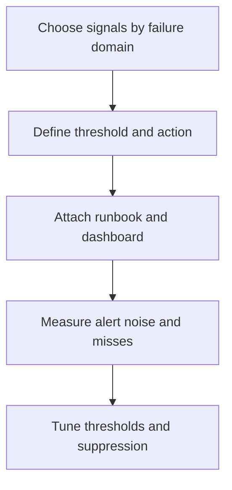

---
content_sources:
  diagrams:
    - id: operations-baseline-alerts-feedback-loop
      type: flowchart
      source: self-generated
      justification: "AKS alerting workflow synthesized from Microsoft Learn guidance for platform metrics, Prometheus alerts, control-plane resource logs, and Grafana analysis."
      based_on:
        - https://learn.microsoft.com/en-us/azure/aks/monitor-aks
        - https://learn.microsoft.com/en-us/azure/aks/monitor-aks-reference
        - https://learn.microsoft.com/en-us/azure/azure-monitor/containers/kubernetes-monitoring-overview
content_validation:
  status: verified
  last_reviewed: 2026-07-18
  reviewer: agent
  core_claims:
    - claim: "Platform metrics for AKS clusters are automatically collected at no cost."
      source: https://learn.microsoft.com/en-us/azure/aks/monitor-aks
      verified: true
    - claim: "Prometheus metrics collected for AKS can be used with Prometheus alerts in Azure Monitor."
      source: https://learn.microsoft.com/en-us/azure/aks/monitor-aks
      verified: true
    - claim: "Azure Managed Grafana provides predefined dashboards for monitoring Kubernetes."
      source: https://learn.microsoft.com/en-us/azure/azure-monitor/containers/kubernetes-monitoring-overview
      verified: true
    - claim: "AKS control-plane logs can be queried in a Log Analytics workspace after routing them with a diagnostic setting."
      source: https://learn.microsoft.com/en-us/azure/aks/monitor-aks
      verified: true
---

# Baseline Alerts

Baseline alerts keep AKS incidents short by surfacing cluster health regressions before operators start guessing. Use this library as the minimum alert set for shared production clusters, then tighten thresholds per workload and region.

## Prerequisites

- Platform metrics, Container insights, and managed Prometheus are enabled where the listed signals require them.
- Control-plane diagnostic settings are enabled for API server, audit, autoscaler, and CSI categories.
- Alert action groups, escalation paths, and quiet-hours policy are already defined.
- Azure Managed Grafana or Azure Monitor dashboards are available for post-alert drill-down.

## When to Use

- Establishing the first production-grade alert baseline for AKS.
- Replacing noisy pod-only alerts with cluster-aware signals.
- Standardizing a common library across multiple AKS clusters.
- Preparing dashboards and runbooks for on-call rotations.

## Procedure

<!-- diagram-id: operations-baseline-alerts-feedback-loop -->

### 1) Cover each failure domain once before you optimize depth

Baseline coverage should include:

- node availability,
- pod scheduling backlog,
- restart instability,
- API server health,
- autoscaler behavior,
- storage control path,
- certificate lifecycle,
- add-on health.

### 2) Deploy the minimum alert library

| Alert | Signal source | Suggested threshold | Why operators care |
|---|---|---|---|
| Node not ready | Platform metric or `KubeNodeInventory` | Any production node `NotReady` for 10 minutes | Lost capacity and possible noisy-neighbor impact. |
| Pod pending backlog | Managed Prometheus or `KubePodInventory` | More than 10 non-system `Pending` pods for 10 minutes | Scheduling or capacity pressure is now customer visible. |
| Restart spike | `KubePodInventory` / KQL | More than 5 restarts in 15 minutes for one workload | Stable deployments should not recycle repeatedly. |
| API server error rate | Control-plane logs or control-plane metrics | 5xx responses above 1% for 10 minutes | Cluster-wide management path is degrading. |
| Autoscaler lag | `cluster-autoscaler` logs plus unschedulable-pod metrics | Unschedulable pods persist for 15 minutes with no scale-up action | The autoscaler is blocked or misconfigured. |
| Storage attach failure | CSI controller logs or `KubeEvents` | Any repeated `FailedAttachVolume` or mount error burst for 10 minutes | Stateful workloads will not recover by themselves. |
| Certificate expiry | Scheduled audit check | Control-plane or add-on certificate expires within 30 days | Expiry incidents are avoidable and high severity. |
| Add-on health degradation | Grafana dashboard / kube-system readiness metrics | Any critical add-on unavailable for 10 minutes | DNS, ingress, policy, or CSI can fail cluster-wide. |

Add two strong secondary alerts if your clusters are business-critical:

| Alert | Signal source | Suggested threshold | Why operators care |
|---|---|---|---|
| Admission webhook latency or failure | `kube-audit` / `kube-audit-admin` / `kube-apiserver` | Failure burst or persistent latency for 10 minutes | Writes to the API can stall even when workloads look healthy. |
| Audit deny burst | `AKSAuditAdmin` / `AKSAudit` | More than 20 forbidden requests in 10 minutes from one principal | Often indicates broken automation, drift, or a privilege problem. |

### 3) Map each alert to the right query language

- **PromQL / metric alert**: node readiness, pod backlog, autoscaler lag, certificate horizon, add-on health.
- **KQL / log alert**: restart spikes, storage attach failures, audit deny bursts, API server error-rate if you rely on control-plane logs.

### 4) Attach dashboards and runbooks, not just action groups

Every alert should point to:

- a first-10-minutes checklist,
- a detailed playbook if one exists,
- a Grafana or Azure Monitor dashboard for the same failure domain.

Recommended dashboard families:

- **Control plane dashboards** for API server, scheduler, and autoscaler context.
- **Node pool dashboards** for readiness, saturation, and scaling headroom.
- **Workload health dashboards** for restart rates, HPA behavior, and namespace pressure.

### 5) Treat thresholds as starting points, not promises

The thresholds above are operator-facing defaults for shared clusters. Tune them using:

- expected cluster size,
- workload criticality,
- node-pool specialization,
- normal deployment churn,
- whether the signal is customer-visible immediately or only operationally concerning.

## Verification

Validate that each alert can point to a live signal and a drill-down path:

- the metric or log query returns current data,
- the alert threshold is crossed in a lab or rehearsal scenario,
- the action group fires,
- the linked runbook and dashboard are the ones operators actually use.

Minimum verification questions:

- Can on-call engineers reach a control-plane dashboard from an API-server alert in one click?
- Can they reach a CSI or storage playbook from a storage alert without searching the repo?
- Do node, autoscaler, and backlog alerts form one coherent scaling story instead of three isolated pages?

## Rollback / Troubleshooting

- If alerts are noisy, reduce cardinality and duplicate signals before raising thresholds blindly.
- If alerts are quiet but incidents still happen, add failure-domain coverage before adding more replicas of the same signal.
- If control-plane alerts never fire, verify diagnostic settings and managed Prometheus coverage before debugging the alert rules themselves.
- If dashboard links are unused, the alert is incomplete even if the threshold is technically correct.

## See Also

- [Monitoring and Logging](monitoring-logging.md)
- [Diagnostic Settings](diagnostic-settings.md)
- [Managed Prometheus](managed-prometheus.md)
- [Control Plane Query Pack](../troubleshooting/kql/control-plane/index.md)
- [Storage Query Pack](../troubleshooting/kql/storage/index.md)

## Sources

- [Monitor AKS](https://learn.microsoft.com/en-us/azure/aks/monitor-aks)
- [AKS monitoring data reference](https://learn.microsoft.com/en-us/azure/aks/monitor-aks-reference)
- [Kubernetes monitoring in Azure Monitor](https://learn.microsoft.com/en-us/azure/azure-monitor/containers/kubernetes-monitoring-overview)
- [Enable monitoring for AKS clusters](https://learn.microsoft.com/en-us/azure/azure-monitor/containers/kubernetes-monitoring-enable)
