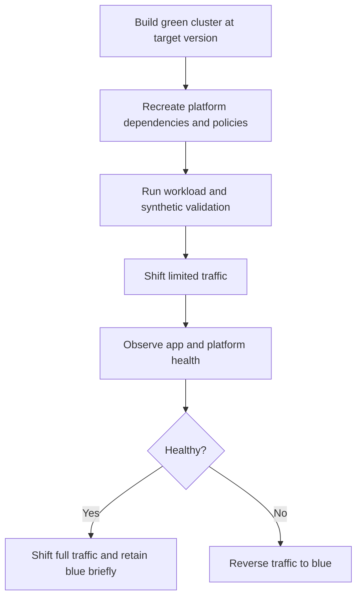

---
content_sources:
  diagrams:
    - id: operations-blue-green-upgrades
      type: flowchart
      source: self-generated
      justification: Blue/green AKS upgrade workflow synthesized from Microsoft Learn upgrade guidance, version-support policy, and network-policy validation guidance.
      based_on:
        - https://learn.microsoft.com/en-us/azure/aks/upgrade-options
        - https://learn.microsoft.com/en-us/azure/aks/supported-kubernetes-versions
        - https://learn.microsoft.com/en-us/azure/aks/use-network-policies
content_validation:
  status: verified
  last_reviewed: 2026-07-18
  reviewer: agent
  core_claims:
    - claim: "AKS recommends blue-green deployment patterns for critical workloads when avoiding disruption from in-place upgrade drains is important."
      source: https://learn.microsoft.com/en-us/azure/aks/upgrade-options
      verified: true
    - claim: "Supported non-LTS Kubernetes minor upgrades progress one minor version at a time, which makes large version jumps a design consideration for blue-green planning."
      source: https://learn.microsoft.com/en-us/azure/aks/supported-kubernetes-versions
      verified: true
    - claim: "Network policies are explicit cluster resources that must be recreated and revalidated on the target cluster when you use a parallel-cluster upgrade pattern."
      source: https://learn.microsoft.com/en-us/azure/aks/use-network-policies
      verified: true
---

# Blue-Green Upgrades

Blue/green upgrades replace “upgrade in place and hope rollback is possible” with “stand up the next cluster, validate it, then move traffic deliberately.” This is the safest pattern when control-plane change, controller churn, or workload sensitivity makes in-place risk unacceptable.

## Prerequisites

- A traffic-management path exists outside the cluster, such as DNS, Front Door, Application Gateway, or other edge routing.
- Platform dependencies can be recreated on the green cluster: ingress, identities, secrets, policies, storage mappings, and observability.
- The team can afford temporary parallel capacity.

## When to Use

- The production cluster is business critical and drain failures are unacceptable.
- The version gap is large enough that in-place change risk is hard to bound.
- You need explicit workload validation gates before any user traffic moves.
- Rollback must be a traffic shift rather than a version-reversal attempt.

## Procedure

<!-- diagram-id: operations-blue-green-upgrades -->

### 1) Build the green cluster as a real production candidate

Do not create a skeletal test cluster and call it blue/green. The green cluster must include:

- Equivalent networking posture.
- Equivalent ingress pattern.
- Equivalent identity model.
- Equivalent storage and CSI assumptions.
- Equivalent network policies and policy enforcement.

### 2) Recreate cluster-scoped dependencies first

Before application traffic moves, validate the platform surface:

- Ingress and TLS behavior.
- Workload identity and secret access.
- Network policies and namespace isolation.
- Monitoring, alerts, and logs.

If the green cluster lacks equivalent network-policy resources, your test result is not representative.

### 3) Use explicit validation gates

Required gates usually include:

- `kubectl get nodes` and `kubectl get pods --all-namespaces` are healthy.
- Synthetic checks pass for ingress, DNS, east-west traffic, and Azure dependencies.
- Critical business transactions succeed.
- Capacity and autoscaling behavior match the expected production profile.

### 4) Shift traffic gradually

Use a staged move rather than a binary cut whenever the edge platform allows it:

- Canary traffic.
- Namespace or tenant subset.
- Regional or weighted DNS.
- Short hold period with strong telemetry.

### 5) Treat rollback as traffic reversal

The strength of blue/green is that rollback does not depend on cluster version reversal. It depends on keeping blue intact until green proves itself.

Keep blue available long enough to survive:

- Late controller regressions.
- Hidden identity or storage dependencies.
- Node image issues that appear only under production load.

## Verification

- Green cluster is healthy before any traffic moves.
- Edge routing confirms partial and then full traffic shift as planned.
- Identity, storage, and network-policy tests pass on green.
- Blue capacity is retained until the agreed rollback window ends.

## Rollback / Troubleshooting

- If validation fails before traffic cutover, keep blue serving and fix green without user impact.
- If partial traffic reveals regressions, reverse traffic first and debug second.
- If the blocker is version-specific API behavior, check [Upgrade Blocked by Deprecated API](../troubleshooting/playbooks/operations/upgrade-blocked-deprecated-api.md).

## See Also

- [Upgrades](upgrades.md)
- [Version Support](../reference/version-support.md)
- [AKS Version Lifecycle](../platform/version-lifecycle.md)
- [Maintenance Windows](maintenance-windows.md)

## Sources

- [Upgrade options and recommendations for AKS clusters](https://learn.microsoft.com/en-us/azure/aks/upgrade-options)
- [Supported Kubernetes versions in AKS](https://learn.microsoft.com/en-us/azure/aks/supported-kubernetes-versions)
- [Secure pod traffic with network policies in AKS](https://learn.microsoft.com/en-us/azure/aks/use-network-policies)
