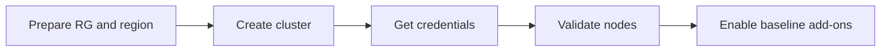

---
hide:
  - toc
content_sources:
  diagrams:
  - id: operations-cluster-creation
    type: flowchart
    source: mslearn-adapted
    mslearn_url: https://learn.microsoft.com/en-us/azure/aks/learn/quick-kubernetes-deploy-cli
    based_on:
    - https://learn.microsoft.com/en-us/azure/aks/learn/quick-kubernetes-deploy-cli
    - https://learn.microsoft.com/en-us/azure/aks/upgrade-cluster
    - https://learn.microsoft.com/en-us/azure/azure-monitor/containers/container-insights-overview
    - https://learn.microsoft.com/en-us/azure/aks/concepts-network
    - https://learn.microsoft.com/en-us/azure/aks/azure-cni-overlay
---


# Cluster Creation

A good AKS cluster is mostly decided before the first `az aks create` command. Use this runbook to create a cluster with explicit networking, identity, and observability choices.

## Prerequisites

- Azure CLI, `kubectl`, and `kubelogin` installed.
- Resource group, VNet strategy, and Log Analytics workspace decided.
- VM quota confirmed for the target region and node size.

## When to Use

- Creating a new environment.
- Rebuilding a cluster from a reviewed baseline.
- Standardizing cluster creation across teams.

## Procedure
<!-- diagram-id: operations-cluster-creation -->

<!-- diagram-id: operations-cluster-creation -->



```bash
export RG="rg-aks-demo"
export CLUSTER_NAME="aks-demo"
export LOCATION="koreacentral"

az group create --name $RG --location $LOCATION
az aks create     --resource-group $RG     --name $CLUSTER_NAME     --location $LOCATION     --node-count 3     --node-vm-size Standard_D4ds_v5     --enable-managed-identity     --enable-oidc-issuer     --enable-workload-identity     --network-plugin azure     --network-plugin-mode overlay     --generate-ssh-keys
az aks get-credentials --resource-group $RG --name $CLUSTER_NAME --overwrite-existing
kubectl get nodes -o wide
```

## Verification

```bash
az aks show --resource-group $RG --name $CLUSTER_NAME --query "{powerState:powerState.code,kubernetesVersion:kubernetesVersion,networkPlugin:networkProfile.networkPlugin,networkMode:networkProfile.networkPluginMode}" --output yaml
kubectl get pods -n kube-system
```

## Rollback / Troubleshooting

- Delete the cluster only if it was a failed greenfield setup and no state was attached.
- If creation fails, check quota, subnet sizing, and Azure Policy denies first.
- If credentials fail, re-run `az aks get-credentials` and validate Entra login requirements.

## See Also

- [Prerequisites](../start-here/prerequisites.md)
- [Cluster Architecture](../platform/cluster-architecture.md)
- [Production Baseline](../best-practices/production-baseline.md)

## Sources

- [Create an AKS cluster](https://learn.microsoft.com/azure/aks/learn/quick-kubernetes-deploy-cli)
- [Upgrade an AKS cluster](https://learn.microsoft.com/azure/aks/upgrade-cluster)
- [Monitor AKS with Container insights](https://learn.microsoft.com/azure/azure-monitor/containers/container-insights-overview)
- [AKS network concepts](https://learn.microsoft.com/azure/aks/concepts-network)
- [Create an AKS cluster with Azure CNI Overlay](https://learn.microsoft.com/azure/aks/azure-cni-overlay)
