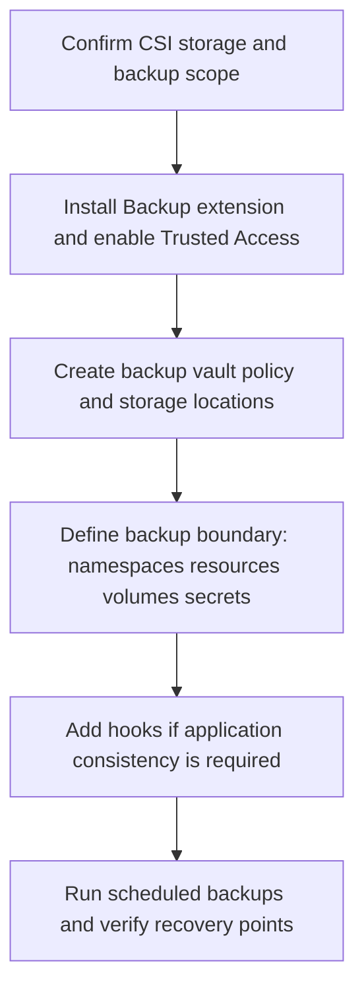

---
content_sources:
  diagrams:
    - id: operations-cluster-resource-pv-backup-flow
      type: flowchart
      source: self-generated
      justification: AKS backup flow synthesized from Microsoft Learn Azure Backup for AKS overview, backup, prerequisites, and management guidance.
      based_on:
        - https://learn.microsoft.com/en-us/azure/backup/azure-kubernetes-service-backup-overview
        - https://learn.microsoft.com/en-us/azure/backup/azure-kubernetes-service-cluster-backup
        - https://learn.microsoft.com/en-us/azure/backup/azure-kubernetes-service-cluster-backup-concept
        - https://learn.microsoft.com/en-us/azure/backup/azure-kubernetes-service-cluster-manage-backups
content_validation:
  status: verified
  last_reviewed: 2026-07-18
  reviewer: agent
  core_claims:
    - claim: "Azure Backup for AKS protects cluster resources and persistent volumes by using a Backup extension installed in the cluster and Trusted Access between the Backup vault and the AKS cluster."
      source: https://learn.microsoft.com/en-us/azure/backup/azure-kubernetes-service-backup-overview
      verified: true
    - claim: "Azure Backup for AKS supports CSI-driver-based Azure Disks and Azure SMB Files, and currently skips other persistent-volume types such as Azure Files NFS and Azure Blob storage."
      source: https://learn.microsoft.com/en-us/azure/backup/azure-kubernetes-service-backup-overview
      verified: true
    - claim: "Operational Tier supports a minimum four-hour recovery-point objective, while Vault Tier long-term storage is available only for Azure Disk-based volumes."
      source: https://learn.microsoft.com/en-us/azure/backup/azure-kubernetes-service-backup-overview
      verified: true
    - claim: "AKS backup supports custom hooks for application-consistent snapshots during backup and restore workflows."
      source: https://learn.microsoft.com/en-us/azure/backup/azure-kubernetes-service-backup-overview
      verified: true
---

# Cluster Resource and PV Backup

AKS backup is not control-plane etcd backup. In AKS, the control plane is Azure-managed. Your backup responsibility is the **cluster resources you own** and the **persistent volumes your workloads depend on**, using Azure Backup for AKS or an intentionally operated Velero-style workflow.

## Prerequisites

- The cluster uses CSI-driver-based Azure Disks or Azure SMB Files for volumes you expect to protect.
- The Backup extension is installed in the source cluster and in any target cluster used for restore drills.
- Trusted Access is enabled between the Backup vault and the AKS cluster.
- Blob-container, snapshot-resource-group, and RBAC prerequisites are validated before the first protected backup run.

## When to Use

- You need scheduled backup of AKS cluster resources and PV data.
- You need namespace-scoped or cluster-scoped recovery points before upgrades or disaster-recovery tests.
- You need an application-consistent workflow for stateful workloads.
- You need an operator-standard alternative when a team cannot use the Azure Backup control plane.

## Procedure

<!-- diagram-id: operations-cluster-resource-pv-backup-flow -->

### 1) Understand the backup boundary

Azure Backup for AKS protects:

- cluster resources selected by backup configuration
- persistent volumes backed by supported CSI storage
- backup metadata stored in a blob container
- disk or file snapshots that form the recovery point

It does **not** mean direct etcd backup by AKS customers. Keep that language out of operational runbooks.

### 2) Choose the backup control plane

**Azure Backup for AKS** is the primary managed path when you want Azure-native scheduling, retention, and restore orchestration.

**Velero-style workflows** are still useful when you intentionally need a portable, self-managed model. In that case, mirror the same boundaries:

- capture Kubernetes objects explicitly
- use CSI snapshots for PV data where supported
- define namespace filters and restore policy deliberately
- rehearse restore, not just backup creation

### 3) Design schedule and retention around workload class

Use policy as an operational contract:

- **4-hour schedule** for tighter RPO on critical namespaces
- **daily schedule** for lower-change clusters or developer recovery
- **separate backup instances** when Azure Disk and Azure Files need different retention behavior

Important Azure Backup realities:

- Azure Files backup retention is capped at 30 days.
- Vault Tier is for Azure Disk-only backup instances.
- Only one scheduled recovery point per day can move to Vault Tier.

### 4) Add application-consistent hooks where they matter

Stateful backup quality is not just “snapshot succeeded.” If the workload needs quiescing, use custom hooks.

Typical pattern:

- freeze writes or flush buffers before the snapshot
- take the backup snapshot
- unfreeze writes immediately after

### 5) Include the right resource types

Backup scope should be explicit about:

- namespaces included
- cluster-scoped resources included or excluded
- persistent volumes included
- secrets included when Azure Files SMB key-based restores depend on them

### 6) Verify the recovery point, not just the job status

After configuration, confirm:

- backup instance exists in the vault
- scheduled or on-demand backup jobs complete
- snapshots appear where expected
- warnings are reviewed, not ignored

## Verification

- Backup instance is present and healthy in the Backup vault.
- Recovery points exist for the intended namespaces and supported PVs.
- Disk snapshots exist in the snapshot resource group, or Azure Files snapshots exist alongside the file share.
- Hook-based backups complete without warning-level data-consistency gaps.

## Rollback / Troubleshooting

- If Azure Files volumes are in scope, verify you included secrets when the mount path depends on storage account keys.
- If backup jobs complete with warnings, review the skipped resources before calling the recovery point usable.
- If extension pods restart or OOM during backup, tune extension resource requests and limits.
- If a PVC or snapshot family is unsupported, document that gap and protect the workload by a separate recovery pattern.

## See Also

- [Restore Drills](restore-drills.md)
- [Snapshot Operations](snapshot-operations.md)
- [Reliability](../best-practices/reliability.md)
- [Tutorial 05: AKS Disaster Recovery](../tutorials/lab-guides/lab-05-aks-disaster-recovery.md)

## Sources

- [What is Azure Kubernetes Service backup?](https://learn.microsoft.com/en-us/azure/backup/azure-kubernetes-service-backup-overview)
- [Back up Azure Kubernetes Service by using Azure Backup](https://learn.microsoft.com/en-us/azure/backup/azure-kubernetes-service-cluster-backup)
- [AKS backup prerequisites](https://learn.microsoft.com/en-us/azure/backup/azure-kubernetes-service-cluster-backup-concept)
- [Manage AKS backups using Azure Backup](https://learn.microsoft.com/en-us/azure/backup/azure-kubernetes-service-cluster-manage-backups)
