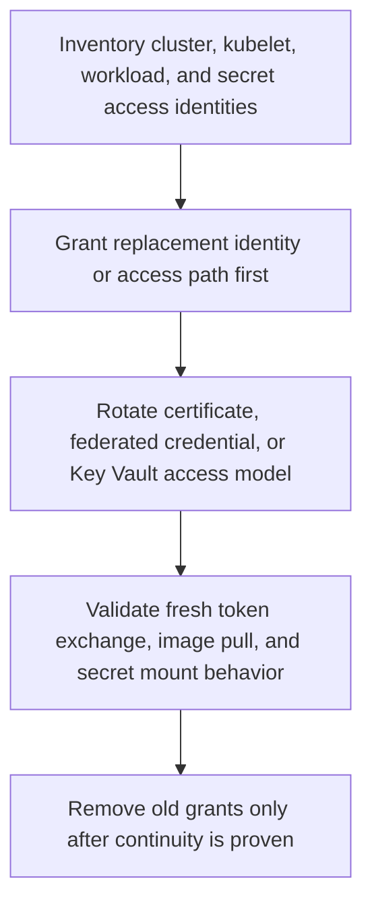

---
content_sources:
  diagrams:
    - id: operations-credential-rotation
      type: flowchart
      source: self-generated
      justification: Rotation sequence synthesized from Microsoft Learn AKS certificate rotation, managed identity, kubelet identity, workload identity, and Key Vault CSI guidance.
      based_on:
        - https://learn.microsoft.com/en-us/azure/aks/certificate-rotation
        - https://learn.microsoft.com/en-us/azure/aks/use-managed-identity
        - https://learn.microsoft.com/en-us/azure/aks/use-kubelet-identity-default-cluster
        - https://learn.microsoft.com/en-us/azure/aks/workload-identity-overview
        - https://learn.microsoft.com/en-us/azure/aks/csi-secrets-store-driver
        - https://learn.microsoft.com/en-us/azure/aks/csi-secrets-store-identity-access
content_validation:
  status: verified
  last_reviewed: 2026-07-18
  reviewer: agent
  core_claims:
    - claim: "AKS uses certificates for authentication between managed control plane components and data plane components."
      source: https://learn.microsoft.com/en-us/azure/aks/certificate-rotation
      verified: true
    - claim: "AKS clusters created after May 2019 have cluster CA certificates that expire after 30 years."
      source: https://learn.microsoft.com/en-us/azure/aks/certificate-rotation
      verified: true
    - claim: "When you manually rotate the cluster CA certificate, AKS also refreshes service account tokens, API server certificates, kubelet client certificates, and kubelet server certificates if serving certificate rotation is enabled."
      source: https://learn.microsoft.com/en-us/azure/aks/certificate-rotation
      verified: true
    - claim: "After rotating the cluster CA certificate, you must refresh kubectl client certificates with az aks get-credentials to maintain API server access."
      source: https://learn.microsoft.com/en-us/azure/aks/certificate-rotation
      verified: true
    - claim: "The kubelet identity is used by AKS agent nodes for Azure resource access such as pulling images from Azure Container Registry."
      source: https://learn.microsoft.com/en-us/azure/aks/use-kubelet-identity-default-cluster
      verified: true
    - claim: "The Azure Key Vault provider for Secrets Store CSI Driver can optionally sync mounted content to Kubernetes Secrets."
      source: https://learn.microsoft.com/en-us/azure/aks/csi-secrets-store-driver
      verified: true
---

# Credential Rotation

Credential rotation in AKS includes more than Kubernetes certificates. You also need rotation plans for kubeconfig access, workload credentials, image pull identities, and external secrets.

## Prerequisites

- You know which identities and certificates exist in the cluster.
- Application teams know how to recover after rotation events.
- A change window and rollback communication plan are prepared.

## When to Use

- Scheduled certificate rotation.
- Secret expiration or emergency compromise response.
- Migration from static credentials to workload identity.
- Kubelet identity replacement or registry-permission remediation.
- Key Vault access-model migration before or after a security review.

## Procedure

<!-- diagram-id: operations-credential-rotation -->


### 1. Inventory the credential paths

Record which AKS identity owns each access path before rotating anything:

- **Cluster certificates and kubeconfig** for API access.
- **Control-plane identity** for Azure resource mutation.
- **Kubelet identity** for ACR pulls and other node-side Azure access.
- **Workload identity** for pod-to-Azure-resource token exchange.
- **Key Vault CSI path** for mounted files and any synced Kubernetes secrets.

```bash
az aks show \
    --resource-group "$RG" \
    --name "$CLUSTER_NAME" \
    --query "{controlPlaneIdentity:identity,kubeletIdentity:identityProfile.kubeletidentity,issuer:oidcIssuerProfile.issuerUrl,workloadIdentity:securityProfile.workloadIdentity,keyVaultAddon:addonProfiles.azureKeyvaultSecretsProvider}" \
    --output yaml

kubectl get serviceaccount \
    --all-namespaces

kubectl get secretproviderclass \
    --all-namespaces
```

### 2. Rotate cluster certificates separately from workload identity

Cluster certificate rotation is not the same as workload identity rotation. Run it on its own change plan, then refresh clients.

```bash
az aks rotate-certs \
    --resource-group "$RG" \
    --name "$CLUSTER_NAME" \
    --yes

az aks get-credentials \
    --resource-group "$RG" \
    --name "$CLUSTER_NAME" \
    --overwrite-existing
```

### 3. Rotate federated credentials without workload interruption

Federated identity credentials are safe to rotate when you overlap old and new trust instead of replacing it in one cut:

- Create the replacement federated identity credential first.
- Keep the same Kubernetes service account subject during the test window when possible.
- Grant downstream Azure access to the replacement identity target before switching production traffic.
- Start a canary pod and validate fresh token exchange.
- Remove the old federated identity credential only after the canary proves continuity.

If you must change the namespace or service account name, treat the change as a new `subject` and overlap both credential definitions during transition.

### 4. Migrate Key Vault access model safely

When moving between Key Vault access policies and Azure RBAC:

- Grant the new authorization model first.
- Start a fresh pod that mounts the same `SecretProviderClass`.
- Validate both mounted file content and any synced Kubernetes secret.
- Remove the old authorization path only after refresh and remount succeed.

Running pods can continue to hold already-mounted values in memory or on disk until the next refresh cycle, so a revoke can appear delayed from the application's perspective.

### 5. Handle kubelet identity rotation deliberately

Kubelet identity changes affect node-side Azure access, especially ACR pulls.

- Distinguish **control-plane identity** failures from **kubelet identity** failures before granting permissions.
- For ACR pull issues, grant the required registry role to the kubelet identity, not to workload identities.
- Validate by forcing a fresh image pull, because already-running pods can hide the break until restart or reschedule.

Replacement implications:

- Existing running pods may stay healthy until a new image pull is required.
- Cluster scale-out, new deployments, and node replacements expose kubelet identity mistakes quickly.

### 6. Set correct secret refresh expectations

The Key Vault CSI refresh path is eventual, not immediate:

- Mounted files refresh after the CSI provider's refresh cycle detects a new Key Vault version.
- `--sync` style secret synchronization creates or updates a Kubernetes secret copy, but it does not make environment variables inside already-running containers reload automatically.
- Applications that read secrets only at startup usually need a restart or rollout to consume the new value, even when the mounted file or synced secret has already updated.

## Verification

```bash
kubectl auth can-i get pods --all-namespaces

kubectl get pods \
    --all-namespaces

kubectl describe serviceaccount "$SERVICE_ACCOUNT_NAME" \
    --namespace "$NAMESPACE"

kubectl describe pod "$POD_NAME" \
    --namespace "$NAMESPACE"

kubectl get secret "$SECRET_NAME" \
    --namespace "$NAMESPACE" \
    --output yaml
```

## Rollback / Troubleshooting

- If client access fails after certificate rotation, refresh kubeconfig and verify Entra authentication plugins.
- If workloads lose Azure access, inspect workload identity federation settings and the [Token Exchange Failure](../troubleshooting/playbooks/identity/token-exchange-failure.md) playbook.
- If the issuer changed or a cluster migration occurred, use [OIDC Issuer Mismatch](../troubleshooting/playbooks/identity/oidc-issuer-mismatch.md).
- If token exchange fails after a credential edit, use [Audience Mismatch](../troubleshooting/playbooks/identity/audience-mismatch.md).
- If Key Vault still fails after apparent RBAC success, use [RBAC Success but Key Vault Still Fails](../troubleshooting/playbooks/identity/rbac-success-key-vault-fail.md).
- If image pulls fail after kubelet credential changes, validate ACR integration and kubelet identity role assignments immediately.

## See Also

- [Identity and Secrets](../platform/identity-and-secrets.md)
- [Microsoft Entra Workload Identity](../platform/workload-identity.md)
- [Identity Model Comparison](../platform/identity-model-comparison.md)
- [Azure Key Vault CSI Driver](../platform/key-vault-csi.md)
- [Security](../best-practices/security.md)
- [Image Pull Failure](../troubleshooting/playbooks/pod-issues/image-pull-failure.md)

## Sources

- [Rotate certificates in AKS](https://learn.microsoft.com/en-us/azure/aks/certificate-rotation)
- [Use managed identities in AKS](https://learn.microsoft.com/en-us/azure/aks/use-managed-identity)
- [Use a pre-created kubelet managed identity in AKS](https://learn.microsoft.com/en-us/azure/aks/use-kubelet-identity-default-cluster)
- [Microsoft Entra Workload ID overview](https://learn.microsoft.com/en-us/azure/aks/workload-identity-overview)
- [Use the Azure Key Vault provider for Secrets Store CSI Driver in AKS](https://learn.microsoft.com/en-us/azure/aks/csi-secrets-store-driver)
- [Configure access to Azure Key Vault provider for Secrets Store CSI Driver in AKS](https://learn.microsoft.com/en-us/azure/aks/csi-secrets-store-identity-access)
