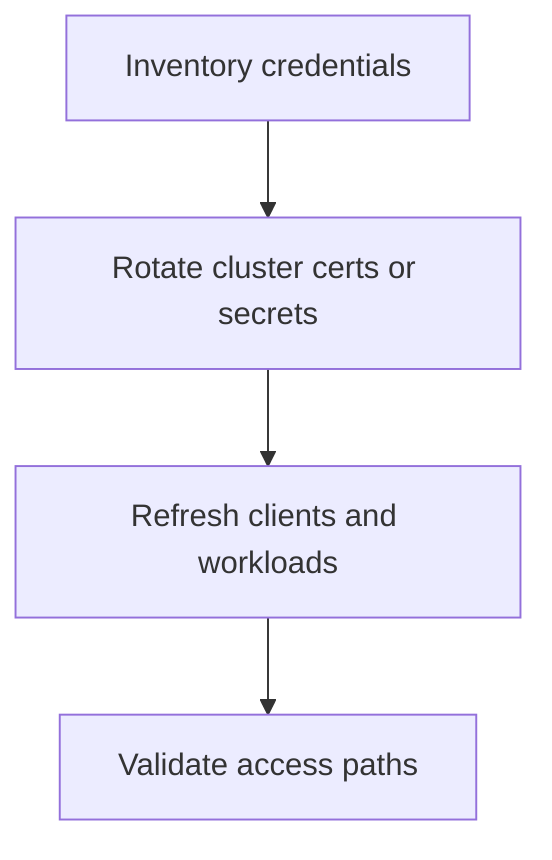

---
content_sources:
  diagrams:
  - id: operations-credential-rotation
    type: flowchart
    source: mslearn-adapted
    mslearn_url: https://learn.microsoft.com/en-us/azure/aks/certificate-rotation
    based_on:
    - https://learn.microsoft.com/en-us/azure/aks/certificate-rotation
    - https://learn.microsoft.com/en-us/azure/aks/use-managed-identity
content_validation:
  status: verified
  last_reviewed: 2026-07-18
  reviewer: agent
  core_claims:
    - claim: "AKS uses certificates for authentication between managed control plane components and data plane components."
      source: https://learn.microsoft.com/en-us/azure/aks/certificate-rotation
      verified: true
    - claim: "AKS clusters created after May 2019 have cluster CA certificates that expire after 30 years."
      source: https://learn.microsoft.com/en-us/azure/aks/certificate-rotation
      verified: true
    - claim: "When you manually rotate the cluster CA certificate, AKS also refreshes service account tokens, API server certificates, kubelet client certificates, and kubelet server certificates if serving certificate rotation is enabled."
      source: https://learn.microsoft.com/en-us/azure/aks/certificate-rotation
      verified: true
    - claim: "After rotating the cluster CA certificate, you must refresh kubectl client certificates with az aks get-credentials to maintain API server access."
      source: https://learn.microsoft.com/en-us/azure/aks/certificate-rotation
      verified: true
---


# Credential Rotation

Credential rotation in AKS includes more than Kubernetes certificates. You also need rotation plans for kubeconfig access, workload credentials, image pull identities, and external secrets.

## Prerequisites

- You know which identities and certificates exist in the cluster.
- Application teams know how to recover after rotation events.
- A change window and rollback communication plan are prepared.

## When to Use

- Scheduled certificate rotation.
- Secret expiration or emergency compromise response.
- Migration from static credentials to workload identity.

## Procedure
<!-- diagram-id: operations-credential-rotation -->



```bash
az aks rotate-certs --resource-group $RG --name $CLUSTER_NAME --yes
az aks get-credentials --resource-group $RG --name $CLUSTER_NAME --overwrite-existing
kubectl get secret -A
kubectl rollout restart deployment/<deployment-name> -n <namespace>
```

## Verification

```bash
kubectl auth can-i get pods --all-namespaces
kubectl get pods -A
kubectl describe serviceaccount <service-account> -n <namespace>
```

## Rollback / Troubleshooting

- If client access fails after certificate rotation, refresh kubeconfig and verify Entra authentication plugins.
- If workloads lose Azure access, inspect workload identity federation settings and Key Vault access policies.
- If image pulls fail after credential changes, validate ACR integration or secret references immediately.

## See Also

- [Identity and Secrets](../platform/identity-and-secrets.md)
- [Security](../best-practices/security.md)
- [Image Pull Failure](../troubleshooting/playbooks/pod-issues/image-pull-failure.md)

## Sources

- [Rotate certificates in AKS](https://learn.microsoft.com/azure/aks/certificate-rotation)
- [Use managed identities in AKS](https://learn.microsoft.com/azure/aks/use-managed-identity)
