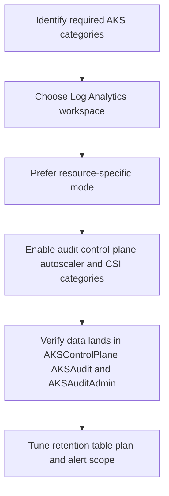

---
content_sources:
  diagrams:
    - id: operations-diagnostic-settings-flow
      type: flowchart
      source: self-generated
      justification: "AKS diagnostic-settings flow synthesized from Microsoft Learn guidance for control-plane resource logs, collection modes, and workspace routing."
      based_on:
        - https://learn.microsoft.com/en-us/azure/aks/monitor-aks
        - https://learn.microsoft.com/en-us/azure/aks/monitor-aks-reference
        - https://learn.microsoft.com/en-us/azure/azure-monitor/essentials/diagnostic-settings
content_validation:
  status: verified
  last_reviewed: 2026-07-18
  reviewer: agent
  core_claims:
    - claim: "AKS control-plane logs are implemented as Azure Monitor resource logs."
      source: https://learn.microsoft.com/en-us/azure/aks/monitor-aks
      verified: true
    - claim: "AKS resource logs are not collected or stored until you create a diagnostic setting."
      source: https://learn.microsoft.com/en-us/azure/aks/monitor-aks
      verified: true
    - claim: "Resource-specific mode for AKS sends data to the AKSAudit, AKSAuditAdmin, and AKSControlPlane tables."
      source: https://learn.microsoft.com/en-us/azure/aks/monitor-aks
      verified: true
    - claim: "The `kube-audit-admin` category excludes `get` and `list` audit events."
      source: https://learn.microsoft.com/en-us/azure/aks/monitor-aks
      verified: true
    - claim: "AKS resource logs incur ingestion and retention costs in the destination Log Analytics workspace."
      source: https://learn.microsoft.com/en-us/azure/aks/monitor-aks
      verified: true
---

# Diagnostic Settings

AKS control-plane and audit troubleshooting starts here: if no diagnostic setting exists, there is no control-plane log history to query. Use this page to enable the right categories, route them to the right workspace, and keep ingestion cost predictable.

## Prerequisites

- An AKS cluster already exists.
- A Log Analytics workspace exists in the same subscription as the AKS cluster.
- You have permission to create Azure Monitor diagnostic settings on the cluster.
- Your operations team knows whether the workspace should keep audit tables in Analytics or Basic logs.

## When to Use

- You need API server, audit, autoscaler, scheduler, or CSI controller evidence.
- You are onboarding a production AKS cluster to a baseline observability stack.
- You are preparing first-10-minutes runbooks and KQL packs that depend on control-plane logs.
- You want to reduce audit-log cost by switching from Azure diagnostics mode to resource-specific mode.

## Procedure

<!-- diagram-id: operations-diagnostic-settings-flow -->


### 1) Know what diagnostic settings unlock

AKS platform metrics are collected automatically, but control-plane logs are not. A diagnostic setting is the switch that makes these categories queryable:

- `kube-apiserver` **(issue #9 minimum baseline)**
- `kube-audit` **(issue #9 minimum baseline)**
- `kube-audit-admin` **(issue #9 minimum baseline)**
- `kube-controller-manager` **(issue #9 minimum baseline)**
- `kube-scheduler` **(issue #9 minimum baseline)**
- `cluster-autoscaler` **(issue #9 minimum baseline)**
- `cloud-controller-manager` **(issue #9 minimum baseline)**
- `guard` **(issue #9 minimum baseline)**
- `csi-azuredisk-controller` **(issue #9 minimum baseline)**
- `csi-azurefile-controller` **(full AKS category set; add when Azure Files is in scope)**
- `csi-snapshot-controller` **(full AKS category set; add when snapshot workflows are in scope)**

### 2) Prefer resource-specific mode

AKS supports two collection modes:

- **Azure diagnostics mode**: all resource logs land in `AzureDiagnostics` and are distinguished by `Category`.
- **Resource-specific mode**: AKS writes dedicated tables such as `AKSControlPlane`, `AKSAudit`, and `AKSAuditAdmin`.

Prefer resource-specific mode because it simplifies KQL and supports cheaper table-plan choices for audit-heavy streams.

### 3) Create the diagnostic setting

Retrieve the cluster and workspace resource IDs first:

```bash
CLUSTER_ID=$(az aks show \
    --resource-group "$RG" \
    --name "$CLUSTER_NAME" \
    --query id \
    --output tsv)

WORKSPACE_ID=$(az monitor log-analytics workspace show \
    --resource-group "$WORKSPACE_RG" \
    --workspace-name "$WORKSPACE_NAME" \
    --query id \
    --output tsv)
```

Create the diagnostic setting with the issue #9 minimum baseline enabled:

```bash
az monitor diagnostic-settings create \
    --name aks-control-plane \
    --resource "$CLUSTER_ID" \
    --workspace "$WORKSPACE_ID" \
    --export-to-resource-specific true \
    --logs '[
      {"category":"kube-apiserver","enabled":true},
      {"category":"kube-audit","enabled":true},
      {"category":"kube-audit-admin","enabled":true},
      {"category":"kube-controller-manager","enabled":true},
      {"category":"kube-scheduler","enabled":true},
      {"category":"cluster-autoscaler","enabled":true},
      {"category":"cloud-controller-manager","enabled":true},
      {"category":"guard","enabled":true},
      {"category":"csi-azuredisk-controller","enabled":true}
    ]'
```

### 4) Make cost choices deliberately

Control-plane logs are valuable but can be noisy. Use these guidelines:

- Start with `kube-audit-admin` before enabling broad `kube-audit` if you mostly need write-path evidence.
- Treat `kube-audit` as the highest-volume category and enable it only when your compliance or forensic requirements justify the extra cost.
- Keep audit tables in **Basic logs** when you primarily need search and incident reconstruction instead of heavy cross-workspace analytics.
- Keep the workspace close to the operators and clusters that most often query it; cross-subscription topologies are supported, but operationally heavier.

### 5) Size the Log Analytics workspace for peak incident volume

Do not size only for quiet-day ingestion. Include:

- baseline Container insights ingestion,
- expected control-plane categories,
- worst-case `kube-audit` spikes during upgrades or policy rollouts,
- retention required by security or platform teams.

If you already use Container insights, route AKS control-plane logs to the same workspace unless isolation or sovereignty requirements demand a split.

## Verification

List the configured diagnostic settings:

```bash
az monitor diagnostic-settings list \
    --resource "$CLUSTER_ID"
```

After data starts flowing, validate the destination tables:

```bash
az monitor log-analytics query \
    --workspace "$WORKSPACE_ID" \
    --analytics-query "union isfuzzy=true AKSControlPlane, AKSAudit, AKSAuditAdmin | summarize count() by Type"
```

Success means:

- a diagnostic setting exists on the AKS cluster,
- the required categories are enabled,
- the workspace returns rows from `AKSControlPlane`, `AKSAudit`, and `AKSAuditAdmin` or, in legacy mode, from `AzureDiagnostics` with the expected `Category` values.

## Rollback / Troubleshooting

- If no data appears, confirm the setting was created on the **AKS managed cluster resource**, not on the node resource group.
- If queries only return `AzureDiagnostics`, the cluster is still using Azure diagnostics mode rather than resource-specific mode.
- If cost spikes, reduce `kube-audit` scope first and favor `kube-audit-admin` plus Basic logs for audit tables.
- If the Azure CLI command succeeds but the cluster never reflects the change, re-check cluster provisioning state and update the setting again.

## See Also

- [Monitoring and Logging](monitoring-logging.md)
- [Managed Prometheus](managed-prometheus.md)
- [Baseline Alerts](baseline-alerts.md)
- [KQL Query Packs](../troubleshooting/kql/index.md)
- [Control Plane Query Pack](../troubleshooting/kql/control-plane/index.md)

## Sources

- [Monitor AKS](https://learn.microsoft.com/en-us/azure/aks/monitor-aks)
- [AKS monitoring data reference](https://learn.microsoft.com/en-us/azure/aks/monitor-aks-reference)
- [Create diagnostic settings in Azure Monitor](https://learn.microsoft.com/en-us/azure/azure-monitor/essentials/create-diagnostic-settings)
- [Diagnostic settings in Azure Monitor](https://learn.microsoft.com/en-us/azure/azure-monitor/essentials/diagnostic-settings)
