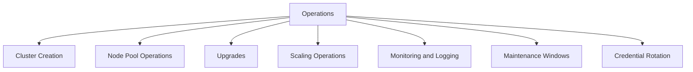

---
content_sources:
  diagrams:
  - id: operations-index
    type: flowchart
    source: mslearn-adapted
    mslearn_url: https://learn.microsoft.com/en-us/azure/aks/learn/quick-kubernetes-deploy-cli
    based_on:
    - https://learn.microsoft.com/en-us/azure/aks/learn/quick-kubernetes-deploy-cli
    - https://learn.microsoft.com/en-us/azure/aks/upgrade-cluster
    - https://learn.microsoft.com/en-us/azure/azure-monitor/containers/container-insights-overview
---

# Operations

This section contains day-2 runbooks for creating, changing, scaling, monitoring, and maintaining AKS clusters in production.

## Main Content
<!-- diagram-id: operations-index -->

<!-- diagram-id: operations-index -->

| Document | Description |
|---|---|
| [Cluster Creation](cluster-creation.md) | Build a production-ready cluster with initial baseline settings |
| [Node Pool Operations](node-pool-operations.md) | Add, scale, cordon, drain, and retire node pools safely |
| [Upgrades](upgrades.md) | Upgrade Kubernetes versions and node images with validation |
| [Scaling Operations](scaling-operations.md) | Operate HPA, VPA, and cluster autoscaler safely |
| [Monitoring and Logging](monitoring-logging.md) | Configure observability, alerts, and diagnostic collection |
| [Maintenance Windows](maintenance-windows.md) | Align upgrades and platform maintenance with business windows |
| [Credential Rotation](credential-rotation.md) | Rotate certificates, identities, kubeconfig access, and secrets |

## Advanced Topics

- Treat every operational change as a runbook with pre-checks and post-checks.
- Keep non-production clusters close enough to production that upgrades and scaling tests are meaningful.

## See Also

- [Platform](../platform/index.md)
- [Best Practices](../best-practices/index.md)
- [Troubleshooting](../troubleshooting/index.md)
- [Reference](../reference/index.md)

## Sources

- [Create an AKS cluster](https://learn.microsoft.com/azure/aks/learn/quick-kubernetes-deploy-cli)
- [Upgrade an AKS cluster](https://learn.microsoft.com/azure/aks/upgrade-cluster)
- [Monitor AKS with Container insights](https://learn.microsoft.com/azure/azure-monitor/containers/container-insights-overview)
