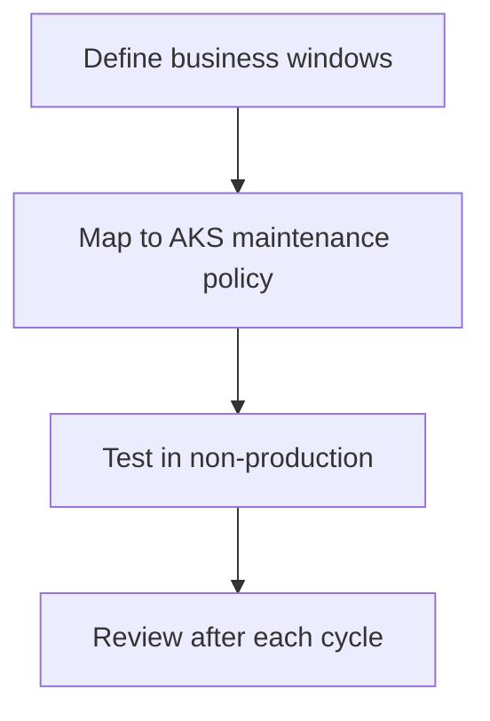

---
hide:
  - toc
content_sources:
  diagrams:
  - id: operations-maintenance-windows
    type: flowchart
    source: mslearn-adapted
    mslearn_url: https://learn.microsoft.com/en-us/azure/aks/planned-maintenance
    based_on:
    - https://learn.microsoft.com/en-us/azure/aks/planned-maintenance
    - https://learn.microsoft.com/en-us/azure/aks/auto-upgrade-cluster
---


# Maintenance Windows

Maintenance windows align AKS upgrades and disruptive platform changes with business-approved change periods. They reduce surprise, but they do not remove the need for validation.

## Prerequisites

- Business change windows are known.
- Upgrade and node image rollout cadence is defined.
- Critical workload disruption tolerance is understood.

## When to Use

- Defining production change governance.
- Preparing auto-upgrade and node image update policies.
- Reducing overlap with peak traffic periods.

## Procedure
<!-- diagram-id: operations-maintenance-windows -->

<!-- diagram-id: operations-maintenance-windows -->



1. Choose maintenance windows that avoid peak business traffic.
2. Align maintenance policy with upgrade cadence and on-call coverage.
3. Test how workloads behave during node drains and rolling updates.
4. Review whether the maintenance window is still appropriate after growth or regional expansion.

## Verification

```bash
az aks show --resource-group $RG --name $CLUSTER_NAME --query autoUpgradeProfile --output yaml
kubectl get pdb -A
kubectl get nodes
```

## Rollback / Troubleshooting

- If maintenance events still create incidents, review PDBs, readiness behavior, and workload singleton patterns.
- If auto-upgrade timing is too risky, pause or narrow the automation scope and move to a controlled manual process.

## See Also

- [Upgrades](upgrades.md)
- [Reliability](../best-practices/reliability.md)
- [Upgrade Failure](../troubleshooting/playbooks/operations/upgrade-failure.md)

## Sources

- [Planned maintenance in AKS](https://learn.microsoft.com/azure/aks/planned-maintenance)
- [Auto-upgrade AKS clusters](https://learn.microsoft.com/azure/aks/auto-upgrade-cluster)
