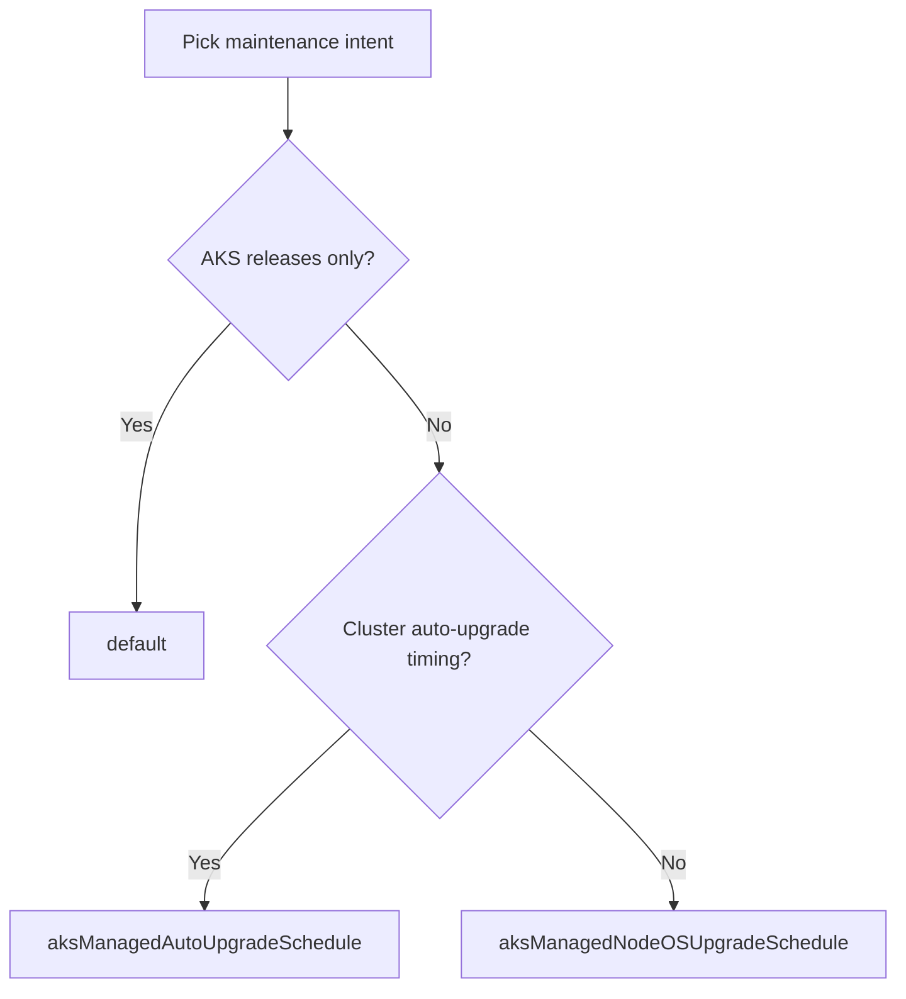

---
content_sources:
  diagrams:
    - id: operations-maintenance-windows-configs
      type: flowchart
      source: mslearn-adapted
      mslearn_url: https://learn.microsoft.com/en-us/azure/aks/planned-maintenance
      based_on:
        - https://learn.microsoft.com/en-us/azure/aks/planned-maintenance
        - https://learn.microsoft.com/en-us/azure/aks/auto-upgrade-cluster
        - https://learn.microsoft.com/en-us/azure/aks/auto-upgrade-node-os-image
content_validation:
  status: verified
  last_reviewed: 2026-07-18
  reviewer: agent
  core_claims:
    - claim: "Planned maintenance in AKS has three schedule configuration types: default, aksManagedAutoUpgradeSchedule, and aksManagedNodeOSUpgradeSchedule."
      source: https://learn.microsoft.com/en-us/azure/aks/planned-maintenance
      verified: true
    - claim: "Planned maintenance controls when maintenance can run, but enabling or disabling it does not enable or disable automatic upgrades."
      source: https://learn.microsoft.com/en-us/azure/aks/planned-maintenance
      verified: true
    - claim: "Maintenance windows for auto-upgrade and node OS auto-upgrade should be four hours or longer."
      source: https://learn.microsoft.com/en-us/azure/aks/planned-maintenance
      verified: true
    - claim: "AKS supports notAllowedDates in maintenance-window configuration files so operators can block maintenance during specific date ranges."
      source: https://learn.microsoft.com/en-us/azure/aks/planned-maintenance
      verified: true
---

# Maintenance Windows

Maintenance windows tell AKS when cluster auto-upgrades, node OS updates, and AKS-managed releases are allowed to run. They do not constrain manual `az aks upgrade` operations, which run when you invoke them. They reduce surprise, but they do not replace upgrade planning or workload validation.

## Prerequisites

- Business change windows and blackout periods are known.
- Cluster auto-upgrade and node OS channel decisions are already made.
- Production workloads can tolerate node drains inside the selected window length.

## When to Use

- Aligning cluster lifecycle work to approved change windows.
- Separating Kubernetes minor-version movement from node OS image movement.
- Blocking maintenance during holidays, freezes, or high-risk business periods.

## Procedure

<!-- diagram-id: operations-maintenance-windows-configs -->


### Configuration types

| Configuration | Controls | Use when |
|---|---|---|
| `default` | AKS weekly releases for control-plane components and system add-ons. | You want a window for AKS-initiated platform maintenance. |
| `aksManagedAutoUpgradeSchedule` | Cluster auto-upgrade timing. | You want Kubernetes version automation to happen in a specific window. |
| `aksManagedNodeOSUpgradeSchedule` | Node OS security or node image rollout timing. | You want node OS maintenance to happen independently from cluster-version automation. |

All three configurations can coexist.

### Maintenance window design rules

- Use **four hours or more** for auto-upgrade and node OS maintenance.
- Stagger windows across clusters instead of lining up every cluster in a subscription at the same time.
- Use `notAllowedDates` to block maintenance during change freezes and business-critical dates.
- Treat windows as best-effort scheduling, not a guarantee that AKS will never need urgent reactive maintenance outside them.

### Add the configurations

```bash
az aks maintenanceconfiguration add \
    --resource-group "$RG" \
    --cluster-name "$CLUSTER_NAME" \
    --name default \
    --schedule-type Weekly \
    --day-of-week Sunday \
    --interval-weeks 1 \
    --duration 4 \
    --utc-offset +00:00 \
    --start-time 01:00

az aks maintenanceconfiguration add \
    --resource-group "$RG" \
    --cluster-name "$CLUSTER_NAME" \
    --name aksManagedAutoUpgradeSchedule \
    --schedule-type Weekly \
    --day-of-week Sunday \
    --interval-weeks 1 \
    --duration 4 \
    --utc-offset +00:00 \
    --start-time 02:00
```

Use a JSON configuration file when you need `notAllowedDates`:

```json
{
  "properties": {
    "maintenanceWindow": {
      "schedule": {
        "weekly": {
          "intervalWeeks": 1,
          "dayOfWeek": "Sunday"
        }
      },
      "durationHours": 4,
      "utcOffset": "+00:00",
      "startTime": "02:00",
      "notAllowedDates": [
        {
          "start": "2026-12-20",
          "end": "2027-01-03"
        }
      ]
    }
  }
}
```

### Inspect the effective configuration

```bash
az aks maintenanceconfiguration list \
    --resource-group "$RG" \
    --cluster-name "$CLUSTER_NAME"

az aks maintenanceconfiguration show \
    --resource-group "$RG" \
    --cluster-name "$CLUSTER_NAME" \
    --name aksManagedNodeOSUpgradeSchedule
```

## Verification

- All intended maintenance configurations exist.
- Cluster auto-upgrade and node OS channels each map to their own schedule where needed.
- Blackout periods are represented in `notAllowedDates` for sensitive periods.

## Rollback / Troubleshooting

- If maintenance lands at the wrong time, verify that you edited the correct configuration type rather than only the `default` schedule.
- If upgrades do not occur, confirm the cluster was running during the window and that the window was long enough.
- If production risk remains high even with maintenance windows, use [Blue-Green Upgrades](blue-green-upgrades.md) for the workload move instead of relying on window timing alone.

## See Also

- [Auto-Upgrade Channels](auto-upgrade-channels.md)
- [Node OS Upgrades](node-os-upgrades.md)
- [Upgrades](upgrades.md)
- [Version Support](../reference/version-support.md)

## Sources

- [Use planned maintenance to schedule and control upgrades for AKS clusters](https://learn.microsoft.com/en-us/azure/aks/planned-maintenance)
- [Automatically upgrade an AKS cluster](https://learn.microsoft.com/en-us/azure/aks/auto-upgrade-cluster)
- [Autoupgrade node OS images in AKS](https://learn.microsoft.com/en-us/azure/aks/auto-upgrade-node-os-image)
