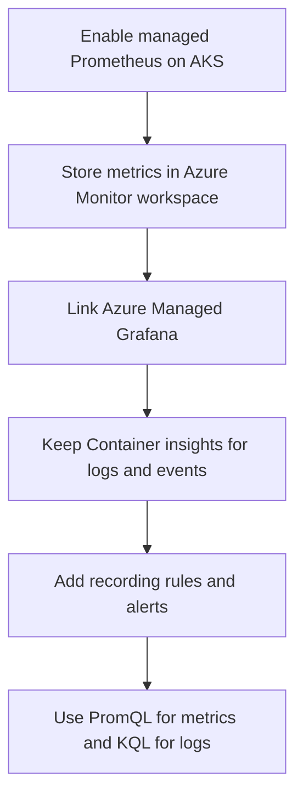

---
content_sources:
  diagrams:
    - id: operations-managed-prometheus-coverage
      type: flowchart
      source: self-generated
      justification: "Coverage model synthesized from Microsoft Learn guidance describing how managed Prometheus, Container insights, Azure Monitor workspaces, and Grafana work together for AKS monitoring."
      based_on:
        - https://learn.microsoft.com/en-us/azure/aks/monitor-aks
        - https://learn.microsoft.com/en-us/azure/azure-monitor/containers/kubernetes-monitoring-overview
        - https://learn.microsoft.com/en-us/azure/azure-monitor/containers/kubernetes-monitoring-enable
content_validation:
  status: verified
  last_reviewed: 2026-07-18
  reviewer: agent
  core_claims:
    - claim: "When you enable metric scraping for AKS, Azure Monitor managed service for Prometheus stores Prometheus metrics in an Azure Monitor workspace."
      source: https://learn.microsoft.com/en-us/azure/aks/monitor-aks
      verified: true
    - claim: "Azure Managed Grafana can be linked to an Azure Monitor workspace to visualize Prometheus metrics collected from AKS."
      source: https://learn.microsoft.com/en-us/azure/azure-monitor/containers/kubernetes-monitoring-enable
      verified: true
    - claim: "Container insights collects stdout and stderr logs and Kubernetes events from each node in an AKS cluster."
      source: https://learn.microsoft.com/en-us/azure/aks/monitor-aks
      verified: true
    - claim: "AKS control-plane metrics monitoring requires managed service for Prometheus to be enabled on the cluster."
      source: https://learn.microsoft.com/en-us/azure/aks/monitor-aks
      verified: true
---

# Managed Prometheus

Managed Prometheus adds the Kubernetes-native metrics layer that Container insights does not replace. Use it with Azure Monitor workspace and Grafana when you need PromQL, histogram math, recording rules, or prebuilt Kubernetes dashboards.

## Prerequisites

- The AKS cluster uses managed identity authentication.
- An Azure Monitor workspace exists or can be created during onboarding.
- An Azure Managed Grafana workspace exists if you want full Grafana dashboards and multi-signal panels.
- Required resource providers are registered for the cluster, Azure Monitor workspace, and Grafana workspace subscriptions.

## When to Use

- You need PromQL-based dashboards, SLO panels, or Prometheus alerts.
- You need richer Kubernetes metrics than platform metrics alone provide.
- You want to observe control-plane metrics that are exposed through managed Prometheus.
- You are reducing overreliance on log-search alerts for high-frequency metrics.

## Procedure

<!-- diagram-id: operations-managed-prometheus-coverage -->


### 1) Understand the coverage model

Use the right tool for the right question:

| Need | Best signal | Language | Typical store |
|---|---|---|---|
| Node, pod, HPA, kube-state, histogram, and control-plane metrics | Managed Prometheus | PromQL | Azure Monitor workspace |
| `stdout`, `stderr`, Kubernetes events, inventory, historical log correlation | Container insights | KQL | Log Analytics workspace |
| Low-cardinality Azure resource health metrics | Platform metrics | Azure Monitor metrics queries / metric alerts | Azure Monitor metrics database |

Managed Prometheus does not replace Container insights. It complements it.

### 2) Enable managed Prometheus and link Grafana

Use a dedicated Azure Monitor workspace and optionally link Grafana during onboarding:

```bash
az aks update \
    --resource-group "$RG" \
    --name "$CLUSTER_NAME" \
    --enable-azure-monitor-metrics \
    --azure-monitor-workspace-resource-id "$AZURE_MONITOR_WORKSPACE_ID" \
    --grafana-resource-id "$GRAFANA_RESOURCE_ID"
```

| Command | Purpose |
| --- | --- |
| `az aks update` | Enable managed Prometheus metrics and Grafana. |
| `--resource-group` | Resource group that contains the AKS cluster. |
| `--name` | Name of the AKS cluster. |
| `--enable-azure-monitor-metrics` | Enable the managed Prometheus metrics add-on. |
| `--azure-monitor-workspace-resource-id` | Azure Monitor workspace to store metrics. |
| `--grafana-resource-id` | Azure Managed Grafana instance to link. |

If Container insights is not already enabled, add it separately so logs and events continue to land in Log Analytics:

```bash
az aks enable-addons \
    --addons monitoring \
    --resource-group "$RG" \
    --name "$CLUSTER_NAME" \
    --workspace-resource-id "$LOG_ANALYTICS_WORKSPACE_ID"
```

| Command | Purpose |
| --- | --- |
| `az aks enable-addons` | Enable the Container Insights monitoring add-on. |
| `--addons` | Add-on to enable, monitoring for Container Insights. |
| `--resource-group` | Resource group that contains the AKS cluster. |
| `--name` | Name of the AKS cluster. |
| `--workspace-resource-id` | Log Analytics workspace for the monitoring data. |

### 3) Decide whether Grafana in the portal is enough

Choose between the two Grafana experiences:

- **Azure Monitor dashboards with Grafana**: good default when you want built-in dashboards in the Azure portal at no extra dashboard-management cost.
- **Azure Managed Grafana**: better when you need shared dashboards, more data sources, RBAC separation, folders, alerting workflows, or external Grafana integrations.

### 4) Use PromQL and KQL deliberately

- Use **PromQL** when the question is numeric, rate-based, or histogram-based. Examples: `rate()`, `sum by()`, `histogram_quantile()`, saturation, error budgets.
- Use **KQL** when the question is log-, event-, or audit-based. Examples: crash evidence, webhook failure text, recent cluster changes, audit denies.

In practice:

- PromQL answers **how much**, **how fast**, and **how often**.
- KQL answers **who**, **why**, and **what changed**.

### 5) Add recording rules before dashboards sprawl

Create recording rules for metrics you query constantly. Good first candidates:

- pre-aggregated API server request-rate and error-rate series,
- node-pool CPU or memory saturation summaries,
- HPA desired-vs-current replica deltas,
- cluster-autoscaler unschedulable-pod rollups.

Typical patterns:

- **Normalize expensive histograms** into p95 or p99 latency series.
- **Pre-sum high-cardinality labels** by cluster, node pool, namespace, or workload.
- **Create alert-ready ratios** so alert rules do not recalculate the same expensive expression repeatedly.

### 6) Plan overlap and migration carefully

| Topic | Container insights | Managed Prometheus | Guidance |
|---|---|---|---|
| Logs and Kubernetes events | Strong | None | Keep Container insights.
| Pod and node inventory | Strong | Partial via metrics | Keep Container insights for fast incident evidence.
| Prometheus-native metrics and histograms | Limited | Strong | Migrate metrics-first dashboards here.
| Grafana dashboards | Limited | Strong | Use Managed Grafana for reusable SRE dashboards.
| Cost driver | Log ingestion and retention | Metric series cardinality and scrape scope | Control both independently.

Do not migrate by dashboard count alone. Migrate by **question type**.

## Verification

Validate that metric scraping is enabled:

```bash
az aks show \
    --resource-group "$RG" \
    --name "$CLUSTER_NAME" \
    --query "azureMonitorProfile.metrics.enabled" \
    --output tsv
```

| Command | Purpose |
| --- | --- |
| `az aks show` | Check whether managed Prometheus metrics are enabled. |
| `--resource-group` | Resource group that contains the AKS cluster. |
| `--name` | Name of the AKS cluster. |
| `--query` | Selects the metrics enabled flag. |
| `--output` | Output format for the result. |

Then confirm the workspace and Grafana linkages are present:

```bash
az aks show \
    --resource-group "$RG" \
    --name "$CLUSTER_NAME" \
    --query "azureMonitorProfile.metrics" \
    --output yaml
```

| Command | Purpose |
| --- | --- |
| `az aks show` | Show the managed Prometheus metrics profile. |
| `--resource-group` | Resource group that contains the AKS cluster. |
| `--name` | Name of the AKS cluster. |
| `--query` | Selects the metrics profile. |
| `--output` | Output format for the result. |

Success means:

- managed Prometheus is enabled on the AKS cluster,
- the Azure Monitor workspace is attached,
- Grafana can open built-in Kubernetes dashboards,
- Container insights remains available for logs and events.

## Rollback / Troubleshooting

- If dashboards are empty, confirm the Azure Monitor workspace and Grafana workspace are linked and that Grafana has `Monitoring Reader` access.
- If node or pod metrics exist but logs are missing, the monitoring add-on for Container insights is separate and might not be enabled.
- If costs rise unexpectedly, check scrape scope, kube-state-metrics label allow-lists, and overly granular Grafana panels before you disable the service.
- If you need forensic control-plane text rather than metrics, switch back to the [Diagnostic Settings](diagnostic-settings.md) and KQL path instead of forcing metrics to answer a log question.

## See Also

- [Monitoring and Logging](monitoring-logging.md)
- [Diagnostic Settings](diagnostic-settings.md)
- [Baseline Alerts](baseline-alerts.md)
- [Managed Prometheus and Grafana](../reference/metrics/managed-prometheus-grafana.md)
- [KQL Query Packs](../troubleshooting/kql/index.md)

## Sources

- [Monitor AKS](https://learn.microsoft.com/en-us/azure/aks/monitor-aks)
- [Kubernetes monitoring in Azure Monitor](https://learn.microsoft.com/en-us/azure/azure-monitor/containers/kubernetes-monitoring-overview)
- [Enable monitoring for AKS clusters](https://learn.microsoft.com/en-us/azure/azure-monitor/containers/kubernetes-monitoring-enable)
- [Container insights overview](https://learn.microsoft.com/en-us/azure/azure-monitor/containers/container-insights-overview)
