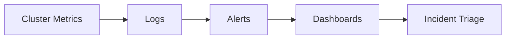

---
hide:
  - toc
content_sources:
  diagrams:
  - id: operations-monitoring-logging
    type: flowchart
    source: mslearn-adapted
    mslearn_url: https://learn.microsoft.com/en-us/azure/azure-monitor/containers/container-insights-overview
    based_on:
    - https://learn.microsoft.com/en-us/azure/azure-monitor/containers/container-insights-overview
    - https://learn.microsoft.com/en-us/azure/azure-monitor/containers/container-insights-data-collection-configure
---


# Monitoring and Logging

AKS observability must cover cluster state, node health, workload health, and control-plane-related signals. Effective monitoring is the difference between guessing and diagnosing.

## Prerequisites

- Log Analytics workspace or equivalent telemetry backend is available.
- Metrics Server and/or Azure Monitor pipelines are configured.
- Alert ownership and escalation paths are defined.

## When to Use

- Building the baseline observability stack.
- Expanding alerts for new critical workloads.
- Diagnosing incidents with cluster and node evidence.

## Procedure
<!-- diagram-id: operations-monitoring-logging -->

<!-- diagram-id: operations-monitoring-logging -->



```bash
az aks enable-addons     --resource-group $RG     --name $CLUSTER_NAME     --addons monitoring
kubectl top nodes
kubectl top pods -A
kubectl get events -A --sort-by=.lastTimestamp
```

## Verification

```bash
az aks show --resource-group $RG --name $CLUSTER_NAME --query addonProfiles.omsagent.enabled --output tsv
kubectl get pods -n kube-system
```

## Rollback / Troubleshooting

- If metrics are missing, check Metrics Server and Azure Monitor agent health.
- If logs exist but are unusable, refine namespace, workload, and owner labeling.
- If alerts are noisy, fix thresholds and missing suppression logic instead of disabling visibility.

## See Also

- [Reference: Diagnostic Commands](../reference/diagnostic-commands.md)
- [Evidence Map](../troubleshooting/evidence-map.md)
- [Performance Checklist](../troubleshooting/first-10-minutes/performance.md)

## Sources

- [Monitor AKS with Container insights](https://learn.microsoft.com/azure/azure-monitor/containers/container-insights-overview)
- [Use managed Prometheus with AKS](https://learn.microsoft.com/azure/azure-monitor/containers/container-insights-data-collection-configure)
