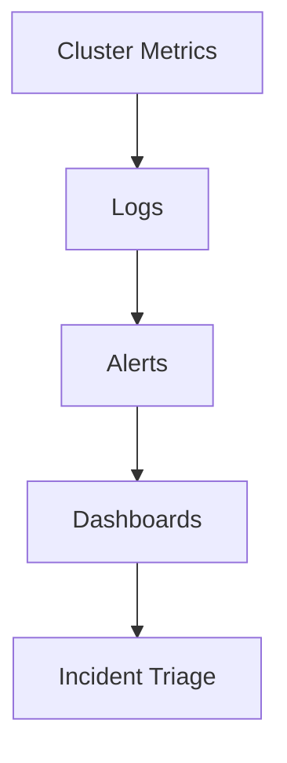

---
content_sources:
  diagrams:
  - id: operations-monitoring-logging
    type: flowchart
    source: mslearn-adapted
    mslearn_url: https://learn.microsoft.com/en-us/azure/azure-monitor/containers/container-insights-overview
    based_on:
    - https://learn.microsoft.com/en-us/azure/azure-monitor/containers/container-insights-overview
    - https://learn.microsoft.com/en-us/azure/azure-monitor/containers/container-insights-data-collection-configure
---


# Monitoring and Logging

AKS observability must cover cluster state, node health, workload health, and control-plane-related signals. Effective monitoring is the difference between guessing and diagnosing.

## Prerequisites

- Log Analytics workspace or equivalent telemetry backend is available.
- Metrics Server and/or Azure Monitor pipelines are configured.
- Alert ownership and escalation paths are defined.

## When to Use

- Building the baseline observability stack.
- Expanding alerts for new critical workloads.
- Diagnosing incidents with cluster and node evidence.

## Procedure
<!-- diagram-id: operations-monitoring-logging -->



```bash
az aks enable-addons     --resource-group $RG     --name $CLUSTER_NAME     --addons monitoring
kubectl top nodes
kubectl top pods -A
kubectl get events -A --sort-by=.lastTimestamp
```

## Verification

```bash
az aks show --resource-group $RG --name $CLUSTER_NAME --query addonProfiles.omsagent.enabled --output tsv
kubectl get pods -n kube-system
```

You can confirm the same telemetry in the Azure Portal on the cluster monitoring blades.

[[[ shot("aks-monitoring-insights") ]]]

Purpose: Confirm Container insights is collecting live node and workload telemetry after enabling the monitoring add-on.

Look for:

- **Node CPU and memory** charts show recent, non-empty data points.
- The node and pod counts match the cluster's actual topology.
- No agent health warnings are shown at the top of the blade.

Expected result: Container insights reports live utilization, confirming the monitoring pipeline is active.

Next step: Build a custom chart on the Metrics blade for a specific signal.

[[[ shot("aks-monitoring-metrics") ]]]

Purpose: Show where to build ad hoc charts from platform metrics for a specific investigation.

Look for:

- The **Scope** is the AKS cluster and the **Metric Namespace** is `Container service`.
- The chart builder lets you add a metric, aggregation, and splitting.
- The time range control reflects the window you want to inspect.

Expected result: You can compose a metric chart for any supported AKS signal and optionally pin it to a dashboard.

Next step: Configure a diagnostic setting to stream control-plane logs to Log Analytics.

[[[ shot("aks-monitoring-diagnostic-settings") ]]]

Purpose: Show where to enable streaming export of control-plane logs (API server, audit, scheduler) to a destination.

Look for:

- The blade lists log categories such as **Kubernetes API Server**, **Kubernetes Audit**, and **Cluster Autoscaler**.
- A destination (Log Analytics workspace, storage account, or event hub) can be attached.
- Any existing diagnostic settings and their destinations are visible.

Expected result: You can route control-plane logs to Log Analytics for audit and incident investigation.

Next step: Query the exported logs from the [Diagnostic Commands](../reference/diagnostic-commands.md) reference.

## Rollback / Troubleshooting

- If metrics are missing, check Metrics Server and Azure Monitor agent health.
- If logs exist but are unusable, refine namespace, workload, and owner labeling.
- If alerts are noisy, fix thresholds and missing suppression logic instead of disabling visibility.

## See Also

- [Reference: Diagnostic Commands](../reference/diagnostic-commands.md)
- [Evidence Map](../troubleshooting/evidence-map.md)
- [Performance Checklist](../troubleshooting/first-10-minutes/performance.md)

## Sources

- [Monitor AKS with Container insights](https://learn.microsoft.com/azure/azure-monitor/containers/container-insights-overview)
- [Use managed Prometheus with AKS](https://learn.microsoft.com/azure/azure-monitor/containers/container-insights-data-collection-configure)
