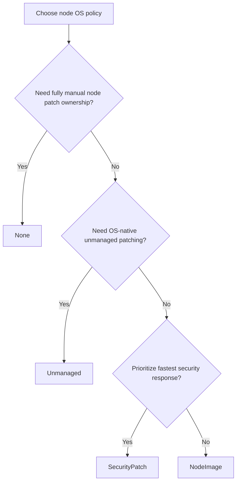

---
content_sources:
  diagrams:
    - id: operations-node-os-channel-selection
      type: flowchart
      source: self-generated
      justification: Node OS auto-upgrade channel selection flow synthesized from Microsoft Learn node OS autoupgrade and release-tracker guidance.
      based_on:
        - https://learn.microsoft.com/en-us/azure/aks/auto-upgrade-node-os-image
        - https://learn.microsoft.com/en-us/azure/aks/planned-maintenance
        - https://learn.microsoft.com/en-us/azure/aks/release-tracker
content_validation:
  status: verified
  last_reviewed: 2026-07-18
  reviewer: agent
  core_claims:
    - claim: "AKS Standard supports the node OS upgrade channels None, Unmanaged, SecurityPatch, and NodeImage, and new AKS Standard clusters default to NodeImage."
      source: https://learn.microsoft.com/en-us/azure/aks/auto-upgrade-node-os-image
      verified: true
    - claim: "SecurityPatch applies AKS-tested security patches and can live-patch nodes when reimage is unnecessary, while NodeImage applies a newly patched VHD with security fixes and bug fixes on a weekly cadence."
      source: https://learn.microsoft.com/en-us/azure/aks/auto-upgrade-node-os-image
      verified: true
    - claim: "The release tracker exposes regional node image releases and security patch releases so operators can track node OS availability by region."
      source: https://learn.microsoft.com/en-us/azure/aks/release-tracker
      verified: true
    - claim: "AKS recommends a maintenance window of four hours or more for node OS planned maintenance."
      source: https://learn.microsoft.com/en-us/azure/aks/auto-upgrade-node-os-image
      verified: true
---

# Node OS Upgrades

Cluster version policy and node OS policy are different decisions. Kubernetes minor and patch upgrades control API and control-plane behavior; node OS channels control how quickly AKS applies security and image-level fixes to the machines that actually run your workloads.

## Prerequisites

- Decide whether the environment prioritizes fastest security response or broader bug-fix uptake.
- Confirm the cluster has an explicit maintenance schedule for production.
- Verify add-ons, custom DaemonSets, and workload startup paths tolerate node reimage events.

## When to Use

- Defining the default node update posture for AKS Standard clusters.
- Aligning security-patch urgency with maintenance and workload resilience.
- Replacing the legacy `node-image` cluster auto-upgrade habit with the dedicated node OS policy.

## Procedure

<!-- diagram-id: operations-node-os-channel-selection -->


### Channel comparison

| Channel | What it does | Trade-off | Best fit |
|---|---|---|---|
| `None` | No automatic node security updates. | Full operator ownership and highest drift risk. | Exceptional environments only. |
| `Unmanaged` | Uses OS-native patching behavior. | AKS does not control update timing; reboot handling is on you. | Estates with their own OS patch orchestration model. |
| `SecurityPatch` | Applies AKS-tested security patches and can avoid full reimage when live patching is sufficient. | Focuses on security fixes, not broader bug-fix payloads. | Security-first environments that want faster CVE response. |
| `NodeImage` | Reimages nodes to a newly patched VHD with security fixes and bug fixes on a weekly cadence. | More disruptive than live patching, but simpler and broader in payload. | Recommended default for most AKS Standard production clusters. |

### Decision guidance

- Choose **`SecurityPatch`** when the primary objective is fast security remediation and you accept the channel's narrower scope.
- Choose **`NodeImage`** when you want the cleanest fully managed weekly node refresh with both security and bug fixes.
- Choose **`Unmanaged`** only if your operating model already owns reboot timing and patch orchestration.
- Avoid **`None`** for long-lived production clusters unless a separate, enforced node-patching process exists.

### Configure the node OS channel

```bash
az aks update \
    --resource-group "$RG" \
    --name "$CLUSTER_NAME" \
    --node-os-upgrade-channel NodeImage

az aks show \
    --resource-group "$RG" \
    --name "$CLUSTER_NAME" \
    --query "autoUpgradeProfile" \
    --output yaml
```

### CVE response and operational cadence

For production planning, the important difference is usually:

- **`SecurityPatch`** is the faster security-only path.
- **`NodeImage`** is the broader weekly image-refresh path.

Use the AKS release tracker to confirm which node image or security patch release has landed in the cluster's region before you assume the fix is available.

## Verification

```bash
az aks show \
    --resource-group "$RG" \
    --name "$CLUSTER_NAME" \
    --query "autoUpgradeProfile.nodeOsUpgradeChannel" \
    --output tsv

kubectl get nodes --show-labels
```

- Confirm the cluster shows the intended `nodeOsUpgradeChannel` value.
- Confirm node labels reflect the expected image version after rollout.
- Confirm the maintenance configuration for `aksManagedNodeOSUpgradeSchedule` exists in production.

## Rollback / Troubleshooting

- If node refreshes are too disruptive, revisit workload readiness, PDBs, and maintenance timing before changing the channel.
- If the cluster needs quicker security reaction, move from `NodeImage` to `SecurityPatch` rather than disabling automation.
- If node reimage rollout stalls, use [Node Image Upgrade Stuck](../troubleshooting/playbooks/operations/node-image-upgrade-stuck.md).

## See Also

- [Auto-Upgrade Channels](auto-upgrade-channels.md)
- [Maintenance Windows](maintenance-windows.md)
- [Upgrades](upgrades.md)

## Sources

- [Autoupgrade node OS images in AKS](https://learn.microsoft.com/en-us/azure/aks/auto-upgrade-node-os-image)
- [Use planned maintenance to schedule and control upgrades for AKS clusters](https://learn.microsoft.com/en-us/azure/aks/planned-maintenance)
- [AKS release tracker](https://learn.microsoft.com/en-us/azure/aks/release-tracker)
