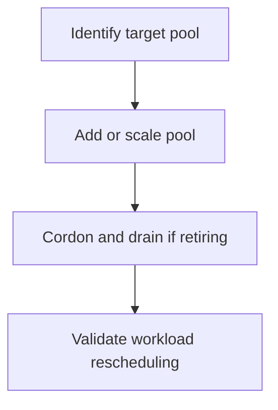

---
hide:
  - toc
---

# Node Pool Operations

Use node pool changes to adjust cluster capacity and isolate workloads without rebuilding the cluster. Safe node pool operations depend on drain behavior, pod disruption budgets, and quota awareness.

## Prerequisites

- Cluster credentials are current.
- You understand which workloads run on the target pool.
- PodDisruptionBudgets and autoscaler settings have been reviewed.

## When to Use

- Adding a new workload class.
- Replacing VM sizes or OS images.
- Scaling specific workload pools independently.

## Procedure




```bash
az aks nodepool list --resource-group $RG --cluster-name $CLUSTER_NAME --output table
az aks nodepool add     --resource-group $RG     --cluster-name $CLUSTER_NAME     --name apps01     --mode User     --node-vm-size Standard_D4ds_v5     --node-count 3
kubectl get nodes -L kubernetes.azure.com/agentpool
kubectl cordon <node-name>
kubectl drain <node-name> --ignore-daemonsets --delete-emptydir-data
```

## Verification

```bash
az aks nodepool show --resource-group $RG --cluster-name $CLUSTER_NAME --name apps01 --query "{count:count,mode:mode,vmSize:vmSize,provisioningState:provisioningState}" --output yaml
kubectl get pods -A -o wide
```

## Rollback / Troubleshooting

- If drain blocks, inspect PodDisruptionBudgets and unmanaged pods.
- If scale-out fails, inspect quota, subnet IPs, and autoscaler bounds.
- If workloads land on the wrong pool, inspect taints, tolerations, selectors, and affinity.

## See Also

- [Node Pools](../platform/node-pools.md)
- [Scaling](../platform/scaling.md)
- [Scaling Failure](../troubleshooting/playbooks/operations/scaling-failure.md)

## Sources

- [Create an AKS cluster](https://learn.microsoft.com/azure/aks/learn/quick-kubernetes-deploy-cli)
- [Upgrade an AKS cluster](https://learn.microsoft.com/azure/aks/upgrade-cluster)
- [Monitor AKS with Container insights](https://learn.microsoft.com/azure/azure-monitor/containers/container-insights-overview)
- [AKS core concepts for Kubernetes and workloads](https://learn.microsoft.com/azure/aks/concepts-clusters-workloads)
- [Azure Kubernetes Service (AKS) architecture](https://learn.microsoft.com/azure/architecture/reference-architectures/containers/aks/secure-baseline-aks)
